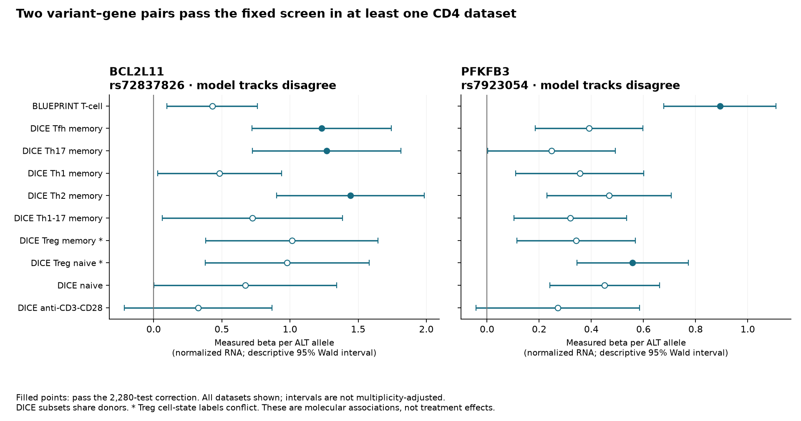
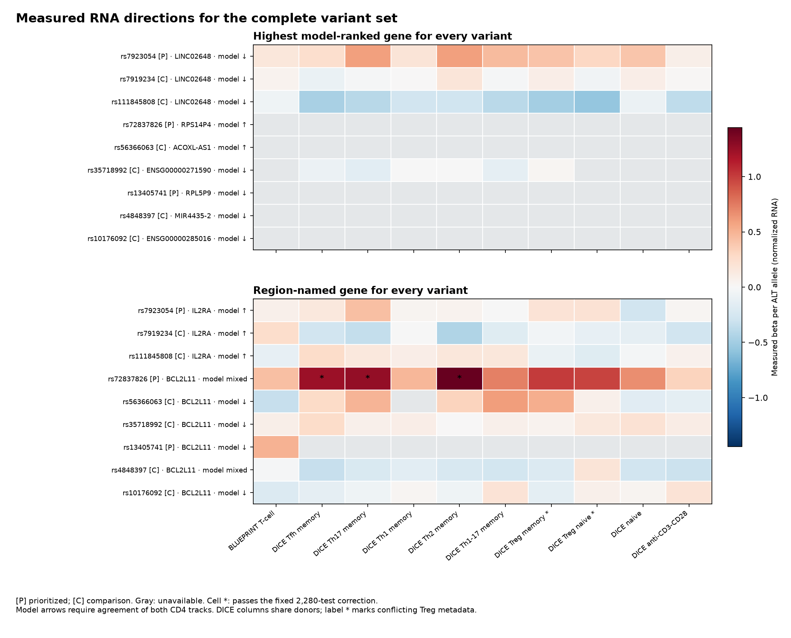
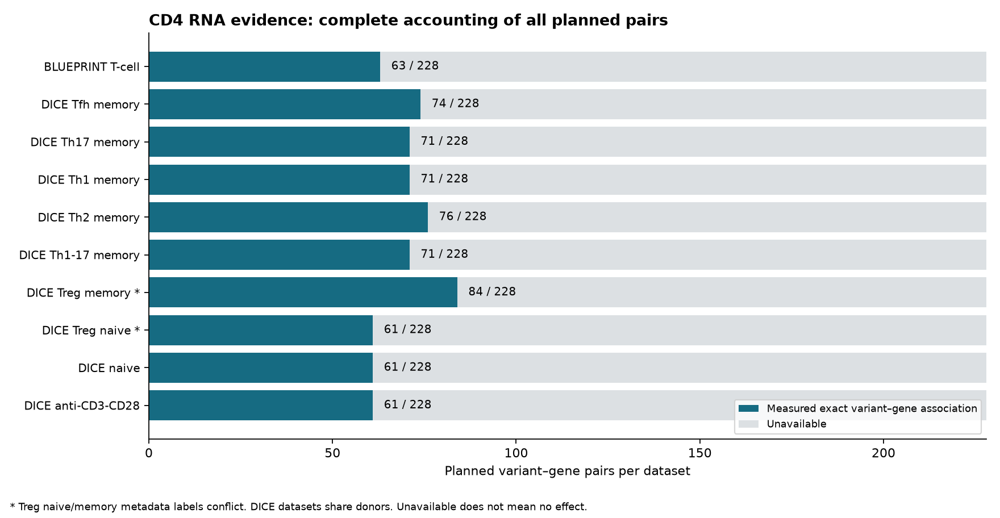

# CD4 RNA evidence: two supported associations, mixed model directions

Subsequent result: the [regional colocalisation assessment](colocalisation.md) is complete for PFKFB3 and BCL2L11 across all ten contexts. It finds no supported shared PSC–RNA signal, with explicit variant-coverage limits. The original RNA associations and this report's frozen analysis remain unchanged.

Completed September 12, 2026. **Measured RNA data support two variant–gene associations worth investigating: rs7923054 with PFKFB3, and rs72837826 with BCL2L11.** Five dataset-level associations pass the fixed statistical screen, representing these two pairs. Both involve higher RNA per alternate allele. AlphaGenome's two CD4 RNA tracks disagree on direction for both pairs, so this is not a clear validation of the model's predicted direction.

We queried all nine variants from the [completed matched comparison](matched-comparison.md) in ten public CD4 datasets. All 90 queries succeeded. Of **2,280 planned dataset–variant–gene comparisons**, **693 have usable measurements** and 1,587 remain unavailable. Every prioritized variant, comparison variant, gene and missing measurement is retained. No new AlphaGenome request was needed.

## The two associations that passed the screen

The plan fixed a conservative threshold of **P ≤ 0.05 / 2,280 = 2.19298 × 10⁻⁵**, including unavailable tests in the denominator. The table contains every association that passes. These are observational associations with normalized RNA levels, not causal-variant probabilities, percentage expression changes or treatment effects.

| Variant → gene | Dataset / CD4 context | N | Minor-allele carriers | RNA beta per ALT | Descriptive 95% interval | Nominal P |
|---|---|---:|---:|---:|---|---:|
| rs7923054 T>A → PFKFB3 | BLUEPRINT naive CD4, QTD000031 | 167 | 40 | +0.893215 | +0.678099 to +1.108331 | 1.33355 × 10⁻¹³ |
| rs7923054 T>A → PFKFB3 | DICE Treg subset, QTD000469* | 89 | 38 | +0.558412 | +0.344843 to +0.771981 | 2.29753 × 10⁻⁶ |
| rs72837826 G>T → BCL2L11 | DICE Tfh memory, QTD000439 | 89 | 9 | +1.231120 | +0.720383 to +1.741857 | 1.07140 × 10⁻⁵ |
| rs72837826 G>T → BCL2L11 | DICE Th17 memory, QTD000444 | 89 | 9 | +1.269600 | +0.724908 to +1.814292 | 1.92284 × 10⁻⁵ |
| rs72837826 G>T → BCL2L11 | DICE Th2 memory, QTD000454 | 89 | 9 | +1.443360 | +0.902130 to +1.984590 | 1.53743 × 10⁻⁶ |

Intervals are source beta ± 1.96 standard errors and are **not** adjusted for multiple comparisons. The filled points below mark associations that pass the fixed correction; every other dataset for both pairs is also shown. [Exact values, allele counts and provenance](cd4-rna-screened-associations.csv).

*QTD000469 has `sample_group=Treg_naive` but `tissue_label=Treg memory`; QTD000464 has the opposite mismatch. Both fields are preserved. We refer to the passing result as the **QTD000469 Treg subset**, without claiming that the naive/memory identity has been resolved.

**PFKFB3:** the A allele at rs7923054 has positive estimated coefficients in all ten datasets, though only the two rows above pass the fixed correction. In DICE resting naive CD4, beta is +0.450929 with P=7.41717 × 10⁻⁵; in activated CD4, +0.271627 with P=0.0941299. Neither passes the fixed screen. Directional consistency across shared-donor cell states is not ten independent replications.

**BCL2L11:** the T allele at rs72837826 also has positive estimated coefficients in all ten datasets. BLUEPRINT naive CD4 has beta +0.429547, P=0.0123155; DICE resting naive CD4 has +0.671713, P=0.0532076; activated CD4 has +0.326850, P=0.241066. None passes the fixed correction. The three passing DICE contexts each report nine minor-allele carriers among 89 donors. These subsets share a donor pool and do not establish three independent replications or a formally tested difference between cell states.

All five passing associations occur at prioritized variants; none occurs at a matched comparison variant. Two regions, incomplete measurement coverage, uncertain fine-mapping labels and reused source cohorts do not support an accuracy percentage or generalization claim from that observation.

## What this says about the model

| Pair | Model gene rank | Total-RNA model score | PolyA-RNA model score | Primary direction assessment |
|---|---:|---:|---:|---|
| rs7923054 → PFKFB3 | 10 / 30 | +0.001394 | −0.001971 | Tracks disagree; no single predicted direction |
| rs72837826 → BCL2L11 | 17 / 23 | +0.000201 | −0.000649 | Tracks disagree; no single predicted direction |

The primary analysis requires the two fixed tracks to agree in sign. Consequently, **all five passing measured associations have an unavailable primary direction comparison**. They are not counted as either successes or failures. As a separately planned assay comparison, BLUEPRINT's total-RNA PFKFB3 direction agrees with the total-RNA model track; all four passing DICE associations oppose the polyA model track. Library-method differences and cell-state coverage remain relevant; we did not choose a favorable track after inspecting coefficients.

The previously highest-ranked gene for rs7923054 was **LINC02648**, not PFKFB3. LINC02648 is measured in every dataset, with median TPM between 46.599 and 226.861, so its evidence gap here is not simply absent expression. Its estimated effect is positive in all ten datasets, opposing the model's negative direction, but none passes the fixed 2,280-test correction. Some uncorrected P values are small; they do not become corrected discoveries by selecting that gene afterward.

Across all variants' highest-ranked genes, **36 of 90 dataset-level comparisons are measured**, 44 lack a gene–variant association, and ten lack the exact variant. None of the 36 measured maxima passes the fixed correction. The remaining missing values cannot establish absence of a biological effect. Both prioritized BCL2L11-region maxima—RPS14P4 and RPL5P9—lack a usable measurement in this follow-up. [All maximum-ranked and region-named gene results](cd4-rna-focus-genes.csv).

The rs7923054–IL2RA association itself does not pass the screen in any selected dataset. The other prioritized BCL2L11-region variant, rs13405741, is absent from all nine DICE nominal archives at its exact position and alleles. BLUEPRINT measures its BCL2L11 association at beta +0.502822, P=0.00360753, opposite its model decrease but below the required evidence threshold. That result is retained without promoting it into a corrected association.

## Complete coverage, including comparisons that could not be tested

We retained the original 30-gene IL2RA and 23-gene BCL2L11 universes. Three variants at the first region and six at the second give 228 distinct variant–gene pairs, each planned in ten datasets. The unmatched BACH2 candidates remain outside this follow-up because they were not part of the nine-variant model batch; no prediction or RNA result has been substituted for them.

| Dataset | Context as recorded | Metadata N | Measured / 228 | Passing screen |
|---|---|---:|---:|---:|
| QTD000031 | BLUEPRINT naive CD4 | 167 | 63 | 1 |
| QTD000439 | DICE Tfh memory | 89 | 74 | 1 |
| QTD000444 | DICE Th17 memory | 89 | 71 | 1 |
| QTD000449 | DICE Th1 memory | 82 | 71 | 0 |
| QTD000454 | DICE Th2 memory | 89 | 76 | 1 |
| QTD000459 | DICE Th1/17 memory | 88 | 71 | 0 |
| QTD000464 | DICE Treg subset; labels conflict | 89 | 84 | 0 |
| QTD000469 | DICE Treg subset; labels conflict | 89 | 61 | 1 |
| QTD000479 | DICE resting naive CD4 | 88 | 61 | 0 |
| QTD000484 | DICE CD4, anti-CD3/CD28 for four hours | 89 | 61 | 0 |

The **1,587 unavailable comparisons** comprise 1,227 absent gene–variant rows, 130 absent gene annotations, and 230 absent exact-variant results. These are ordered status categories; separate annotation-presence fields remain available even when the variant is also absent. Three stable gene IDs in the model universe are absent from the older reference annotation: ENSG00000289934, ENSG00000293111 and ENSG00000293584. We did not substitute a nearby gene or a symbol alias.

The 230 absent-variant comparisons are all 23 genes for rs13405741 in each of the nine DICE datasets, plus all 23 genes for comparator rs56366063 in DICE Th1 memory. A missing row could reflect filtering or coverage; these summaries do not establish its exact cause. All source requests completed, and no query failure, conflicting duplicate or invalid numerical measurement was hidden inside a missing-data category.

All 693 measured rows contain a median TPM. DICE reports imputation r² values at least 0.8 for every retained measurement; BLUEPRINT's 63 rows leave that optional field unavailable. No imputation value was invented. [Complete 2,280-row evidence table](cd4-rna-evidence.csv) and [coverage by dataset, region and variant role](cd4-rna-coverage.csv).

## Methods, source reuse and limits

The [plan](../config/cd4-rna-plan.json) was saved at **10:30:39 UTC**, before querying target QTL coefficients. The [complete input lock](../config/cd4-rna-input-lock.json) followed at **10:34:48 UTC**, immediately before the first query; all queries finished at **10:39:14 UTC**. The follow-up itself was chosen after the model run, so it is not a previously unseen model benchmark or a registry preregistration.

Dataset selection used the pinned eQTL Catalogue release-7 metadata: all nine DICE CD4-related bulk gene-expression datasets and BLUEPRINT CD4. Resting CD4, activation and specialized subsets were distinguished before effects were read. The [Catalogue studies page](https://www.ebi.ac.uk/eqtl/Studies/) identifies the original cohorts and their donor sharing. The original studies are [Chen et al., BLUEPRINT (2016)](https://doi.org/10.1016/j.cell.2016.10.026) and [Schmiedel et al., DICE (2018)](https://doi.org/10.1016/j.cell.2018.10.022).

We queried the **full nominal gene-level association archives**, containing all tested pairs after upstream quality and coverage filters, rather than only statistical hits or selected lead variants. The Catalogue documents [indexed access, ALT effect alleles and duplicate rsID aliases](https://www.ebi.ac.uk/eqtl/Data_access/). Each exact GRCh38 position was queried with a two-second pause between requests and bounded row/byte limits. Ninety deterministic gzip subsets preserve **1,047 original nominal rows**, including rows outside the frozen gene universe. Only planned exact-allele gene-level pairs enter the analysis. Full multi-gigabyte association archives and individual-level RNA/genotypes were not downloaded.

Alignment requires matching GRCh38 chromosome, 1-based position, reference and alternate alleles; no complement guessing or LD proxy is used. Gene IDs are joined only after removal of a numeric version suffix, with gene-level molecular-trait identity verified. Exact duplicates differing only in rsID would be collapsed; conflicting measurements would remain unavailable. No duplicate alias collapse was needed in the measured result. The [source gene annotation](https://zenodo.org/records/7808390) uses Ensembl 105, while model selection used Ensembl 116 and GENCODE v46; this coverage difference is explicit.

Source coefficients are for normalized gene counts per ALT allele, following the Catalogue's [quantification and normalization workflow](https://www.ebi.ac.uk/eqtl/Methods/). We retain beta, standard error, nominal P, allele counts, carrier counts, sample scope, TPM and optional imputation quality. The Bonferroni screen controls a planned family of tests under its assumptions and does not establish a shared disease-causal variant. No cross-study meta-analysis or formal interaction test was performed. No PSC risk allele, disease-progression direction or intervention effect is inferred from ALT direction.

**Both source cohorts already appear in Goode et al.'s PSC analysis.** The paper explicitly refers to Schmiedel's immune-cell resource as well as BLUEPRINT. DICE is a separate named cohort from BLUEPRINT, but this does not make the current exercise wholly independent of the published PSC evidence. [Goode et al. (2024)](https://www.nature.com/articles/s41467-024-53602-w). Recovering an association at BCL2L11 is not a new gene discovery, and no novelty claim is made for PFKFB3 from this limited review.

The published AlphaGenome track inventory identifies four relevant ENCODE experiments. Live public experiment metadata links the two total-RNA experiments to the same donor, and the two polyA experiments to two other donor accessions. This confirms that experiment counts do not equal independent donor counts. Exact overlap with DICE or BLUEPRINT donors remains unresolved; accessions and lab names alone cannot establish non-overlap. [Training-source audit](cd4-rna-training-provenance.csv), with the four source responses pinned in the manifest. `ALL_FOLDS` also does not hold out these genomic regions.

The [36-source manifest](../config/cd4-rna-sources.json), [90-query record](../config/cd4-rna-queries.json) and [summary provenance](cd4-rna-summary.json) record source hashes, versions, request times and reporting code. All 48 repository tests pass. Two complete local replays produced byte-identical tables, summary and figures; all supporting source and query hashes were verified. The full [reproduction procedure](../README.md#reproduce-the-cd4-rna-evidence) uses cached public data without credentials or new model calls. Source-data and model-output terms remain separate.

## Next research decision

Prioritize **rs7923054–PFKFB3** for a regional shared-signal analysis, with **rs72837826–BCL2L11** alongside it. PFKFB3 has passing evidence in two named cohorts with more minor-allele carriers; BCL2L11 has useful subset evidence but few carriers and shared donors. This ordering is a research-work decision, not a ranking of treatments.

The next question is whether the **same underlying genetic signal** explains both PSC susceptibility and the measured RNA association. That requires complete regional PSC and expression-QTL statistics, verified allele alignment, and a colocalisation approach that can accommodate multiple signals. Keep the unresolved fine-mapping provenance and missing variants explicit. Also resolve the Treg metadata mismatch before interpreting a naive-versus-memory mechanism. Additional model scores alone would not resolve these questions.
