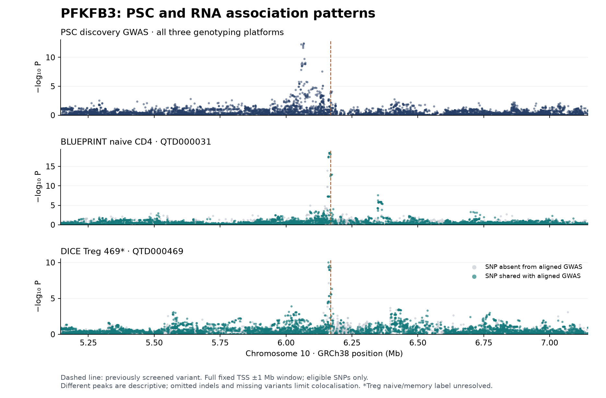
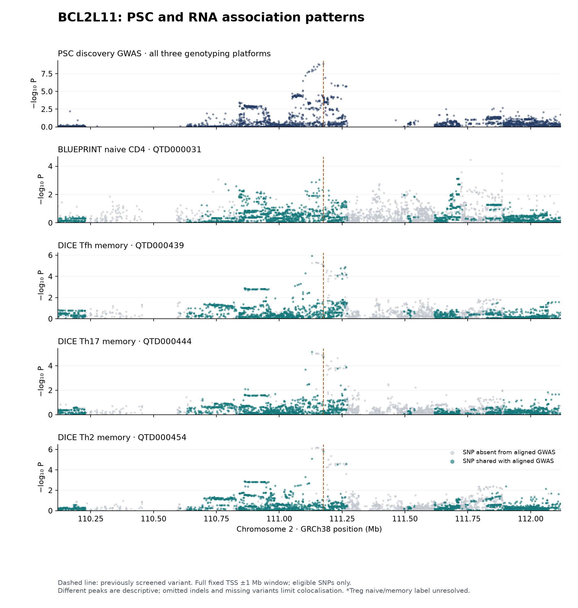
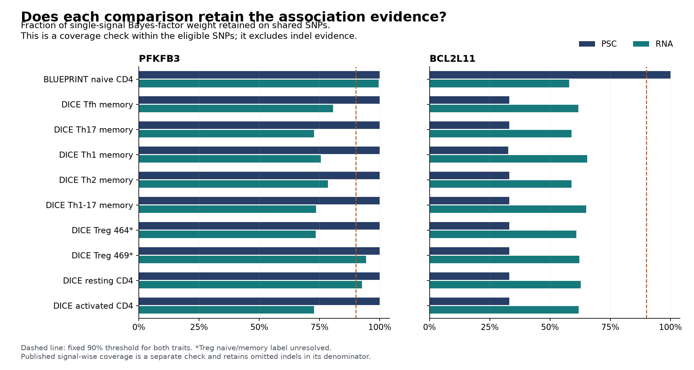

# Do the PFKFB3 and BCL2L11 RNA associations share the PSC signal?

Completed September 12, 2026. Public aggregate data; no new AlphaGenome prediction.

**Neither pair currently meets our standard for a shared PSC–RNA signal.** PFKFB3's SNP results favor different signals, and its secondary published RNA signal also appears distinct. Its strongest RNA signals remain unresolved in the full analysis because small deletions carry substantial evidence that our SNP inputs omit. BCL2L11 remains unresolved because important PSC-associated variants are missing from the RNA comparisons.

Colocalisation asks whether two association patterns are consistent with the same underlying causal variant. A variant can associate with both PSC and RNA simply because it is correlated with different causal variants nearby. The earlier five significant RNA associations remain valid observations; they do not establish that changing either gene mediates PSC susceptibility.

| Candidate | What the completed analysis supports | Research decision |
|---|---|---|
| rs7923054 → PFKFB3 | Eligible-SNP comparisons strongly favor different PSC/RNA signals in BLUEPRINT and DICE Treg QTD000469. The secondary BLUEPRINT signal is also distinct under the reference-LD sensitivity analysis. Dominant published RNA signals fail full evidence coverage. | Weaker support than the single-variant RNA result suggested. Resolve omitted indels before making a full negative claim or proposing a PSC mechanism. |
| rs72837826 → BCL2L11 | The three earlier positive DICE contexts retain only 33.0% of eligible PSC SNP evidence and 58.9–61.7% of RNA SNP evidence. No published 95% RNA credible set was found for this gene in the ten selected contexts. | Keep unresolved. Obtain better variant coverage and a usable molecular signal before interpreting a colocalisation probability. |

These are susceptibility analyses using published cohorts. They establish neither a treatment target nor an effect on progression of established PSC.

## What was tested

Both genes were assessed across **all ten previously selected CD4 datasets**, preserving 20 gene–context comparisons. We used complete fixed gene-TSS ±1 Mb queries, including nonsignificant associations, rather than a handful of selected variants. The [original plan](../config/coloc-plan.json) was frozen at 11:22:10 UTC; its numerical inputs were frozen at 11:37:04 UTC. Both cohorts were already used in the original PSC evidence base. This is a new analysis of reused data, not independent validation of the original study or AlphaGenome. [Goode et al. (2024)](https://www.nature.com/articles/s41467-024-53602-w).

The regional subsets preserve 10,653 original GWAS rows and 165,288 nominal RNA-association rows. After alias handling and explicit allele/build filters, the amended GWAS has 6,919 eligible SNPs for PFKFB3 and 2,742 for BCL2L11. The RNA inputs contain 117,988 eligible gene–dataset SNP rows across the 20 comparisons. These counts are not independent variants or donors. [All query records and source hashes](../config/coloc-qtl-queries.json).

The analysis uses the 2017 discovery GWAS, whose genome-wide sample is **2,871 cases and 12,019 controls**. The larger discovery-plus-replication totals in the paper cannot be assigned to every genome-wide SNP. Original statistics are GRCh37; RNA statistics are GRCh38. [Ji et al. (2017)](https://www.nature.com/articles/ng.3745), [GWAS Catalog GCST004030](https://www.ebi.ac.uk/gwas/studies/GCST004030).

## Why a documented amendment was necessary

The original analysis retained only GWAS variants measured on both genotyping platforms, because we initially had only the combined sample counts. That excluded important variants. Every original comparison failed the fixed evidence-coverage gate; BLUEPRINT PFKFB3 retained only 4.10 × 10⁻⁹ of its eligible RNA Bayes-factor weight. Those [original results](coloc-baseline.csv) are preserved as a coverage failure and do not support a biological conclusion.

The publisher's Supplementary Table 1 resolves the platform counts:

| GWAS platform label | Cases | Controls | Total |
|---|---:|---:|---:|
| both | 2,871 | 12,019 | 14,890 |
| omni | 2,170 | 9,216 | 11,386 |
| affy | 701 | 2,803 | 3,504 |

Omni counts come from cells B13–D13, sheet “Table 1”; Affymetrix case/control counts are the overall totals minus Omni, cross-checked against E13–G13. [Original publisher workbook](https://media.springernature.com/original/springer-static/esm/art%3A10.1038%2Fng.3745/MediaObjects/41588_2017_BFng3745_MOESM245_ESM.xlsx).

The [separate amendment](../config/coloc-platform-plan.json) was frozen at 11:47:36 UTC, after observing that coverage failure and before the amended posteriors. It uses each SNP's documented sample size and case fraction without changing the genes, contexts, windows, priors or decision thresholds. This is an exploratory amendment, not a preregistered success. Failed PMC document requests returned HTML challenges; they are explicitly excluded from evidence in the [source record](../config/coloc-platform-sources.json).

The Omni total also matches the 11,386-person field in the older FINEMAP logs. That is a useful provenance clue, but it does not resolve the existing log/configuration discrepancies or prove which inputs generated the published figures.

## PFKFB3: separate signals in the evaluable comparisons

Within the eligible SNP universe, the amended single-causal-variant model assigns almost all probability to **H3: both traits associate through different variants**, in both earlier positive contexts. H4 denotes a shared causal variant under that model; it is not the probability that the gene is a treatment target.

| Context | Shared SNPs | PSC evidence retained | RNA evidence retained | H4, primary prior | H4 range across all six baseline settings |
|---|---:|---:|---:|---:|---:|
| BLUEPRINT naive CD4, QTD000031 | 6,385 | >99.99% | 99.52% | 2.28 × 10⁻⁹ | 2.28 × 10⁻¹⁰–2.29 × 10⁻⁸ |
| DICE Treg subset, QTD000469 | 5,921 | >99.99% | 94.34% | 5.77 × 10⁻⁸ | 5.77 × 10⁻⁹–1.36 × 10⁻⁵ |

The strongest eligible PSC association is at GRCh38 chr10:6,066,377 (P = 3.68 × 10⁻¹³). The strongest BLUEPRINT RNA SNP is rs611911 at chr10:6,163,864 (RNA P = 3.18 × 10⁻¹⁹); its PSC P is 0.0281. The screened rs7923054 has PSC P = 8.56 × 10⁻⁵ in this discovery file. A screened variant, a marginal association lead, and an archived fine-mapping candidate need not be the same record.

We then obtained the **complete published SuSiE Bayes-factor vectors**, including indels, for BLUEPRINT and DICE QTD000469. Both compressed archives were scanned through end-of-file: 2,431,437,676 and 824,792,197 bytes. Only the 10,552 and 10,264 PFKFB3 rows are retained in the repository. We did not reconstruct these vectors from a truncated credible set. [BLUEPRINT archive](https://ftp.ebi.ac.uk/pub/databases/spot/eQTL/susie/QTS000002/QTD000031/), [DICE archive](https://ftp.ebi.ac.uk/pub/databases/spot/eQTL/susie/QTS000026/QTD000469/), [complete-stream hashes](../config/coloc-published-bf-queries.json).

| Published RNA component | Distinct variants in its 95% credible set | Full RNA signal weight retained in the GWAS comparison | Signal-wise result |
|---|---:|---:|---|
| BLUEPRINT component 1 | 5 | **50.47%** | Unavailable: fails 90% coverage gate. |
| BLUEPRINT component 2 | 1 | **99.94%** | Favors a different signal. Primary H4 = 3.43 × 10⁻¹⁰; all nine prior/sample-size settings range from 3.33 × 10⁻¹¹ to 4.59 × 10⁻⁹. |
| DICE QTD000469 component 1 | 10 | **54.06%** | Unavailable: fails 90% coverage gate. |

The strongest BLUEPRINT component assigns 47.55% of its normalized component Bayes-factor weight to `chr10_6161637_TAGAG_T`. DICE assigns 27.58% to `chr10_6161575_TAC_T`. Across all indels, the weights are 49.44% and 41.76%, respectively. Additional missing SNPs account for the remaining coverage gap. These are model-dependent signal weights, not measured fractions of disease risk. The original credible-set file has extra rows for rsID aliases; the actual set sizes are **5, 1 and 10**, not 6, 1 and 15. Full vectors reproduce all published credible-set PIPs within 1.5 × 10⁻¹⁴.

The secondary BLUEPRINT component is dominated by rs2387397 at chr10:6,348,230 and differs from the fitted PSC component. That result cannot rescue the missing dominant-component comparisons or rule out every mechanism involving PFKFB3. The [complete signal-status table](coloc-signal-status.csv) accounts for all 27 component/prior/sample-size combinations and the 18 gene–contexts without published credible sets. Coverage failures have no interpreted posterior.

## BCL2L11: missing evidence prevents a decision

The earlier rs72837826 RNA hits in DICE Tfh, Th17 and Th2 memory remain observed associations. Each uses 89 donors and only nine minor-allele carriers; the subsets share donors. Their colocalisation intersections omit about **67% of the eligible PSC SNP Bayes-factor weight**. BLUEPRINT retains nearly all PSC SNP weight but only 58.0% of RNA weight. All ten BCL2L11 contexts fail the joint 90% coverage gate.

The missing DICE variants are concrete. In each of the three earlier positive contexts, rs13405741 alone carries 19.96% of the eligible GWAS single-signal weight, followed by the source-specific rs72837816 A/C record (16.14%), rs72836352 (10.39%), and rs144569746 (9.10%). An rsID alone cannot resolve a multiallelic record. [Top missing GWAS variants for every context](coloc-missing-gwas-variants.csv).

The three baseline H4 values are 0.0938, 0.0643 and 0.1099 at the primary prior. They change substantially with prior and RNA-variance assumptions; the largest across the fixed sensitivities is 0.553. **These coverage-failed numbers are neither convincing shared-signal evidence nor a sound negative test.** No published 95% SuSiE credible set for BCL2L11 appears in the ten selected Catalogue contexts. This records unavailable signal-level evidence, not proof that RNA has no genetic effect.

## Methods and boundaries

The baseline uses coloc 5.2.3 approximate Bayes factors: original GWAS P values, control minor-allele frequency, per-platform N and case fraction; RNA beta and variance, with unit expression SD as the primary assumption and estimated SD as a sensitivity. We do not assume the source GWAS “SE” is a log-odds standard error. Priors are p1 = p2 = 10⁻⁴ and p12 = 10⁻⁶, with 10⁻⁷ and 10⁻⁵ sensitivities. All 120 amended baseline rows and the 120 original rows are retained. The fixed strong-sharing rule requires H4 ≥0.9 at the primary prior, ≥0.8 in sensitivities, adequate coverage and usable multiple-signal evidence. No pair qualifies. [Coloc prior sensitivity](https://chr1swallace.github.io/coloc/articles/a04_sensitivity.html).

GWAS bases undergo unique reciprocal UCSC chain mapping from GRCh37 to GRCh38. Exact two-allele identities are joined after mapping; ambiguous mappings and non-SNVs are excluded with a reason. Palindromic SNPs require compatible public EUR allele frequencies within 0.15. A colon-form key such as `chr10:6348230:C:G` uses lexically sorted alleles and is **not a REF/ALT identifier**. Signed Z and LD use dosage of the lexically larger allele. Original source fields remain available separately.

Signal-wise colocalisation uses the published RNA component vectors and newly fitted GWAS SuSiE signals. GWAS LD comes from 503 public 1000 Genomes EUR donors, not the GWAS participants. All six amended GWAS fits converge with one 95% credible set each; they use L=10, maximum 200 iterations, fixed seed, and no residual-variance estimation. Scalar N=11,386 is primary, with N=3,504 and 14,890 sensitivities. This brackets known platform sizes but **does not reconstruct the covariance of overlapping genotyping subsets**. Reference-LD mismatch diagnostic s is approximately 0.180 for PFKFB3 and 0.0545 for BCL2L11. It is a diagnostic parameter, not an “error percentage”; convergence does not establish calibrated fine-mapping. These remain sensitivity analyses. No EUR-reference model is imposed on DICE. [Coloc with SuSiE](https://chr1swallace.github.io/coloc/articles/a06_SuSiE.html), [SuSiE-RSS guidance](https://stephenslab.github.io/susieR/articles/finemapping_summary_statistics.html), [LD diagnostics](https://stephenslab.github.io/susieR/articles/susierss_diagnostic.html).

Evidence coverage is the fraction of normalized Bayes-factor weight retained on the intersecting variants, with at least 100 shared variants and at least 90% weight retained in each trait/component. This is more informative than SNP count alone, but baseline denominators cover only eligible SNPs. The published-component denominators also retain unmatched indels. Neither guarantees that every truly causal variant was measured.

QTD000464/469 retain their conflicting naive/memory metadata; neither is relabeled by inference. Source cohort reuse, shared DICE donors, uncertain model-training overlap, the earlier mixed AlphaGenome track directions, and the old fine-mapping archive's provenance limitations remain. Colocalisation would not by itself establish mediation, intervention direction, safety or treatment benefit.

## Files and verification

Start with the [20-context summary](coloc-context-summary.csv), [45-row signal-status table](coloc-signal-status.csv), [missing-variant table](coloc-missing-gwas-variants.csv), and [machine-readable audit](coloc-summary.json). Full original and amended R outputs remain separate. In the raw signal output, coloc omits the failing BLUEPRINT component and returns incomplete NA vectors for DICE; the derived status table restores all planned rows and marks these as unavailable. Tiny near-zero H0 placeholders in those incomplete vectors are not valid posterior results.

All 57 Python tests and both R verification suites pass. Tests cover allele/build handling, missing high-weight variants, shared-versus-distinct signals, a published multiple-signal fixture, and platform-specific Bayes factors. A separate Python calculation agrees with the official R GWAS log Bayes factors within 7.4 × 10⁻¹³. Source effects at all five earlier RNA hits exactly reproduce the previous beta, SE and P values. Full-vector PIP reconstruction and posterior sum/range checks pass. A portable copy without 103 ignored cache files reproduced all ten generated report artifacts and both baselines exactly using the pinned installed runtime. The [verification record](coloc-verification.json) also records checks of 235 local artifacts and all six LD matrices. See [reproduction instructions](../docs/coloc-reproduction.md) for the additional requirements for full LD refitting.

The next useful work is the [targeted input-repair plan](../docs/coloc-next-inputs.md): reference-verified indel matching for PFKFB3, missing-variant and filtering evidence for BCL2L11, and cohort-matched GWAS covariance where obtainable. Neither gene is ready for a PSC-targeted experimental proposal on the basis of these results alone.
