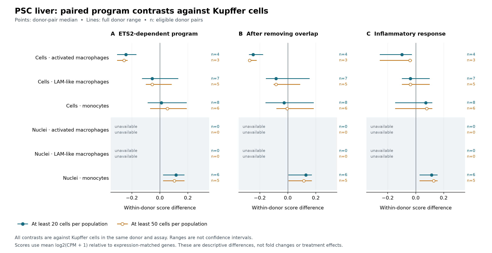

# ETS2 program benchmark and inhibitor-method reconstruction

Analysis date: September 12, 2026. This report combines a source audit, a published experimental-summary benchmark and a donor-level follow-up in the public PSC liver atlas. The [methods](../docs/ets2-program-methods.md), [frozen plan](../config/ets2-program-plan.json) and [reproduction guide](../docs/ets2-program-reproduction.md) define its scope.

**The program is measurable, but this analysis does not establish an ETS2-specific disease-activity score.** Its expression-adjusted score is lower in the atlas's activated-macrophage population than in Kupffer cells in every eligible whole-cell donor pair. Removing direct overlap with four broad biological programs preserves that direction. Separately, the inhibitor-file reconstruction recovers the intended analysis method and numerically reproduces all nine archived pathway enrichment scores.

## PSC liver program measurements

Of the 927 intended primary-program genes after excluding ETS2, 906 map uniquely in each atlas object (97.7%); 21 are unavailable. All eight original programs pass their fixed mapping gates. Removing genes present in the inflammatory-response, interferon-gamma, oxidative-stress and apoptotic-signaling sets removes 165 primary-program genes, leaving 741. This derived sensitivity analysis uses its parent's 97.7% mapping gate; its 741/927 retention fraction is not an annotation-coverage failure.

The analysis aggregates 10,802 selected PSC whole cells into 32 donor/population groups and the corresponding selected PSC nuclei into 14 groups. At the primary 20-cell threshold, whole-cell eligibility is eight donors for monocytes, eight for Kupffer cells, seven for LAM-like macrophages and four for activated macrophages. Nuclei provide six eligible monocyte and six Kupffer donors. The nuclear object has no author-labeled activated or LAM-like macrophages, so those comparisons remain unavailable.

All programs have enough eligible expression-matched reference genes. Matching is approximate: the primary program's mean reference-abundance mismatch is +0.009 log-expression units in cells and +0.105 in nuclei. Across all programs it ranges from −0.001 to +0.234. Baseline offsets are not evidence of activation, and matching mean abundance does not match co-regulation or the way each gene varies across populations. See the [matching audit](../data/derived/ets2-program-matching-qc.csv).

The primary paired results at 20 cells per population are:

| Same-donor comparison against Kupffer cells | Donor pairs | Median primary-score difference | Full donor range | Positive pairs |
|---|---:|---:|---:|---:|
| Whole-cell activated macrophages | 4 | −0.243 | −0.306 to −0.168 | 0/4 |
| Whole-cell LAM-like macrophages | 7 | −0.055 | −0.128 to +0.131 | 2/7 |
| Whole-cell monocytes | 8 | +0.011 | −0.087 to +0.191 | 5/8 |
| Nuclear monocytes | 6 | +0.116 | +0.022 to +0.175 | 6/6 |

These scores are differences in mean log2(CPM + 1) after an expression-matched reference, not expression fold changes. Ranges describe the observed donors, not confidence intervals. The activated-macrophage median remains negative under the 50-cell threshold (−0.256; three pairs). Its 20-cell leave-one-donor-out medians range from −0.256 to −0.230; removing another donor from the three-pair sensitivity result would fall below the fixed gate.

After removing the 165 overlapping genes, activated macrophages remain lower (median −0.248, all four pairs negative), and nuclear monocytes remain higher (+0.129, all six pairs positive). Whole-cell monocytes change from a small positive median to a small negative median (−0.027). Broad inflammation also increases in nuclear monocytes (+0.114). Removing literal gene overlap therefore does not establish a separate ETS2-specific mechanism.

The [figure PDF](figures/ets2-program-contrasts.pdf) is available for sharing. The underlying tables include **144 context summaries, 108 planned paired contrasts and 80 descriptive correlations**, with all unavailable rows retained. The selected figure shows the primary program, its nonoverlap sensitivity and inflammation; the tables preserve all nine programs.

Correlations with broad inflammation range from 0.357 to 0.771 across the six measured population/modality contexts at 20 cells. Correlations with ETS2 RNA range from 0.371 to 1.000; the latter involves only four activated-macrophage donors. Such small samples cannot establish incremental predictive value. Cells and nuclei also overlap in donor identities and cannot be counted as independent replications.

The practical implication is to retain ETS2 as an experimentally supported research lead while avoiding an assumption that this transferred score identifies ETS2-driven liver cells or predicts inhibitor response. Cell labels are themselves based on RNA patterns; these observational contrasts do not test causal dependence. Source: [Andrews et al. liver atlas](https://pubmed.ncbi.nlm.nih.gov/38199298/), [versioned CELLxGENE collection](https://cellxgene.cziscience.com/collections/0c8a364b-97b5-4cc8-a593-23c38c6f0ac5).

## What the experimental evidence supports

The released ETS2-dependent program contains 928 genes whose RNA decreases after gRNA1 disruption of ETS2. Its membership exactly reproduces the publisher's Supplementary Table S1 at adjusted P < 0.05 and negative log fold change. Removing ETS2 itself leaves 927 genes for our benchmark. This is a published experimental signature, not a new gene discovery.

The second guide and enhancer deletion largely preserve that direction. Overexpression reverses it only partially in these gene-by-gene summaries:

| Experiment | Program genes measured | Negative statistic | Positive statistic | Interpretation |
|---|---:|---:|---:|---|
| ETS2 gRNA1 disruption | 927/927 | 927 | 0 | Circular reproduction of the list's definition |
| ETS2 gRNA2 disruption | 927/927 | 927 | 0 | Agreement across related guides in the same study |
| chr21 enhancer deletion | 927/927 | 909 | 18 | 98.1% of measured program genes decrease |
| ETS2 overexpression, 250 ng | 831/927 | 413 | 418 | 50.3% increase; 96 genes unavailable |
| ETS2 overexpression, 500 ng | 831/927 | 344 | 487 | 58.6% increase; 96 genes unavailable |

These are counts of effect directions, not counts of statistically significant effects. Across all shared genes, the signed t-statistic correlations are 0.858 for the two guides, 0.682 for gRNA1 versus enhancer deletion, 0.038 for gRNA1 versus 250-ng overexpression, and −0.092 for gRNA1 versus 500-ng overexpression. The two overexpression doses correlate at 0.593. Every planned comparison is retained in the [comparison table](../data/derived/ets2-experiment-comparisons.csv).

The disruption experiment used inflammatory TPP macrophages; overexpression used resting M0 macrophages with low-dose LPS. These are different starting states, and guide/dose comparisons are related experiments, not independent cohorts. A weak genome-wide reverse correlation does not negate the authors' selected pathway results. It does limit use of the full list as a universal, reversible ETS2 activity meter. Source: [Stankey et al.](https://www.nature.com/articles/s41586-024-07501-1), [publisher tables](https://media.springernature.com/original/springer-static/esm/art%3A10.1038%2Fs41586-024-07501-1/MediaObjects/41586_2024_7501_MOESM3_ESM.xlsx).

## Source discrepancies remain visible

The [source audit](../docs/ets2-source-semantics.md) preserves original identifiers, statistics, footer descriptions and source hashes. The saved knockout vector agrees with final S1 t statistics for all 11,658 uniquely matched symbols within an absolute tolerance of 10⁻⁹. The two saved overexpression vectors do not numerically reproduce final S2: each has 9,908 unambiguous symbol matches, with 36 and 42 sign disagreements respectively. Ambiguous symbols are excluded from identity-based matching; a numerically similar row is not chosen to resolve an identifier.

The experimental benchmark therefore uses the final publisher tables. It preserves both inhibitor files but leaves their treatment-direction comparisons unavailable under the frozen source-orientation rule. The supplementary reconstruction below adds evidence without silently changing that rule or the original results.

## How much of the inhibitor method can be recovered?

**A useful approximation of the pipeline is possible, and its ranking-to-pathway calculation can be reproduced.** The public R code supplies the intended three-donor, nine-sample design; a CPM > 0.5 filter in all nine samples; edgeR normalization; a drug-plus-donor design; limma voom fitting and empirical-Bayes moderation; and 100-nM/500-nM minus control contrasts. The two released files each contain 12,095 unique symbols with finite, descending statistics. See the [full reconstruction](../docs/ets2-inhibitor-reconstruction.md).

Using the 500-nM vector, the original nine gene sets and a weighted running-sum calculation reproduces **all nine archived enrichment scores within 10⁻⁹**. A separate NumPy implementation gives a maximum absolute difference of **1.63 × 10⁻¹³**. This is a direct numerical link from the released vector to the archived pathway output, stronger evidence than a merely plausible biological pattern. These scores are raw enrichment scores (ES); normalized scores (NES) also depend on a random-set reference distribution.

The archived NES values also match the final publisher's nine Figure 5 values within 10⁻⁹ (maximum difference 2 × 10⁻¹⁶). Negating the statistics and reversing their order reverses every ES sign. Together, this supports the 500-nM file's intended connection to the published inhibitor-versus-vehicle analysis. We have reproduced ES and compared existing NES values; we have not recreated the historical random-set null, NES normalization or P values.

The upstream fit is still underdetermined. The matching rank-export code and exact symbol-mapping/collapse rule are absent, the request for 12,801 topTable rows does not by itself explain the final 12,095 symbols, and the macrophage count matrices are controlled access. A moderated t statistic combines a coefficient and its uncertainty; a single statistic cannot recover either uniquely, much less each donor's expression. The files cannot yield a donor count matrix, an inhibitor dose-response curve or a patient treatment simulation.

This reconstruction is an explicitly subsequent forensic analysis requested after the original benchmark plan. Numerical compatibility does not establish that every historical processing step ran exactly as shown. Its results are stored separately from the frozen benchmark. Sources: [versioned public release](https://zenodo.org/records/10707942), [Figure 5 source data](https://media.springernature.com/original/springer-static/esm/art%3A10.1038%2Fs41586-024-07501-1/MediaObjects/41586_2024_7501_MOESM9_ESM.xlsx).

## Interpretation boundary

This work analyzes published experiments and public advanced-disease tissue. It contains no personal genome or health records, makes no clinical efficacy claim, and does not select a treatment. Genetic susceptibility, RNA expression, dependency on ETS2 and response to a drug remain distinct questions.

## Next useful work

The most useful inhibitor follow-up is narrowly defined: obtain the two original per-gene MEK differential tables, contrast labels, symbol-mapping/export code and package versions. These would close the missing production link without requiring us to reconstruct donor data from ranks. Re-fitting the original analysis would additionally require authorized access to its counts and sample design. No request has been sent.

For independent computation, test transfer of the fixed source-defined program in a separate, donor-annotated macrophage perturbation dataset, with its own exact mapping audit, a general inflammation comparator and an explicit source-overlap audit. This would address whether the current liver result is a cell-state/context limitation. Optimizing the signature against this same atlas, or using it immediately for drug ranking, would answer a different and more easily overfit question.

## Verification and reproducibility

The full repository suite passes **120 tests** in the recorded research environment. A second atlas run with different chunk boundaries reproduces all six public tables exactly; an isolated experimental-summary replay reproduces all four tables. Source hashes, the frozen plan and its eight pinned inputs remain valid.

An independent comparison against the previous five-gene pipeline matches every selected donor group's cell count and all-feature denominator (46 groups), plus all 230 gene-count comparisons. A separate workbook reader reproduces the five publisher-statistic correlations and program direction counts. A separate NumPy calculation reproduces the nine inhibitor ES values. The [verification record](ets2-program-verification.json) pins the scripts and checks. These checks establish computational consistency, not independent biological validation.
