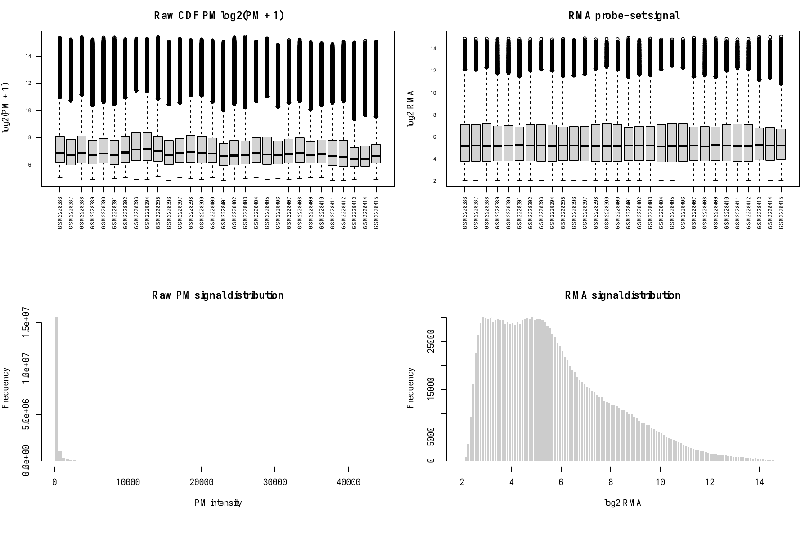
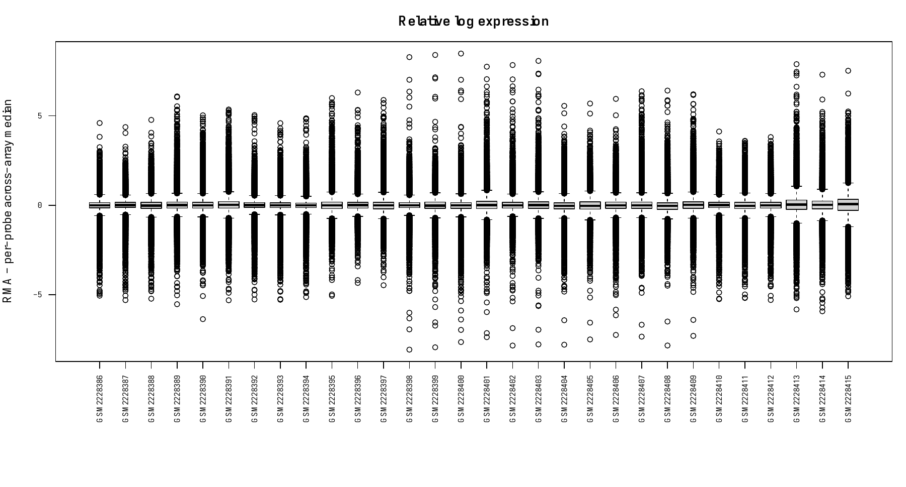

# GSE84161 normalization and mapping

Completed September 12, 2026. All **30 original monocyte arrays** have been freshly normalized together. The result contains **54,675 probe sets × 30 arrays**, followed by **20,486 Entrez genes × 30 arrays** after fixed median aggregation. No program scores or treatment/donor contrasts were calculated.

The primary ETS2 program has **801 of 927 intended genes represented (86.4%)**, above the fixed 80% coverage threshold. Eight of the nine planned programs pass their mapping gates. The ETS2 gRNA1-up companion fails at **518/668 (77.5%)** and remains unavailable under the current rules. These are measurement and mapping results, not evidence of a treatment response.

## What was run

The [method specification](../docs/gse84161-normalization-method.md) was frozen at 17:41:34 UTC before new program coverage and array processing. The final [execution plan](../config/gse84161-normalization-plan.json) was frozen at 18:12:10 UTC; its successful run took place from 18:12:29 to 18:13:18 UTC. Program coverage was already known at execution freeze, while no new program effect had been inspected.

The implementation uses R 4.4.3, `affy` 1.84.0, `affyio` 1.76.0, `preprocessCore` 1.68.0 and the full `hgu133plus2cdf` 2.18.0 CDF. All arrays enter `affy::rma` together with background correction, quantile normalization and `bgversion=2`. For every eligible Entrez gene, the gene matrix takes the per-array median of all its eligible probe sets. No variance-based probe selection, second log transform or subsequent normalization is applied. Matrices retain double precision. [Official affy reference](https://www.bioconductor.org/packages/release/bioc/manuals/affy/man/affy.pdf).

A summary-writing bug and a native threading failure were repaired before the successful run. The [serialization correction](../docs/gse84161-normalization-run-amendment.md), [runtime correction](../docs/gse84161-runtime-correction.md), original execution plans and [same-version source-build manifest](../config/gse84161-preprocesscore-thread-override.json) preserve the details. The successful environment uses official `preprocessCore` 1.68.0 rebuilt with threading disabled; the original base package lock alone does not describe this override. The analysis settings and source data were unchanged.

## Gene mapping and coverage

The complete pinned GPL570 annotation has 54,675 probe sets. Exactly **41,834** have one unique usable Entrez identifier; **2,300** have multiple identifiers and **10,541** have blank or unresolved identifiers. All probe sets remain in the normalized probe matrix, with only the eligible ones contributing to gene medians. Every probe's original annotation and mapping reason is preserved in the [probe map](../data/derived/gse84161-probe-map.csv.gz).

The Ensembl 116 June 2026 archive export contains 91,748 relationship rows and 86,411 distinct Ensembl IDs. Its terminal success marker and separate whole-dataset count agree. Reciprocal one-to-one relationships are evaluated across this entire reference before restricting to array genes or programs. The four ETS2/CHR21 sets use Ensembl IDs; the four comparison sets use exact HGNC symbols. This source-namespace distinction was recorded before mapping. No alias rescue or expression-based mapping choice was used. See the [source manifest and exact queries](../config/gse84161-gene-map-sources.json) and [complete crosswalk](../data/derived/gse84161-gene-map.csv.gz).

| Program | Array genes / intended source members | Coverage | Mapping gate |
|---|---:|---:|---|
| ETS2 gRNA1 down — primary | 801 / 927 | 86.4% | Pass |
| ETS2 gRNA1 up | 518 / 668 | 77.5% | **Fail; unavailable** |
| ETS2 gRNA2 down | 764 / 875 | 87.3% | Pass |
| Chr21 enhancer deletion down | 120 / 141 | 85.1% | Pass |
| Inflammatory response | 666 / 815 | 81.7% | Pass |
| Response to interferon gamma | 114 / 139 | 82.0% | Pass |
| Response to oxidative stress | 378 / 436 | 86.7% | Pass |
| Apoptotic signaling | 512 / 588 | 87.1% | Pass |
| Primary with comparator overlap removed | 652 retained; 149 overlaps removed | Parent gate: 86.4% | Pass; ≥10 remain |

The ninth program uses the prespecified parent coverage gate (801/927) plus its remaining-gene minimum. Its retained fraction is **652/927 = 70.3%**; that fraction is reported separately and is not substituted into the parent gate. The [coverage table](../data/derived/gse84161-program-coverage.csv) makes both denominators explicit.

For the primary program's 126 losses, 74 have ambiguous Ensembl–Entrez relationships, 23 are present in Ensembl without an Entrez relation, two are absent from this Ensembl snapshot, and 27 have an eligible crosswalk but no eligible array probe. Absence from a snapshot does not establish retirement. All original members and outcomes remain in the [member mapping table](../data/derived/gse84161-program-mapping.csv.gz).

All **20,486** eligible Entrez genes remain in the full gene matrix: 17,451 have a reciprocal one-to-one Ensembl relationship; 1,258 have multiple Ensembl matches; 176 have a single Ensembl match with multiple Entrez links; and 1,601 have no Ensembl relation. The [complete array-gene universe](../data/derived/gse84161-entrez-gene-universe.csv.gz) records every gene, its contributing probes and its status. Crosswalk exclusions affect program membership, not retention in this full matrix.

## Array quality checks

Each array supplies **604,258 CDF-defined perfect-match entries**. Across all 30 arrays, there are no missing, non-finite, negative or zero PM entries. Raw PM medians range from 85 to 141; overall raw intensities range from 27 to 44,373. All normalized probe and Entrez values are finite, with expected unique feature IDs and the fixed GSM sample order.

Normalized probe-set medians range from 5.134 to 5.245 log2 RMA units. RLE medians range from −0.0353 to +0.0623, with interquartile ranges from 0.2509 to 0.6121. GSM2228415, GSM2228413 and GSM2228414 have the three widest RLE distributions (IQR 0.6121, 0.5183 and 0.4376). These are descriptive observations; the source of the differences is unresolved. All 30 arrays are retained under the method's rule against automatic signal-based exclusions.

RLE is calculated from each probe's median across all arrays for diagnostics only. It does not replace the expression measurements. Compact images above are rendered from the complete vector PDFs; those larger originals remain ignored locally with their hashes recorded in the [normalization audit](gse84161-normalization-audit.json). No point selection or numeric QC changed during rendering. These checks establish usable numeric inputs, not absence of technical confounding.

## Verification and what this enables

The independent implementation recomputed **all 614,580 Entrez-matrix values exactly**, using explicit probe-ID joins. It also reproduced normalized-probe quantiles within 4.98 × 10⁻¹⁴ and RLE summaries within 5.33 × 10⁻¹⁵, with no mismatches at the declared numerical tolerance. The complete probe-ID sets agree with GPL570, although their row orders differ at 1,129 positions; explicit ID joins preserve the correct gene assignments. This independently checks aggregation and QC, not a second implementation of the RMA algorithm.

An independent source parser agreed on every program's mapped membership. A replay reproduced all five mapping tables and the mapping audit byte for byte. The complete array-gene universe was checked separately, and 41 historical/method artifact hashes remained unchanged. The full repository suite passes **144 tests**, including the summary-writing and median-aggregation regression fixture. The [verification record](gse84161-normalization-verification.json) links the hashes and checks; the [reproduction guide](../docs/gse84161-reproduction.md) provides commands and runtime limitations. A clean-machine installation and complete independent RMA rerun have not been performed.

This completes normalization, mapping and descriptive QC for the requested step. GSE84161 remains comparative MEK/TPL2 pharmacology, without a direct ETS2 perturbation. Anonymous sample-to-donor correspondence, exact compound identities and the paper/GEO concentration discrepancy remain unresolved. The [prepared source questions](../docs/gse84161-source-questions.md) are still unsent. A later scoring run needs its own fixed execution inputs and the applicable readiness checks; donor-paired interpretation requires source-backed grouping. No clinical conclusion follows from this preparation.
