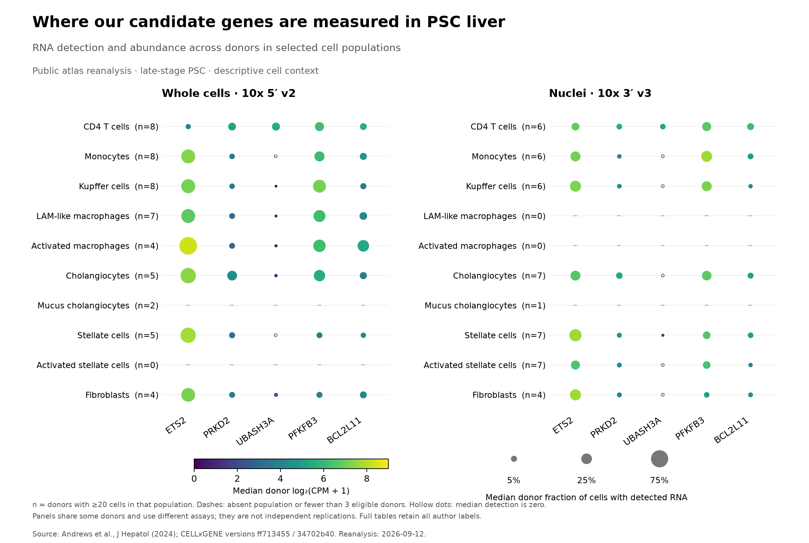

# PSC liver-cell context for five genetic candidates

Analysis date: 2026-09-12. This phase is complete: the public expression objects were downloaded, checked and analyzed at donor level. The [analysis plan](../config/liver-atlas-plan.json) was frozen at 14:15:24 UTC after metadata inspection and before candidate expression inspection.

**UBASH3A has a usable CD4 T-cell context, and ETS2 and PRKD2 have measurable monocyte contexts in PSC liver.** PFKFB3 and BCL2L11 are also measured in CD4 T cells, but their unresolved genetic associations remain unresolved. These observations support where to investigate the existing hypotheses; they do not demonstrate variant effects, a PSC-specific expression change, or treatment benefit.

[Printable figure](liver-atlas-candidate-contexts.pdf) · [Complete expression summaries](../data/derived/liver-atlas-expression-summary.csv) · [Every planned contrast and its status](../data/derived/liver-atlas-expression-contrasts.csv)

## What was analyzed

The source is the [Andrews et al. liver atlas](https://pubmed.ncbi.nlm.nih.gov/38199298/), distributed through its [CELLxGENE collection](https://cellxgene.cziscience.com/collections/0c8a364b-97b5-4cc8-a593-23c38c6f0ac5). We pinned the exact collection response and two H5AD versions. These are existing observational data from late-stage PSC tissue, not samples from the person who motivated this project.

| Distributed object | Observations before our exclusions | Donors: PSC / control / PBC | Retained observations |
|---|---:|---:|---:|
| Whole-cell RNA, version `ff713455-e6b7-45b3-b2dd-1c9dd26251f6` | 89,637 | 8 / 6 / 2 | 84,110 |
| Nuclear RNA, version `34702b40-d0ac-4ec2-8871-776ca012efd0` | 105,780 | 7 / 4 / 2 | 97,015 |
| Total observations | 195,417 | 21 distinct donor labels across both objects | 181,125 |

Eight donor labels overlap between the objects, including five PSC donors. The union contains 10 PSC, eight control and three PBC donor labels. The modalities are reported separately; neither 195,417 observations nor the 29 donor/object records represents that many independent people.

The fixed exclusion rules remove 14,292 observations assigned to doublet/hybrid or unknown cell groups. These categories overlap; we count their union rather than adding overlapping flags. Every input observation is accounted for. Source cell annotations are preserved, including labels that are unavailable in one modality.

All five symbols map uniquely to annotated features in both raw matrices. Every stored raw value was checked for valid, finite, nonnegative integer counts, alongside sparse-matrix structure and cell/feature identity checks. Normalized expression matrices were not used as raw counts.

## Candidate measurements

The table shows selected contexts tied to our existing hypotheses, not the highest-scoring cell type selected after searching the atlas. A donor qualifies with at least 20 cells in that population. RNA detection is the median of the donor-specific fractions of cells with at least one recorded count for that gene; it is not the proportion of patients carrying a variant.

| Candidate and context | Whole-cell PSC donors with detected RNA / eligible donors | Median cellular RNA detection | Nuclear PSC donors with detected RNA / eligible donors | Median nuclear RNA detection |
|---|---:|---:|---:|---:|
| ETS2 — monocytes | 8 / 8 | 58.1% | 6 / 6 | 29.7% |
| PRKD2 — monocytes | 8 / 8 | 7.7% | 5 / 6 | 4.5% |
| UBASH3A — CD4 T cells | 8 / 8 | 18.2% | 6 / 6 | 8.0% |
| PFKFB3 — CD4 T cells | 8 / 8 | 24.0% | 6 / 6 | 23.9% |
| BCL2L11 — CD4 T cells | 8 / 8 | 12.9% | 6 / 6 | 13.5% |

Detection rates differ with assay, sequencing depth and the fraction of RNA captured. They do not measure protein abundance, gene activity per molecule, or treatment sensitivity. A zero median does not prove absence from every donor. The full tables retain observed ranges, eligible and excluded groups, gene counts and normalization denominators.

At the stricter threshold of 50 cells, all five selected whole-cell gene/context pairs remain detected in all seven eligible PSC donors. In nuclei, ETS2 and PRKD2 are detected in all five eligible monocyte donors, and UBASH3A, PFKFB3 and BCL2L11 in all four eligible CD4 donors. This supports the measurement context, while reduced donor counts and changes in the summaries remain visible in the sensitivity results.

## Why disease comparisons remain limited

**Whole cells:** all distributed controls are labeled 10x 5′ v1 and all PSC/PBC cells 10x 5′ v2. No comparison across those chemistries is used to estimate a PSC difference. Across both cell-count thresholds, 400 planned gene/context rows are explicitly blocked for this reason; missing-cohort rows are recorded separately.

**Nuclei:** all observations use 10x 3′ v3, but preparation and reference-annotation fields still differ by cohort. Only two control donors share the cases' GENCODE 24 annotation; matching both chemistry and that annotation cannot meet our three-control minimum. Published control alignment software is unspecified in this object. These limitations prevent attributing the numerical differences to PSC alone.

The primary, chemistry-matched descriptive calculation is possible in 10 nuclear cell groups (50 gene/context rows), falling to nine groups (45 rows) at the stricter cell threshold. All 95 results are marked as subject to residual processing confounding. They have no significance labels. **CD4 T cells, monocytes and Kupffer cells each have only two eligible nuclear controls at the primary threshold, so their disease contrasts are not estimable under the frozen rule.**

Leave-one-donor-out ranges are descriptive sensitivities, not confidence intervals. A leave-out is included only if three donors remain in each cohort; where there are exactly three controls, removing a control is not an evaluable sensitivity. These ranges do not remedy systematic processing differences.

Other source limitations remain explicit:

- The nuclear release contains 57,511 PSC and 21,754 PBC observations, compared with 23,000 and 20,202 in the published abstract. We retain the versioned release counts; its exact relationship to the paper's QC subset is unresolved.
- GEO titles support donor-label links, but no exact GEO-library-to-CELLxGENE-library crosswalk was established. The earlier 19 label conflicts are preserved. The author code's `PSC014X` label and the distributed `PSC014` label are recorded as a naming discrepancy.
- Control observations carry `is_primary_data=False`, a provenance/reuse flag. They were not excluded solely for this flag. No other overlapping control-only objects were added to this analysis.
- The tissue is from advanced disease. Genotype, splice-junction choice, protein abundance, progression and intervention response are not measured by this analysis.

The [metadata audit](liver-atlas-metadata-audit.json) and [expression audit](liver-atlas-expression-audit.json) retain the source details, row accounting and numerical coverage.

## Three follow-ups worth carrying forward

1. **ETS2 program in monocytes and macrophage populations.** The gene is readily measured in PSC monocytes, Kupffer cells and author-defined macrophage groups. Next, test the source-defined downstream program from the [published perturbation study](https://www.nature.com/articles/s41586-024-07501-1), with matched control programs and donor aggregation. This will test whether the broader program adds information beyond ETS2 RNA. A weak or nonspecific program would reduce this atlas's support for that mechanism. The [public benchmark input assessment](../docs/ets2-benchmark-next-inputs.md) identifies actual available files and the controlled-access limits. This is reproduction and contextual analysis of an existing mechanism, not a new target discovery.
2. **UBASH3A splice consequence in CD4 T cells.** Its measurement in liver CD4 T cells supports that cellular context. Map the existing +29-nucleotide splice hypothesis onto transcript coding regions and possible RNA-decay consequences before proposing a protein structure. Direct genotype-associated canonical/+29 junction measurements are still required; the present gene-count matrices cannot test splice choice. The [earlier sparse-read result](ubash3a-junction-followup.md) stays inconclusive.
3. **PRKD2 regulatory mechanism in monocytes.** RNA is measurable, although detection is much sparser than ETS2. Combine this context with the [previous allele-aligned monocyte QTL evidence](qtl-followup.md). A future mechanism test should measure both PRKD2 RNA and downstream protein/activity consequences in a relevant, adequately covered setting. Gene expression alone cannot establish that changing PRKD2 mediates PSC susceptibility or benefits established disease.

PFKFB3 and BCL2L11 stay in the complete output tables. Their CD4 expression does not repair the [missing genetic evidence](variant-coverage-repair.md), establish a shared causal signal, or select a drug direction.

## Reproduction and verification

See the [reproduction guide](../docs/liver-atlas-reproduction.md). The source and plan hashes, complete tables and tests accompany this report. A second full count run with different chunk boundaries reproduces all five numerical CSVs exactly; the metadata CSV also reproduces exactly. All 89 repository tests pass. Six independent direct matrix slices agree with the pipeline's selected ETS2/monocyte, PRKD2/monocyte and UBASH3A/CD4 summaries across both modalities. The full matrix analysis is replayable without an AlphaGenome key or GPU. Large downloaded matrices and donor-level expression intermediates remain ignored by Git.
