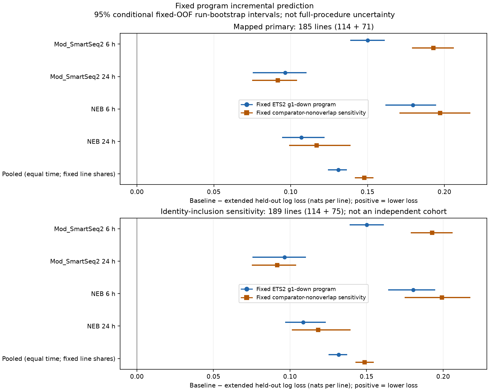
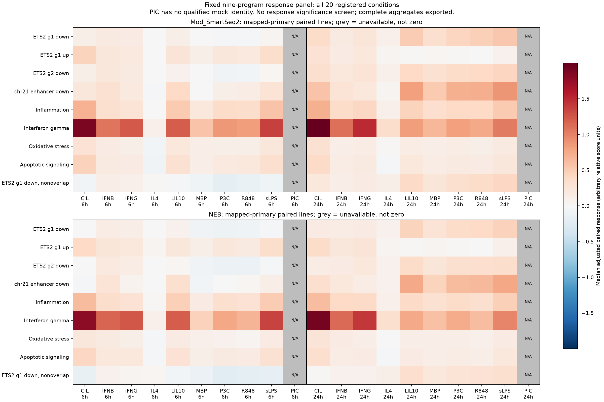

# MacroMap: fixed-program stimulus context

**Status: primary computation, independent verification, numerical replay, aggregate reporting and presentation replay complete.** All scientific freeze pins remain unchanged.

## Main result

Adding the fixed ETS2 gRNA1-down program (ETS2 itself excluded) lowered held-out nine-class log loss from **1.660703 to 1.529782**. The improvement was **0.130921 natural-log units**, or **7.88%** of baseline loss. The prespecified fixed-prediction, run-cluster bootstrap interval was **0.124191–0.136547**. All four protocol/time estimates were positive.

This is **incremental predictive performance of a fixed model in healthy-derived iPSC macrophage stimulus experiments**. It is not PSC diagnosis, proof of ETS2 activity/dependence, a genetic allele-direction result or a clinical outcome. A log-loss reduction is not the same as a percentage-point increase in classification accuracy. The interval is conditional on fitted models/references/folds, not full-procedure or unconditional generalization uncertainty.

- [Frozen protocol](../docs/macromap-program-context-protocol.md), [exact plan](../config/macromap-program-context-execution-freeze.json), [method specification](macromap-program-design.md) and [independent pre-effect review](macromap-independent-review.md)
- [Independent numerical verification](macromap-independent-verification.json) and [clean replay](macromap-replay-verification.json)
- [Aggregate manifest](../data/derived/macromap-program-context/reporting-manifest.json), [prediction table](../data/derived/macromap-program-context/predictions.csv.gz), [complete response table](../data/derived/macromap-program-context/responses.csv.gz) and [all optimizer flags](../data/derived/macromap-program-context/independent-optimizer-qc.csv.gz)
- [Presentation replay](macromap-presentation-replay-verification.json), [reporting contract](macromap-reporting-design.md), [reproduction guide](../docs/macromap-program-context-reproduction.md) and [final stage record](macromap-stage-verification.json)

## What was compared

The original released universe has 58,243 count features and 4,698 samples. Gene totals retain all released rows; 45 reference-only `_PAR_Y` records remain absent, not zeros. The new released-universe quantity does not retroactively pass an earlier historical full-universe gate. Complete pinned original program exports were used; the absent original ETS2 ZIP was not silently replaced by an atlas-mapped subset.

The primary prediction cohort is **185 mapped source lines**, 114 Mod_SmartSeq2 and 71 NEB, with at least one strict paired condition at both 6 h and 24 h. Published unrelated-donor provenance is not an independent kinship check. Entire sequencing runs were held out in five fixed folds within each protocol. Training controls alone set abundance-matched gene references; both training and test predictors use the same outer fold's reference. Predictor scaling uses training paired responses only.

The baseline has four fixed programs: inflammation, interferon-gamma, oxidative stress and apoptotic signaling. The extension adds ETS2 gRNA1-down. Both use the same frozen nine-class ridge method, lambda 0.1, without tuning. Available stimuli are averaged within line/time, times are averaged once with weights 1/2, and protocols use fixed line shares 114/185 and 71/185. Missing measurements are not imputed; folds and failed expected predictions cannot be dropped.

## Complete primary predictive result

Positive gain means lower held-out log loss after adding the ETS2 program. Intervals below are the frozen **conditional fixed-OOF** 95% run-bootstrap intervals; they do not include retraining or reference-estimation uncertainty.

| Protocol / time | Baseline loss | Extended loss | Gain | Conditional interval |
|---|---:|---:|---:|---:|
| Mod_SmartSeq2 / 6 h | 1.552563 | 1.402409 | 0.150154 | 0.138836–0.161265 |
| Mod_SmartSeq2 / 24 h | 1.653192 | 1.556822 | 0.096370 | 0.075380–0.110284 |
| NEB / 6 h | 1.682576 | 1.503107 | 0.179469 | 0.161579–0.194691 |
| NEB / 24 h | 1.824523 | 1.717555 | 0.106968 | 0.094502–0.122046 |
| Fixed-share / equal-time pooled | 1.660703 | 1.529782 | 0.130921 | 0.124191–0.136547 |

The study had already selected successfully stimulated samples using expression QC. This result applies to the released available-condition pattern, not an unobserved complete factorial experiment or every attempted stimulation. Overlapping training sets are not independent fold replications.

The top panel is the mapped primary cohort; the bottom panel is the separately prespecified identity sensitivity. Blue is the original program, orange the nonoverlap sensitivity. Intervals do not include full-pipeline refitting.

## Fixed sensitivities, not replacement endpoints

| Identity scope | ETS2 predictor | Both-time lines | Gain | Conditional interval |
|---|---|---:|---:|---:|
| mapped_primary | ets2_g1_dn | 185 | 0.130921 | 0.124191–0.136547 |
| mapped_primary | ets2_g1_dn_without_comparators | 185 | 0.147878 | 0.141669–0.153906 |
| all_source_lines_sensitivity | ets2_g1_dn | 189 | 0.131721 | 0.125157–0.137276 |
| all_source_lines_sensitivity | ets2_g1_dn_without_comparators | 189 | 0.148769 | 0.142750–0.154782 |

The nonoverlap score retains 759 mapped primary genes after removing 167 shared comparator members. Its larger gain does not replace the original primary endpoint. The less-qualified identity sensitivity adds four separately named NEB `NOMATCH` lines; it is not an independent cohort. All leave-one-run-out **fixed-prediction** gains remain positive; the primary range is 0.129730–0.133208 over 56 omissions. These are not pipeline refits.

Removing shared members addresses literal gene overlap, not expression correlation. Adding a correlated feature at fixed ridge penalty can also change effective regularization and parameterization. The observed gain therefore does not establish unique conditional/information-theoretic ETS2 information. This analysis does not determine how much of the gain has that explanation, and no post-effect penalty/model search was used to decide it.

## Full response panel and opposing directions

Both identity scopes retain all nine programs and all 20 registered stimulus/time conditions. Response summaries use every available strict same-time pair in the identity scope, not only the 185-line both-time prediction cohort. Mapped response cells have 98–117 SmartSeq2 lines and 64–77 NEB lines. Their available-pair pooling is descriptive; the predictive endpoint’s fixed protocol/time weights do not define these response summaries. Each scope has 1,458 available quantity summaries and 54 PIC-unavailable rows. PIC lacks a qualified mock-control identity; it was not assigned a zero response. There is no response-P discovery screen. Pooled response means and medians have **no confidence intervals**; protocol-specific intervals are pointwise and conditional.

The table gives the primary program's **median adjusted-score treatment-minus-control change**. It is not a change in absolute RNA or proof of TF activation.

| Stimulus | SmartSeq2 6 h | SmartSeq2 24 h | NEB 6 h | NEB 24 h |
|---|---:|---:|---:|---:|
| CIL | +0.118 | +0.361 | +0.001 | +0.162 |
| IFNB | +0.180 | +0.186 | +0.146 | +0.141 |
| IFNG | +0.168 | +0.242 | +0.128 | +0.170 |
| IL4 | -0.010 | +0.098 | +0.005 | +0.091 |
| LIL10 | +0.122 | +0.504 | +0.080 | +0.451 |
| MBP | -0.011 | +0.327 | -0.064 | +0.272 |
| P3C | -0.047 | +0.427 | -0.097 | +0.370 |
| R848 | -0.028 | +0.474 | -0.092 | +0.391 |
| sLPS | +0.057 | +0.538 | -0.039 | +0.455 |

Both protocols have positive primary-program medians for all nine 24 h stimuli. Each has four negative medians at 6 h; IL4 and sLPS have opposing early signs across protocols. These descriptive counts are not independent discoveries. Different donor pools also prevent identifying a pure protocol effect. Time-specific matching references differ, so the descriptive early/late patterns are not a formal time-interaction test.

The unadjusted and background components matter. For SmartSeq2 CIL at 6 h, the mean target-program change is **-0.588289**, the mean matched-background change is **-0.707332**, and their mean adjusted change is **+0.119044**. A positive adjusted response can reflect a smaller decrease than background, not target-gene induction. Mean component differences are additive; differences of medians need not equal the median adjusted change.

The complete panels preserve guide/enhancer companions, all four broad comparators, the overlap sensitivity, all quantities, ranges, signs and missing statuses. Related perturbation programs are not independent biological replications. MacroMap does not test the organoid disease-by-IL17 interaction, and none of the new organoid candidates defined these programs.

Both protocols use the same color scale. Grey PIC cells are unavailable, not zero. This shows every program and registered condition, not a significance-selected subset. The complete table also retains raw/background means and medians, ranges, signs, all protocol-specific intervals and the separate descriptive pooling.

## Verification and remaining numerical limits

- All **80 paired-model cells /160 primary fits** passed their frozen status checks. Maximum native final gradient is about 3e-07; no failed cell was dropped.
- The independent verifier checks all model cells, identities, paired X, scalers, independent coefficients, probabilities and losses; all four endpoint sets, conditional prediction intervals and leave-run summaries pass. Maximum coefficient difference is 1.42e-06. The frozen gradient/coefficient criteria are distinct from an independent optimizer's success flag. Separate post-fit flag capture does not alter the original verification or model.
- The separate [post-fit independent optimizer diagnostic](macromap-independent-optimizer-diagnostics.json) reruns the same frozen independent routine for all 160 models: **120 raw success flags are true and 40 are false**, while **all 160 meet the unchanged numerical criteria**. Maximum independent-refit gradient is `4.066594978638404e-9` (frozen limit `1e-7`); coefficient agreement uses the original tolerances. No training feature triggers the frozen constant-scale fallback, and all saved flags agree. These are authenticated reruns, not saved original SciPy result objects. The helper does not return a solver message/status code, so the reasons for false flags are not inferred. No primary refit, alternative optimizer, new threshold or endpoint change was used.
- Independent raw normalization covers eight deterministically chosen samples over all 58,243 genes, not every source count. Maximum absolute discrepancy is 1.78e-15. Source-to-score reconstruction covers eight fold-0 protocol/time/scope contexts, all nine programs, and fixed hash-selected training/held-out pairs. Other folds retain identity/X/model/loss checks, not full independent numerical matching reconstruction.
- All response points/statuses are checked. Numerical response-interval replay is restricted to CIL at 6 h: 54 protocol/program/quantity cells per scope. Other response-interval values rely on the frozen tested algorithm. No pooled response interval is accepted.
- A clean replay changes only the ignored output directory. All **266 non-start manifest artifacts** are byte-identical, including the complete normalized cache. All 534 listed primary/replay files were rehashed. The only differing listed artifact is the execution-start receipt; plan hash/start time and corresponding completion metadata differ as expected. This is computational reproduction, not biological replication.
- The pre-effect root suite reported 637 tests with seven historical missing-cache/R-runtime errors; all 71 MacroMap tests passed. The result-stage root snapshot reports 890 tests with exactly those same seven errors and no new failure. The 25 reporting and 13 optimizer-capture tests pass. All 13 aggregate files and four figures replay byte-for-byte. Frozen source, code, preparation and protocol pins remain unchanged. These tests do not authorize the separate unfinished liver analysis.

## Interpretation and next work

The result supports the usefulness of this fixed ETS2-associated expression score in this particular stimulus-context classifier relative to four particular broad programs. It does not show that the information is unique to ETS2, that ETS2 mediates these responses, or that the score is disease-specific. The narrow conditional intervals do not remove reference-learning uncertainty, correlated predictors, the original study's QC selection or cross-study transport limits.

The prior blood and organoid findings retain their own estimands and limitations. A separately frozen pediatric liver disease-control panel remains a new observational question. The intended external epithelial IL17-response source is currently held rather than replaced with favorable genes or the eight organoid interactions. No treatment recommendation follows from any of these analyses.
