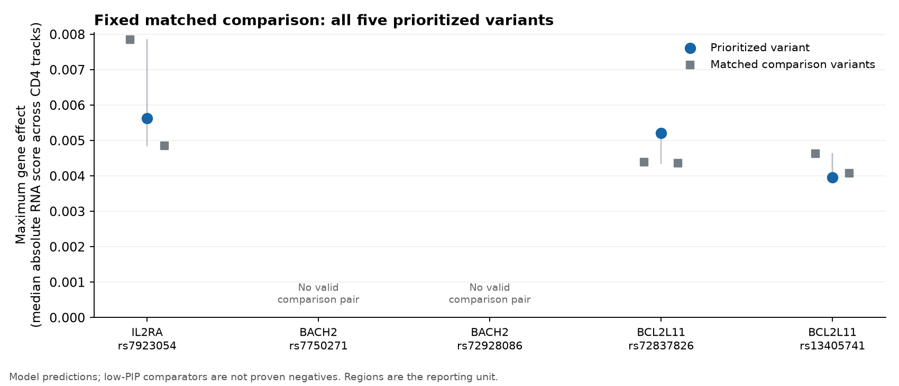

# Fixed matched comparison at PSC-associated regions

Follow-up: [measured CD4 RNA evidence for the complete tested set](cd4-rna-evidence.md) is now available. This report preserves the original model comparison.

Completed September 12, 2026 (UTC). **Nine AlphaGenome requests completed across three matched groups. One prioritized variant had a larger model effect than its comparison pair; two had smaller effects. This small comparison does not show consistent separation between the two groups.** Both planned BACH2 candidates lacked a valid pair and were excluded before predictions, with the original rules unchanged.

These are descriptive molecular model results. The archived fine-mapping probabilities are uncertain statistical labels, and low-probability variants are not proven biological negatives. Nothing in this result establishes a treatment or a disease-risk direction.

## All planned comparisons

The effect is the largest gene-level score magnitude within the same fixed gene universe for each region. For each gene, we take the median of the absolute raw scores across two fixed CD4 RNA tracks. Each comparison variant gets its own maximum under that identical rule. The contrast subtracts the median of the two comparison-variant effects from the prioritized variant's effect.

| Region | Prioritized variant | Prioritized effect | Comparison variants | Median comparison effect | Contrast | Outcome |
|---|---|---:|---|---:|---:|---|
| IL2RA | rs7923054 | 0.005635 | rs7919234; rs111845808 | 0.006353 | −0.000718 | Below comparison median |
| BACH2 | rs7750271 | — | No eligible pair | — | — | Unmatched before inference |
| BACH2 | rs72928086 | — | No eligible pair | — | — | Unmatched before inference |
| BCL2L11 | rs72837826 | 0.005213 | rs56366063; rs35718992 | 0.004372 | +0.000841 | Above both comparison variants |
| BCL2L11 | rs13405741 | 0.003957 | rs4848397; rs10176092 | 0.004349 | −0.000391 | Below both comparison variants |

Regions are the reporting unit: the IL2RA contrast is **−0.0007176101**, and the BCL2L11 median contrast is **+0.0002247990**. Their equal-weight median is **−0.0002464056**, based on **two evaluable regions out of three planned**. BACH2 remains unavailable, not zero. The two BCL2L11 anchors are not independent replications. No hypothesis test, generalization estimate or accuracy percentage is calculated.

Blue circles are prioritized variants and gray squares are their two assigned comparison variants. Connecting lines show the three values, not confidence intervals. [Exact anchor contrasts](matched-comparison-anchor-contrasts.csv) and [region contrasts](matched-comparison-region-contrasts.csv) preserve unrounded values.

## What the model ranked highest

| Variant | Role | GRCh38 substitution, 1-based | Maximum effect | Highest-ranked gene | Nearest-TSS gene's model rank |
|---|---|---|---:|---|---:|
| rs7923054 | Prioritized | chr10:6169124 T>A | 0.005635 | LINC02648 | 21 / 30 |
| rs7919234 | Comparison | chr10:6311012 C>A | 0.007853 | LINC02648 | 24 / 30 |
| rs111845808 | Comparison | chr10:6160667 G>C | 0.004853 | LINC02648 | 11 / 30 |
| rs72837826 | Prioritized | chr2:111175424 G>T | 0.005213 | RPS14P4 | 14 / 23 |
| rs56366063 | Comparison | chr2:111146954 C>A | 0.004387 | ACOXL-AS1 | 9 / 23 |
| rs35718992 | Comparison | chr2:111240679 A>C | 0.004358 | ENSG00000271590 | 14 / 23 |
| rs13405741 | Prioritized | chr2:111155479 T>C | 0.003957 | RPL5P9 | 7 / 23 |
| rs4848397 | Comparison | chr2:111146793 A>G | 0.004627 | MIR4435-2 | 12 / 23 |
| rs10176092 | Comparison | chr2:111003512 C>T | 0.004070 | ENSG00000285016 | 9 / 23 |

Under the pinned Ensembl annotation, these maxima are lncRNAs, processed pseudogenes or a miRNA. None is the gene used to name its region. This does not establish that those noncoding features cause PSC, or that the named genes are uninvolved. The full [228 variant–gene rankings](matched-comparison-gene-rankings.csv) and [456 signed track scores](matched-comparison-primary-track-scores.csv) are retained, including both comparison arms. Nearest-TSS identities and all variant-level fields are in [the variant table](matched-comparison-variant-effects.csv); their agreement with a model ranking cannot measure accuracy without causal-gene truth labels.

For descriptive context, IL2RA ranks second for rs7923054 (effect 0.005025), and third for both its comparison variants. BCL2L11 ranks 17th for rs72837826 (0.000425), with opposite signs in its two tracks, and 14th for rs13405741 (0.001546). Selecting the named gene after inspecting these results would answer a different question from the frozen maximum-effect comparison.

The [official gene-mask scorer implementation](https://github.com/google-deepmind/alphagenome_research/blob/0db53bd4352c66d1e00a049a81da373a066e6670/src/alphagenome_research/model/variant_scoring/gene_mask.py) uses the difference between natural logs of predicted alternate and reference gene means, each with a 0.001 pseudocount. These scores are not log2 changes, clinical effect sizes or percent changes in measured expression. The retained score tables do not include the underlying reference and alternate expression means, so expression-level and pseudocount sensitivity of these maxima remains untested. Signed scores describe ALT relative to REF; no PSC risk allele is assigned here.

## How the comparison variants were selected

The [original protocol](../config/psc-controlled-comparison.json) was recorded before this phase. It nominated five unambiguous substitutions from the three regions. The [preceding archive audit](psc-finemap-and-comparison.md) accounts for all 12 high-PIP records: five nominated anchors, one reserve, and six excluded records. Its source log/configuration discrepancies remain unresolved.

We queried every literal rsID with archived probability at most 0.001 in the three regions against both Ensembl genome builds, using the documented [batch variation API](https://rest.ensembl.org/documentation/info/variation_post). The complete low-PIP source pool contains 7,374 records; 1,257 have non-rsID identifiers and do not meet the fixed identifier requirement. All **6,117 eligible rsID queries** are accounted for. The services sometimes return a canonical replacement ID instead of the requested original ID. We retained those responses but did not silently substitute identities: 92 source IDs lack a usable direct mapping under the fixed rule. These are mapping exclusions, not unfinished network requests.

| Region | Low-PIP rsIDs audited | Passed initial annotation/distance checks | Exact population genotypes, including high-PIP targets |
|---|---:|---:|---:|
| IL2RA | 2,780 | 77 | 78 / 78 |
| BACH2 | 2,070 | 126 | 128 / 129 |
| BCL2L11 | 1,267 | 332 | 334 / 334 |
| Total | 6,117 | 535 | 540 / 541 |

All 541 target reference bases agree across Ensembl GRCh37, Ensembl GRCh38 and AlphaGenome's GRCh38.p13 reference. The sole missing exact genotype is the BACH2 pool variant rs9362750 G>A. Public [1000 Genomes phase 3](https://www.internationalgenome.org/data-portal/data-collection/phase3/) release 20130502 supplies the matching reference; calculations use the **503 EUR donors** in the pinned population panel. No relative's genome was used.

Both arms require EUR minor-allele frequency at least 0.05, a frequency difference at most 0.05, matching transition/transversion and noncoding class, a nearest-TSS log-distance difference at most 0.5, and physical separation at most 250 kb. Dosage-correlation r² must be at most 0.1 in at least 400 jointly called donors. Each comparison variant is checked against every eligible high-PIP SNV in its region, including the unused BACH2 reserve rs7750559, and against previously assigned comparison variants. The two members of a pair must also pass mutual LD screening. No comparison variant is reused.

Assignment follows the fixed frequency/distance cost and numeric-rsID tie rule. All assigned pairs have 503 jointly called EUR donors. Their mutual r² values are 0.002253, 0.014271 and 0.002611, in the order shown in the first table. The maximum screened r² for any assigned comparison variant is 0.048344. [All selected matching covariates](../data/derived/psc-comparator-matches.csv), [the full mapping audit](../data/derived/psc-comparator-mapping-audit.csv), [pair eligibility](../data/derived/psc-comparator-pair-audit.csv) and [every computed LD comparison](../data/derived/psc-comparator-ld-audit.csv) are versioned.

**BACH2 failed the matching gate.** Among its 126 initial candidates, 124 fail frequency matching for each anchor and one lacks an exact genotype. For rs7750271, only one candidate remains eligible; for rs72928086, that remaining candidate fails the static annotation/distance criteria. Neither yields the required pair. These are first-failed-criterion counts, not independent exclusion categories. We did not relax the frequency requirement, replace the region or run unmatched predictions.

Ambiguous high-PIP identifiers, indels and multiallelic records remain outside the LD screen. Passing the implemented screen therefore does not establish low LD with every possibly causal record at these regions. EUR reference frequencies and LD also need not exactly reproduce the original study's population structure.

## Frozen inputs, model coverage and provenance

The final [input manifest](../config/psc-matched-comparison-inputs.json) was frozen at **04:33:28 UTC**, before requests began at **04:34:00 UTC**. All nine requests finished by **04:34:08 UTC**. The original protocol, matching algorithms and frozen covariates were unchanged after predictions. This is a local dated freeze, not a registry preregistration.

- Original protocol SHA-256: `10b6cdf6875e3e4926a59c8fa0c183e74ec1d99cb41540cb0bddd01e054b66a1`.
- Final input SHA-256: `100dafeda4f96b9d0927d5e250ede1c9d3adea4febcfd96340e5cf0cfbc6701d`.
- Client: AlphaGenome 0.9.0, commit `aa6fc8f6faadcb8c910fa2b85b57386fbd5c7b5d`; model selection `ALL_FOLDS`. The client does not expose a server build identifier, so dates and output hashes are retained. This selection does not provide held-out genomic validation; donor independence is unestablished.
- Requested scorer: recommended `RNA_SEQ` GeneMaskLFCScorer with stranded gene tracks merged. Primary ontology: `CL:0000624`, generic CD4-positive alpha-beta T cells. Fixed merged tracks: `CL:0000624 total RNA-seq` and `CL:0000624 polyA plus RNA-seq`. Live RNA metadata matched the frozen snapshot before the run. These two tracks are not independent biological replications or a claim of PSC-specific coverage.
- Gene membership was pinned from Ensembl 116 gene TSSs intersected with the model's GENCODE v46 transcript-TSS universe before scoring. Exact [model annotation](https://storage.googleapis.com/alphagenome/reference/gencode/hg38/gencode.v46.annotation.gtf.gz.feather) and [membership implementation](https://github.com/google-deepmind/alphagenome_research/blob/0db53bd4352c66d1e00a049a81da373a066e6670/src/alphagenome_research/model/variant_scoring/gene_mask_extractor.py) are source-pinned. The 30 IL2RA and 23 BCL2L11 genes were complete on both tracks for every requested variant. The prepared BACH2 universe contains 16 genes but was not scored.
- Identical 1,048,576-base windows within each region: IL2RA `chr10:[5644835,6693411)`, BACH2 `chr6:[89802217,90850793)`, BCL2L11 `chr2:[110651135,111699711)`, using 0-based half-open coordinates. Different universe sizes limit comparisons of raw maxima across regions; matching is within region.

The [matching source manifest](../config/psc-comparator-sources.json) pins 85 public responses, including 64 two-build variant batches, gene/reference data, three population VCF indexes, model annotation and supporting implementation files. RNA metadata and three indexed genotype subsets have [separate](../config/psc-comparator-model-metadata.json) [provenance](../config/psc-comparator-genotype-queries.json). The preceding 43 fine-mapping source pins are preserved. Full chromosome VCFs were not downloaded; the model annotation download was approximately 333 MB. Public donor-level subsets and full model output remain in ignored local storage.

The [run record](matched-comparison-run-provenance.json) pins each output and the runner. The [summary](matched-comparison-summary.json) pins the reporting code. All 42 repository tests pass, including allele/sample alignment, unavailable LD, correlated comparison-pair rejection, fixed gene/track completeness, and absolute-before-median scoring. Cached replay reproduced all 14 matching/source/freeze files and all nine summary tables, provenance files and figures byte for byte, without further prediction requests. Reproduction commands and the distinction between cached replay and a new API run are in the [README](../README.md#reproduce-the-fixed-matched-comparison).

## Next useful research step

Check measured molecular evidence for **all nine tested variants across all 228 fixed variant–gene pairs**, retaining the comparison variants and missing measurements. Start by freezing available CD4 expression-QTL datasets, exact allele/gene joins, coverage rules and cohort-independence labels before reading their effect coefficients. Assess whether these predicted RNA shifts are detectable in the measured data, and whether the noncoding maxima have usable expression measurements. Treat a missing or filtered association as unavailable, not a null result.

This follow-up is selected after inspecting the present model results and must be labeled accordingly. It should keep the current comparison unchanged and report at the region/cohort level. An empirical RNA association would still require source and training-overlap checks; it would not establish a therapeutic target. The concrete next deliverable is a complete coverage-and-effect table with an aligned sign comparison where both tracks agree, explicit mixed-track cases, and no substitution of the one positive contrast for the full tested set.
