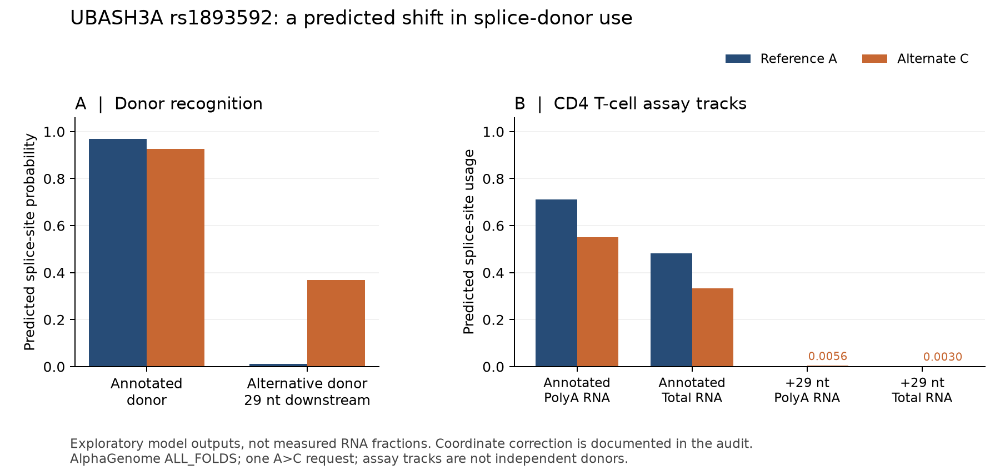

# UBASH3A splice follow-up and PRKD2 allele audit

Completed 2026-09-11. This follows the [four-variant AlphaGenome pilot](first-alphagenome-pilot.md). One additional variant request was made; the original four predictions and benchmark rules were not changed.

## What we learned

1. **UBASH3A has a concrete predicted splicing effect.** For rs1893592 A→C, AlphaGenome predicts reduced use of the annotated donor and increased use of an alternative donor 29 nucleotides downstream. Using that alternative donor would retain the first 29 nucleotides of this intron in RNA. This is a known splice form, not a newly discovered mechanism or treatment.
2. **The expression disagreement predates our model run.** Published studies report different expression directions and measure different RNA quantities. The model's lower gene-expression score agrees in sign with one experiment but disagrees with other source evidence. That does not resolve which endpoint or cell state matters for PSC.
3. **C is the best-supported working PSC risk allele for PRKD2 rs313839.** The original GWAS labels C as risk, and its frequency matches forward-strand population records. This contradicts the thesis's G label and the 2024 supplement's unusable A label. A directly aligned molecular-QTL row is still needed before declaring an expression-direction match.

These are public-data mechanism checks. They do not establish an intervention for established PSC, protein-level consequences, or individual risk.

## UBASH3A: separate the quantities being measured

The risk/protection assignment itself is consistent: **A is risk-associated, C is protective** in the original PSC GWAS. The uncertainty concerns RNA consequences.

| Evidence | Context and measurement | Reported A→C consequence | How to use it |
|---|---|---|---|
| [Ji et al., 2017](https://pmc.ncbi.nlm.nih.gov/articles/PMC5540332/) | PSC association; reanalysis of GEUVADIS RNA-seq | Increased intronic expression; partial intron retention and RNA decay proposed | Supports a splice mechanism; the paper explicitly leaves the protein consequence for further work. |
| [Newman et al., 2017](https://pmc.ncbi.nlm.nih.gov/articles/PMC5668939/), Fig. 2 | RNA-seq from purified lymphocytes of 81 people with T1D | More intron retention; higher coverage of eight exons and three junctions in CD4 cells | Exon/junction coverage suggested higher overall expression. This was not the same assay as total-transcript qPCR. |
| [Ge and Concannon, 2018](https://pmc.ncbi.nlm.nih.gov/articles/PMC6018660/), Fig. 1 | Healthy-donor primary CD4 cells, anti-CD3/CD28 stimulation for 6 h; selected background genotypes | Lower total UBASH3A mRNA; no significant absolute change in the measured intron-9 transcript; higher intron-9/total ratio | The model's lower expression has the same sign, but stimulation and assay matching are not established. |
| [Goode et al., 2024](https://www.nature.com/articles/s41467-024-53602-w) | PSC fine-mapping and molecular-QTL comparisons | Protective C associated with higher expression and intron retention | Remains the original pilot's prespecified comparison, which the expression prediction opposed. |

[Todd's 2018 commentary](https://pmc.ncbi.nlm.nih.gov/articles/PMC6018710/) already identified the conflicting UBASH3A expression directions across these datasets. Assay effects, cell state, transcript choice and local haplotypes are possible explanations, not findings established by our analysis. We have not reanalyzed donor-level RNA-seq or proved which explanation applies.

**A larger retained-intron/total-RNA ratio does not require more retained-intron RNA.** It can also arise when the denominator falls. The 2018 experiment illustrates why these endpoints cannot be collapsed into a single “expression increased/decreased” label.

## Transcript numbers and the coordinate correction

The pinned Ensembl release-116 annotation places the shared upstream exon at **chr21:42434832–42434954**, with the next exon starting at **42437488** (GRCh38, 1-based). The intervening intron is 2,533 bases long; rs1893592 at **42434957** is its **+3** base. Five current transcripts share this boundary. It is exon 9 in ENST00000291535.12 and exon 10 in ENST00000319294.11. Thus “intron 9” versus “intron 10” can describe the same physical splice junction. See [transcript-boundaries.csv](../data/derived/ubash3a-transcript-boundaries.csv).

**We made a one-base endpoint error in follow-up protocol v0.1.** We initially used the first intronic base as the donor-track position, following the client's transcript helper. The prediction's diagnostic window exposed the mistake. The [official model implementation](https://github.com/google-deepmind/alphagenome_research/blob/0db53bd4352c66d1e00a049a81da373a066e6670/src/alphagenome_research/io/splicing.py#L91-L96) instead labels the last exonic base for positive-strand donor tracks; junction intervals begin one base later.

The correct donor-track index is **42434953 (0-based)**; the native junction start is **42434954 (0-based)**. The [original protocol](../config/archive/ubash3a-splice-followup-v0.1.json) is preserved exactly. [Version 0.2](../config/ubash3a-splice-followup.json) records the correction. At the original erroneous index the donor output was near background and increased by approximately 0.00000106. Both readings are retained in the comparison CSV. No prediction was repeated, and the corrected result is exploratory rather than a successful prospective endpoint test.

## New predictions

| Endpoint | Reference A | Alternate C | C minus A |
|---|---:|---:|---:|
| Annotated donor, splice-site probability | 0.968750 | 0.925781 | −0.042969 |
| Donor 29 nt downstream, splice-site probability | 0.012329 | 0.369141 | +0.356812 |
| Annotated donor usage, CD4 polyA RNA track | 0.710938 | 0.550781 | −0.160156 |
| Annotated donor usage, CD4 total RNA track | 0.482422 | 0.333984 | −0.148438 |
| Downstream donor usage, CD4 polyA RNA track | 0.000020 | 0.005554 | +0.005534 |
| Downstream donor usage, CD4 total RNA track | 0.000018 | 0.002975 | +0.002958 |

The downstream donor was selected as the largest positive donor-probability change in the **101-base diagnostic window defined before this request**. Its selection as a reported endpoint is exploratory. The +0.356812 change explains the original pilot's maximum absolute donor score; that score primarily reflected gain at the alternative site, not loss at the annotated one.

Native junction outputs also shift toward the downstream donor. For the polyA track, the annotated junction's normalized signal falls **5.1068→4.5344**, while the alternative junction rises **0.00218→0.13871**. The total-RNA track has the same directions. Junction coordinates are respectively **[42434954, 42437487)** and **[42434983, 42437487)**; their starts differ by 29 bases.

Splice-site probability, site usage, normalized junction signal and a measured transcript fraction are different quantities. In particular, **0.369 is not a prediction that 36.9% of RNA retains this intron**. The alternative donor's tissue-specific usage remains much smaller than the annotated donor's. The two assay tracks are not independent donors, and no uncertainty interval or significance test was defined.

### Earlier measurement of the 29-nt splice form

[Mucaki et al., 2020](https://pmc.ncbi.nlm.nih.gov/articles/PMC7066660/), Tables 1–2, measured a 29-nt retained segment in HapMap lymphoblastoid cell lines. This supports the existence of the splice form but **does not validate our predicted allele direction**. Table 2 reports 8.6±4.6 versus 4.2±5.8 relative to an internal gene reference for strong versus weak homozygotes, with **one individual per genotype**. Table 1 also marks the cryptic-site change as a decrease. Those experimental conditions, denominator and cell type differ from our CD4 predictions. The small comparison is unsuitable as decisive validation or refutation of the model.

## PRKD2: the original data change the working interpretation

We retrieved exact rows from the original [GCST004030 public GWAS file](https://ftp.ebi.ac.uk/pub/databases/gwas/summary_statistics/GCST004001-GCST005000/GCST004030/ipscsg2016.result.combined.full.with_header.txt), whose header explicitly defines `allele_1` as the PSC risk allele. Twenty-three bounded byte-range requests retrieved 753,664 bytes instead of the full 662-MB file. Every range has a saved hash; the [two selected rows](../data/derived/gwas-audit-original-rows.txt) are preserved verbatim.

| rs313839 evidence | What it says |
|---|---|
| Original GWAS row, chr19:47221557, build 37 | allele_0=G; **allele_1=C**; OR=1.322; P=2.11865×10⁻⁸; risk frequency 0.87 in cases and 0.84 in controls |
| [Ensembl population records](https://rest.ensembl.org/variation/human/rs313839?pops=1;content-type=application/json) | Forward-strand C frequency 0.837 in 1000 Genomes EUR and 0.843 in CEU; G approximately 0.163 and 0.157 |
| [Goode's 2020 thesis](https://api.repository.cam.ac.uk/server/api/core/bitstreams/1eba2953-4a5e-455e-b243-3c163ee315fa/content), visually checked pp. 60 and 80 | Explicitly calls G the PSC risk allele and links risk to reduced PRKD2 expression |
| Goode 2024 Supplementary Data 2 | Labels rs313839's risk allele A, which is incompatible with its C/G alleles |
| [GWAS Catalog record for the original lead](https://www.ebi.ac.uk/gwas/rest/api/associations/17622296) | rs60652743-A is the original PRKD2-region lead risk allele; it is a different variant |

The raw GWAS P-value corresponds to the discovery data and differs from the full meta-analysis. [Study metadata](https://www.ebi.ac.uk/gwas/rest/api/studies/GCST004030) distinguish 2,871 cases/12,019 controls initially from the additional replication cohort. We do not relabel this row as the complete 4,796-case fine-mapping dataset.

C/G is strand-ambiguous by allele letters alone. Its common-C frequency supports aligning the original GWAS risk C to forward-strand C. **Use C as the working disease-risk allele**, with the raw-source evidence attached. The thesis is not an independent replication, and we cannot determine whether its G label reflects a strand convention or an error. Carryover of the original lead's A label into the 2024 table is plausible but unconfirmed.

The figure's **rs313829** is also not a substitute: the pinned database maps it to **chromosome 7**, whereas rs313839 is on chromosome 19. This is a source-label inconsistency, not an alternative allele at the same position.

The saved model predicts **G increases PRKD2 expression**. That would agree with a “risk C lowers expression” interpretation, but it opposes the thesis's stated “risk G lowers expression” interpretation. The molecular-QTL coefficients must be checked with explicit effect alleles before scoring either comparison. The original pilot's exclusion remains unchanged; the [new allele audit](../data/derived/allele-audit.csv) records the working interpretation separately.

## Reproducibility and limits

The additional run is `20260911T225056Z-ubash3a-splice`, with AlphaGenome client 0.9.0 pinned to commit `aa6fc8f6faadcb8c910fa2b85b57386fbd5c7b5d`, `ALL_FOLDS`, GRCh38.p13 and the same 1,048,576-base input as the pilot. It returned splice-site, CD4 splice-usage and junction outputs for both alleles. Full predictions remain in ignored local storage. The exact internal server build is not exposed.

- [Run and analysis provenance](splice-followup-provenance.json)
- [Site comparisons, including the erroneous original index](ubash3a-splice-site-comparison.csv)
- [All 101 bases and returned tracks](ubash3a-splice-local-window.csv)
- [All 534 scoped junction/track comparisons](ubash3a-splice-junction-comparison.csv); absent features remain missing, not zero
- [Figure as SVG](ubash3a-splice-followup.svg)
- Source manifests: [papers and annotation](../config/mechanism-sources.json), [association evidence](../config/association-sources.json), [coordinate implementation and validation paper](../config/splice-audit-sources.json)

This selected follow-up has no matched control variants, held-out model, stimulation-matched measurements or demonstrated independence from model training evidence. It cannot estimate model accuracy or establish causality.

## Next useful work

**First, obtain explicitly allele-coded PRKD2 molecular-QTL coefficients**, beginning with the original monocyte dataset and the paper's referenced QTL releases. Finish when rsID, build, forward alleles, assessed allele and expression beta can be aligned to the disease-risk row; retain the exclusion if they cannot.

**Second, test the UBASH3A splice-form hypothesis against an independent RNA dataset**, if usable data and genotype labels are accessible. Measure annotated-junction use, the +29-nt junction, intronic coverage and total transcript abundance separately, with donors as replicates. Newman raw reads are controlled-access (dbGaP phs001426.v1.p1); we have not downloaded them. Public annotations and other available datasets can be assessed while access remains unresolved.

Before extending to new loci, define held-out or matched comparison variants and separate endpoints for gene ranking, expression direction and splicing. The current result justifies a more precise test, not a larger unstructured prediction run. Concrete [researcher review questions](../docs/mechanism-review-questions.md) are prepared; no outreach was sent.
