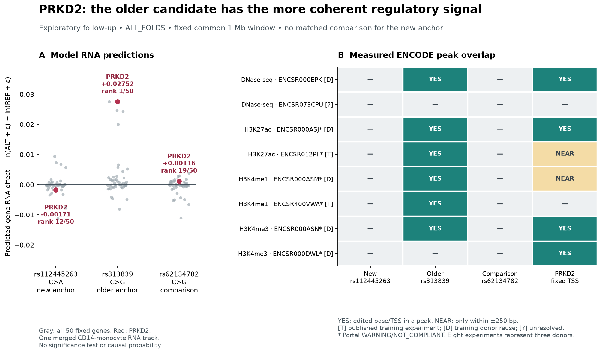

# PRKD2 regulatory mechanism follow-up

Completed September 15, 2026. Exploratory public-data analysis, following the [original-source recovery](prkd2-public-data-recovery.md).

## Finding

**rs313839 remains the more coherent regulatory candidate in the tested model and assay panel. The newly recovered rs112445263 association does not gain comparable mechanistic support from this analysis.** Its predicted PRKD2 RNA effect is small and opposite the recovered association direction, and neither its edited base nor its ±250-bp flank overlaps any of the eight selected CD14-monocyte peak files. This does not invalidate the measured association or establish biological inactivity.

For rs313839, AlphaGenome predicts increased PRKD2 RNA for G relative to C, agreeing with the working interpretation that PSC risk C is associated with lower RNA. PRKD2 ranks first among the 50 fixed genes, and the edited base overlaps six selected peak files. However, the regulatory readouts have mixed directions and the ENCODE observations are substantially reused in model training. **Neither variant is established as the shared cause of PSC susceptibility and PRKD2 expression.**

The figure separates predictions from measured peak context. Every gene in the fixed universe is retained; peak cells are annotated with training reuse and portal QC flags. [Exportable PDF](figures/prkd2-mechanism/overview.pdf).

## Fixed scope and source identities

The [plan](../config/prkd2-mechanism-plan.json) was frozen at **18:40:06 UTC**, before new scores or regional peak inspection. It authorized two anchor variants, up to two eligible comparisons per anchor, a common sequence window, fixed model modalities and a deterministic ENCODE panel. The prior rs313839 prediction and recovered RNA associations were already known. This is a local prospective freeze, not a preregistered or held-out validation study.

All three selected substitutions match independently retrieved Ensembl and AlphaGenome GRCh38 reference DNA. The common model interval is **chr19:[46,192,838, 47,241,414)**, zero-based half-open, exactly 1,048,576 bases. Every prediction uses that interval. The [reference audit](../data/derived/prkd2-mechanism/reference-audit.json) preserves a 17-bp annotation difference: the prior QTL TSS used to center the window is 46,717,127, whereas the Ensembl 116 PRKD2 gene TSS is 46,717,144. Coordinates here are one-based unless an interval is explicitly marked otherwise.

| Variant and role | GRCh38 substitution | Full-source PSC P | Source control MAF | Eligible/selected comparisons |
|---|---|---:|---:|---|
| rs112445263, newly recovered anchor | 19:46,700,099 C→A | 2.451×10⁻⁸ | 0.16 | 0 / 0 |
| rs313839, previous direction control | 19:46,718,300 C→G | 2.119×10⁻⁸ | 0.16 | 1 / 1 |
| rs62134782, comparison for rs313839 | 19:46,702,162 C→G | 0.3014 | 0.24 | Not an anchor |

Comparison selection required a literal rsID and verified full edit, PSC P≥0.1, matching strand-collapsed substitution class and CpG status, source control-MAF difference ≤0.10, separation ≤100 kb and difference in absolute TSS distance ≤25 kb. Ordering was fixed by normalized MAF/distance cost, separation and rsID; no comparison could be reused. **The shortfalls were retained without relaxing criteria.** rs62134782 is not a matched comparator for rs112445263, and weak PSC association does not prove molecular inactivity. Database records list additional alternative alleles at rs112445263 and rs62134782; only the exact source-supported C→A and C→G edits were modeled.

The [selected inputs](../config/prkd2-mechanism-inputs.json) were locked at **18:51:02 UTC**. The complete [candidate covariates](../data/derived/prkd2-mechanism/comparison-covariates.csv), [selection audit](../data/derived/prkd2-mechanism/comparison-selection-audit.csv) and [gene annotation](../data/derived/prkd2-mechanism/gene-universe.csv) are retained. The fixed 50-gene universe intersects Ensembl 116 gene TSSs with GENCODE v46 model transcript TSSs in the common interval. The API returned 52 RNA genes; the two outside that prospectively fixed intersection remain in raw outputs and are separately accounted for.

## Model expression and splicing

Three score requests and two anchor REF/ALT track requests completed between **18:58:54 and 18:59:08 UTC**. They use AlphaGenome client **0.9.0**, commit `aa6fc8f6faadcb8c910fa2b85b57386fbd5c7b5d`, **ALL_FOLDS**. Live metadata matched the preparation snapshot. The serving build identifier is not exposed, and ALL_FOLDS does not supply a held-out locus test. See the [execution record](../config/prkd2-mechanism-execution.json) and [complete model output manifest](../config/prkd2-mechanism-model-run.json).

The primary endpoint is the gene-exon-mask RNA score, `ln(mean ALT + 0.001) − ln(mean REF + 0.001)`. The official stranded-track merge yields **one** primary CD14-monocyte RNA track: it merges the adult +/− pair and drops a duplicate unstranded name. The three raw RNA tracks are not three independent gene-level assays. Ranks order absolute effects across all 50 fixed genes; nearest-TSS ranks use Ensembl 116 gene TSSs in the same universe.

| Variant | PRKD2 RNA score | PRKD2 model rank | Nearest-TSS rank | Agreement with recovered RNA direction | Absolute effect minus its selected comparison median |
|---|---:|---:|---:|---|---:|
| rs112445263 C→A | −0.001706064 | 12/50 | 3/50 | Opposite | Unavailable: no comparison |
| rs313839 C→G | +0.027515948 | 1/50 | 1/50 | Agrees | +0.026351214; one comparison |
| rs62134782 C→G | +0.001164734 | 19/50 | 3/50 | Not a prespecified directional test | Not applicable |

These are model scores, not QTL coefficients, causal probabilities or clinically calibrated changes. There is no significance test or justified biological effect threshold. The single-comparison contrast for rs313839 is descriptive. For rs112445263, several other genes outrank PRKD2, but none is nominated as a new PSC target from this small model exercise.

All **750** fixed variant–gene–RNA-track combinations are present: three variants × 50 genes × five merged tracks. Supporting CD4 and B-cell PRKD2 scores are positive for rs313839, ranging from +0.01434 to +0.02323. For rs112445263 they remain close to zero, ranging from −0.000405 to +0.000072, with mixed signs. The [full table](../data/derived/prkd2-mechanism-results/all-gene-RNA-effects.csv) preserves both Ensembl 116 and model gene labels, all signs and activity scores. The old rs313839 pilot score, +0.020952225, used a different center; its archived result is unchanged. The new common-window result is not an identical-window replication or a measure of temporal model drift.

For rs112445263, PRKD2 splice-site maximum absolute scores are 0.00683594 (donor) and 0.00488281 (acceptor); the primary usage score is 0.00390625. The comparison also has small unsigned flags. **No PRKD2 splice score is returned for rs313839**, which lies outside the target gene-body mask. Missing is not zero, and these unsigned maxima do not identify an altered junction, transcript or direction. [Every target splicing endpoint](../data/derived/prkd2-mechanism-results/target-splicing.csv) is retained.

## Regulatory predictions have mixed signs

The following are signed local variant-centered scores, distinct from gene RNA. DNase/CAGE use a 501-bp mask; histone scores use a 2,001-bp mask. Their `DIFF_LOG2_SUM` aggregation is log₂(sum ALT + 1) minus log₂(sum REF + 1), as described in the [official scoring guide](https://google-deepmind-alphagenome.readthedocs-hosted.com/variant_scoring.html). They are not directly comparable in magnitude to the RNA natural-log score.

| Prespecified monocyte readout | rs112445263 | rs313839 | rs62134782 |
|---|---:|---:|---:|
| CD14 DNase | −0.038450 | −0.070453 | +0.112537 |
| Generic monocyte CAGE + | −0.004119 | −0.057082 | +0.018299 |
| Generic monocyte CAGE − | +0.001536 | −0.038934 | +0.030873 |
| CD14 H3K27ac | −0.012941 | +0.073291 | +0.018477 |
| CD14 H3K4me1 | +0.006375 | +0.021071 | −0.011578 |
| CD14 H3K4me3 | +0.003097 | −0.001008 | +0.004625 |

Thus rs313839 is not a uniform chromatin-activation prediction: RNA/H3K27ac/H3K4me1 increase while local DNase and both CAGE scores decrease. Local CAGE at the variant must not be described as PRKD2-promoter initiation. Its generic-monocyte training label additionally mixes CD14 monocytes with monocyte-derived endothelial progenitor cells; it is auxiliary context. No CD14 or generic-monocyte ATAC model track is available. The [coverage table](../data/derived/prkd2-mechanism/model-context-coverage.csv) keeps unavailable contexts distinct from measured zero effects.

All selected regulatory scores, including activity summaries and supporting cell types, are in the [full table](../data/derived/prkd2-mechanism-results/regulatory-scores.csv). Fixed variant-centered and fixed-TSS-centered ±2,500-bp REF/ALT plots are available for [rs112445263](figures/prkd2-mechanism/rs112445263-fixed-tracks.png) and [rs313839](figures/prkd2-mechanism/rs313839-fixed-tracks.png), each with an exportable PDF. Both anchors were plotted regardless of result. The [crop summaries](figures/prkd2-mechanism/fixed-crop-summary.csv) retain all windows; 128-bp histone bins intersecting a window are retained explicitly.

## Measured ENCODE context and dependence

The complete live search contains **142 released CD14-monocyte experiments**, including 39 DNase-seq and 21 Histone ChIP-seq experiments. No experiment has the exact frozen bulk `ATAC-seq` assay title; two `snATAC-seq` experiments exist but lie outside that assay definition. This is not a claim that monocyte ATAC data do not exist.

The [selected panel](../config/prkd2-mechanism-encode-selection.json) was frozen at **18:55:25 UTC**, before scores or peaks: two experiments each for DNase, H3K27ac, H3K4me1 and H3K4me3, ordered by accession with fixed released GRCh38 BED-output priorities. Whole-file publisher MD5 and SHA-256 checks pass for **11,642,261 compressed bytes**, **591,816 peak rows** and **576 peaks in the common interval**.

| Point | Exact-base overlap | Overlap allowing ±250 bp |
|---|---:|---:|
| rs112445263 | 0/8 files | 0/8 files |
| rs313839 | 6/8 files | 6/8 files |
| rs62134782 | 0/8 files | 0/8 files |
| Fixed PRKD2 QTL TSS | 4/8 files | 6/8 files |

rs313839 overlaps DNase ENCSR000EPK; H3K27ac ENCSR000ASJ/ENCSR012PII; H3K4me1 ENCSR000ASM/ENCSR400VWA; and H3K4me3 ENCSR000ASN. The other H3K4me3 file's nearest regional peak is 394 bp away; the other DNase file's is 13,498 bp away. The nearest selected DNase peak to rs112445263 is 2,279 bp away. Peak absence in this bounded panel is not absence of regulation across donors or cell states. The [32 point/file comparisons](../data/derived/prkd2-mechanism-encode/peak-overlap-summary.csv) and [all regional peaks](../data/derived/prkd2-mechanism-encode/regional-peaks.csv) preserve these differences.

The eight experiments map to **three source donor identifiers**, not eight independent people. Six selected files carry portal WARNING and/or NOT_COMPLIANT flags; no selected experiment/file has an ERROR after computed-audit qualification. Full [QC details](../data/derived/prkd2-mechanism-encode/computed-audit-details.csv) remain available.

The training audit compares experiment/file accessions against all **5,930 human rows** of the pinned [AlphaGenome supplementary training table](https://media.springernature.com/original/springer-static/esm/art%3A10.1038%2Fs41586-025-10014-0/MediaObjects/41586_2025_10014_MOESM3_ESM.xlsx). It resolves biosample/donor metadata for the 16 training experiments in the selected monocyte modality scope, including all monocyte histone marks for provenance.

- **Two selected experiments are published training experiments:** [ENCSR012PII](https://www.encodeproject.org/experiments/ENCSR012PII/) and [ENCSR400VWA](https://www.encodeproject.org/experiments/ENCSR400VWA/). The selected peak files differ from the published training signal files; this does not confer independence.
- **Five additional selected experiments share donors with published monocyte training sources.** Overall, seven of eight have donor reuse in this bounded crosswalk.
- ENCSR073CPU has no donor match in this bounded audit. Its independence remains unresolved; the audit does not enumerate every training donor across every tissue, and the served model build is unexposed.

See the [complete overlap table](../data/derived/prkd2-mechanism-training/selected-peak-training-overlap.csv), [training track rows](../data/derived/prkd2-mechanism-training/published-monocyte-training-tracks.csv) and [audit scope](../data/derived/prkd2-mechanism-training/training-audit.json). These ENCODE results indicate measured regulatory context. They do not measure the alleles' effects or prove a connection to PRKD2, and should not be counted as independent model validation.

## Genetic interpretation

The two anchor ALT dosages have **r²=0.857392** in 503 public 1000 Genomes phase 3 EUR donors. Their r² values with the comparison are 0.086935 and 0.075649. Matching uses complete GRCh37 chromosome/position/REF/ALT identities; the source VCF IDs are dots and were not silently treated as literal rsID matches. [LD values](../data/derived/prkd2-mechanism-results/reference-LD.csv) and the [source crosswalk](../data/derived/prkd2-mechanism-results/reference-LD-provenance.json) are preserved; sample-level genotypes remain ignored.

**A hypothesis consistent with these findings** is that rs112445263 tags a regulatory signal involving rs313839 or another correlated variant. Alternatives include a functional effect of rs112445263 in an unmeasured cell state, a molecular endpoint that these model tracks miss, or model error. Public reference LD cannot adjudicate them. Strong correlation also means that the anchor associations cannot be treated as independent replications.

The original-source recovery remains useful: rs112445263 is associated with PRKD2 RNA in original IBDverse classical/intermediate blood monocytes. That measured result and its source-specific statistical limitations remain unchanged. The present analysis does not recover study-matched LD, exact sample/model details or complete original signal components, does not estimate a new H4 posterior, and does not extend to additional IBDverse blood/gut QTL contexts. A study-qualified signal analysis or direct allele perturbation would be needed to discriminate the causal hypotheses. No intervention direction follows from these predictions.

## Verification and documented repairs

The [independent verifier](prkd2-mechanism-verification.json) reconstructs all **129,294 score values and 129,294 quantiles** from original component matrices and axes, matching the CSV values exactly after float32 round trip. It verifies 16 raw prediction arrays, all 150 primary gene-rank rows, both reference sequences across 1,048,576 bases, all three selected edits, every original BED row, all 32 peak comparisons, and all nine LD-matrix entries using a separate centered-sum calculation. These checks validate computation and provenance, not biological truth.

All **274 repository tests pass**. The original catalog rebuild produces no changes. An [isolated offline replay](prkd2-mechanism-replay-verification.json) reproduces **17 calculated files byte-for-byte** without model or network requests. The three figures were inspected visually. Prior scientific outputs remain unchanged; only the current README/evidence/research-plan navigation is updated.

Operational repairs are preserved rather than hidden: initial restricted-network failures were retried after network access was granted; an ENCODE pagination response failed, so a bounded complete 200-result request recovered all 142 objects; exact bulk-ATAC absence was checked against that complete inventory. Embedded ENCODE object responses omit computed `audit` fields. A separate [audit-resolution record](../config/prkd2-mechanism-encode-audit-resolution.json), completed at 19:03:43 UTC after the model calls but **before peak downloads**, recovered them through exact File searches and the complete Experiment search. All eight selections remained qualified and unchanged. Initial empty audit lists are superseded by that record, not interpreted as clean QC. A local LD-summary identity guard was corrected to preserve the reference VCF's missing rsIDs and require full allele matching; no source value or selection was changed.

The [cache manifest](../config/prkd2-mechanism-cache-manifest.json) pins every new cached source and retains failed request receipts. Full metadata JSON is parsed/reserialized output of the required ENCODE skill, not a claim of byte-exact HTTP-body capture. Large predictions, raw peak files, reference genotypes and credentials remain outside Git. The [reproduction guide](../docs/prkd2-mechanism-reproduction.md) gives commands, cache requirements and the final stage manifest.
