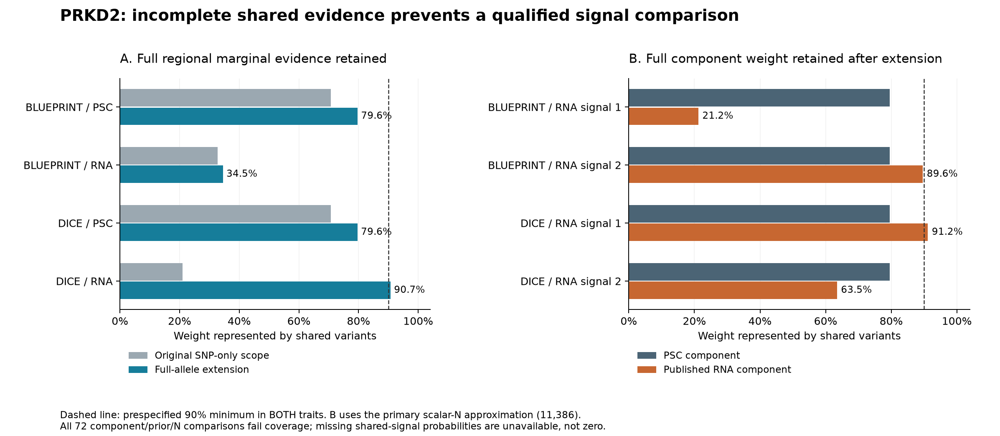
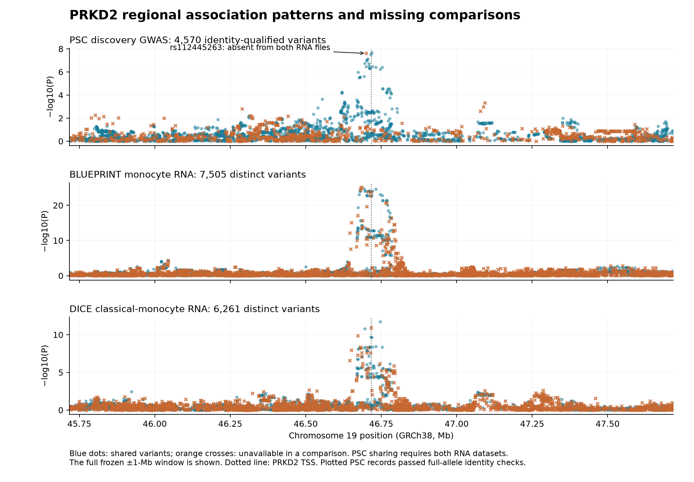

# PRKD2 PSC–monocyte signal analysis

Completed September 15, 2026 UTC. **Result: shared genetic causality remains unresolved.** The regional comparisons fail the prespecified coverage requirements in both BLUEPRINT and DICE. This is an inability to distinguish shared from separate signals with these inputs, not evidence that the two biological effects are different.

The earlier [rs313839 expression-direction agreement](qtl-followup.md) is reproduced exactly. Working PSC-risk allele C corresponds to lower measured PRKD2 RNA in both monocyte cohorts. That remains a molecular association; neither this analysis nor the earlier sequence prediction establishes that changing PRKD2 would alter PSC or benefit patients.

## Fixed question and source scope

The [original plan](../config/prkd2-plan.json) was frozen at **03:49:32 UTC**, before new regional posteriors. It specifies PRKD2/ENSG00000105287, exactly two RNA contexts, and the full Catalogue TSS ±1-Mb region: **GRCh38 chr19:45,717,127–47,717,127**, using 1-based inclusive endpoints. The uniquely mapped GRCh37 extraction envelope is chr19:46,220,385–48,220,384. There is no significance filtering of the source region.

| Input | Analysis scope | Complete regional input |
|---|---|---:|
| [Ji et al. discovery PSC GWAS, GCST004030](https://www.ebi.ac.uk/gwas/studies/GCST004030) | 2,871 cases and 12,019 controls; all three documented platform groups | 4,727 source rows |
| [BLUEPRINT QTD000021](https://ftp.ebi.ac.uk/pub/databases/spot/eQTL/sumstats/QTS000002/QTD000021/) | 191 monocytes; reuses the earlier BLUEPRINT cohort | 8,409 rows / 7,505 distinct variants |
| [DICE QTD000504](https://ftp.ebi.ac.uk/pub/databases/spot/eQTL/sumstats/QTS000026/QTD000504/) | 91 classical-monocyte samples; separate cohort | 7,242 rows / 6,261 distinct variants |
| [1000 Genomes phase 3 chromosome 19](https://ftp.1000genomes.ebi.ac.uk/vol1/ftp/release/20130502/) | 503 European reference donors; signed external LD for the PSC fit only | 4,222 SNPs initially; 4,513 variants after the full-allele extension |

The PSC input is the discovery GWAS, not the larger combined replication sample or the later published FINEMAP release. Publisher Supplementary Table 1 supports Omni N=11,386, Affy N=3,504 and combined N=14,890; case/control counts are retained by platform. Original OR, SE, risk-allele labels and conflicting literature labels remain preserved. Marginal calculations use P values, control MAF and platform-specific sample counts because the scale of the source SE accompanying the OR is not independently documented. The LD sensitivity uses signed inverse-normal P values, with signs derived from the source risk allele.

Both **complete published RNA signal files** were streamed through gzip EOF: **3,473,530,432 compressed bytes and 59,453,263 archive rows** in total. Only the 13,766 PRKD2 rows are retained. Each file contains all ten fitted component vectors; both cohorts have two published credible-set components, L1 and L2. All 59 BLUEPRINT and 29 DICE credible-set rows are checked against the full vectors, including repeated variant memberships. They represent 56 and 23 distinct variants across sets. No full vector was inferred from a credible-set-only table.

## Coverage repair and timing

The original SNP-only analysis retained 4,287 eligible PSC SNPs and excluded 426 non-SNV source rows plus 14 palindromic SNPs lacking qualified frequency support. Every valid excluded row remained in the full regional evidence denominator. All twelve initial baseline settings failed coverage.

A separate [full-allele extension](../config/prkd2-expanded-plan.json) was frozen at **04:11:06 UTC**, after those baseline failures and before any expanded posterior. This is an explicitly **post hoc input-repair analysis**. It retains the same region, cohorts, priors and thresholds and preserves every original output.

All 426 PSC non-SNV records were audited, without choosing favorable variants. Recovery requires an exact original-coordinate/full-allele match to one biallelic reference record, source-risk frequency agreement within 0.15, reference normalization, and reciprocal mapping of the complete edit with 100-base flanks. RNA edits are independently normalized against GRCh38. rsID-only matching, proxy substitution and indel mapping by a single anchor base are excluded.

The extension adds **293 qualified non-SNV PSC variants**. Direct reference checks additionally exclude ten previously eligible SNP records whose source allele pair does not include the GRCh37 reference base; this records a source-identity limitation rather than declaring a particular source field wrong. Four recovered non-SNV candidates fail frequency agreement, and 129 lack an unambiguous exact reference match. The 14 original palindromic exclusions remain. Final inputs contain **4,570 PSC variants** and all **7,505/6,261** distinct RNA edits. All **4,200 queued normalizations** agree with independent bcftools normalization.

## Complete-signal result

The primary PSC fit uses scalar N=11,386, with N=3,504 and N=14,890 sensitivities. All six fits converge and each produces one 95% credible set. The original sets contain 12 SNPs; expanded sets contain 14, 15 and 14 variants respectively. The following table uses the expanded primary fit and every published RNA component.

| RNA comparison | Shared variants in the component analysis | PSC component weight represented | RNA component weight represented | Qualified comparison |
|---|---:|---:|---:|---|
| BLUEPRINT L1 | 3,981 | 79.55% | 21.21% | Unavailable |
| BLUEPRINT L2 | 3,981 | 79.55% | 89.63% | Unavailable |
| DICE L1 | 3,296 | 79.54% | 91.17% | Unavailable |
| DICE L2 | 3,296 | 79.54% | 63.47% | Unavailable |

The requirement is at least 100 common variants **and at least 90% of full component weight in both traits**. Component weight is the normalized full component Bayes-factor vector, not the count of variants. The full fitted PSC component is itself conditional on variants with qualified reference LD; the separate full-source marginal audit retains evidence from all 4,727 PSC rows.

Across scalar-N sensitivities, expanded PSC coverage remains **79.53–79.71%**. Therefore **all 72 recorded component comparisons fail**: four component pairs × three N approximations × three shared-variant priors × two variant scopes. These are sensitivity settings, not 72 independent experiments. Shared-signal H4 probabilities remain unavailable; the corresponding variant-posterior files intentionally contain only headers. Other partial fields emitted by the package for a failed comparison must not be interpreted as a complete hypothesis probability vector.

The [original component table](prkd2-signal-comparison.csv), [expanded component table](prkd2-expanded-signal-comparison.csv), and warning records preserve all failures.

## The missing evidence is identifiable

**rs112445263** is the main PSC-side gap. Its source coordinates/alleles are GRCh37 chr19:47,203,356 A/C and verified GRCh38 chr19:46,700,099 C>A. Its PSC P value is 2.450894×10⁻⁸. It accounts for **20.36% of full regional PSC marginal BF weight** and **20.45% of the expanded primary PSC component weight**.

This variant passed our PSC identity checks. Direct indexed requests find **zero association rows at its position across all genes** in each RNA file, not merely a missing PRKD2 label. Those [requests and empty source extracts](../config/prkd2-missing-evidence-queries.json) are retained. The reason for its absence is not established by aggregate files.

On the RNA side, the three largest missing BLUEPRINT marginal-weight edits are GRCh38 `chr19_46681839_C_CT`, `chr19_46685258_C_CA`, and `chr19_46681255_CT_C`. Together they carry **64.23%** of the unit-SD RNA marginal BF weight. All three reciprocally map with full flanks, but none has a matching normalized full-allele record among all 4,727 regional PSC source rows. The largest remaining DICE marginal gap is `chr19_46717081_T_TCGG`, carrying **8.18%**.

The [omitted-evidence table](../data/derived/prkd2-missing-evidence.csv) retains the top twenty omissions per trait/cohort. The [full-source identity audit](../data/derived/prkd2-missing-allele-identity-audit.csv) checks all forty listed RNA edits: 38 have no possible full-allele PSC match; two cohort rows have the same possible source candidate, rs112241475, at very small marginal weights. This candidate-only audit does not override reference/frequency eligibility or change statistical inputs.

## Why an attractive marginal posterior is insufficient

| Cohort / scope | Common marginal-analysis variants | Full PSC BF weight represented | Full RNA BF weight represented |
|---|---:|---:|---:|
| BLUEPRINT / original SNPs | 3,768 | 70.68% | 32.74% |
| DICE / original SNPs | 3,114 | 70.66% | 21.00% |
| BLUEPRINT / full-allele extension | 4,018 | 79.62% | 34.49% |
| DICE / full-allele extension | 3,325 | 79.59% | 90.69% |

These unit-expression-SD calculations all fail the full-source coverage gate. The estimated-SD sensitivity also fails in both cohorts. For example, the restricted original DICE baseline produces a numerical H4 of 0.945 at p12=10⁻⁶ despite representing only 21% of RNA evidence. After the full-allele extension its numerical H4 is 0.810, moving from 0.298 to 0.977 across p12=10⁻⁷ to 10⁻⁵. **These are archived diagnostic calculations on incomplete intersections, not qualified probabilities of a shared regional cause.**

The [baseline tables](prkd2-baseline.csv) and [extension baseline tables](prkd2-expanded-baseline.csv) include all two-SD/three-prior settings. No significance or coverage requirement was relaxed.

## Remaining statistical limitations

The 503-donor reference LD matrices have rank 502; eigenvalues are nonnegative within numerical tolerance, and every retained original SNP correlation reproduces after expansion. This does not make them in-sample PSC LD. Different platform groups have overlapping or distinct samples; the scalar-N fits do not reconstruct their exact covariance. The estimated LD-mismatch parameter is approximately 0.0948 after expansion. One variant, `chr19:45860351:A:G`, is flagged by the retained diagnostic rule; this does not by itself establish an allele error. No automatic sign reversal or result-selected removal was applied. Published RNA components are used directly; DICE was not refitted with European reference LD.

Both RNA cohorts are healthy/resting monocyte contexts. Cohort separation supports the earlier directional comparison but does not supply independent PSC–RNA colocalization, a disease-state response, genetic mediation, protein abundance or an intervention effect. The published risk-label conflicts remain in the [evidence log](../docs/evidence-log.md).

## Verification and useful next inputs

- Independent Python calculations reproduce all **24 baseline rows and 14,225 conditional diagnostic variant probabilities**, with maximum posterior differences below 1.7×10⁻¹⁴, and verify the complete 72-row component/coverage grid. All 88 published credible-set PIPs agree with values reconstructed from the complete ten-component RNA vectors to below 8.2×10⁻¹⁵. No passing component posterior exists to validate.
- Raw-source checks cover every PSC field, all RNA numerical values, sample/platform counts and allele signs. Independent dosage calculations reproduce **20,367,169 expanded LD entries** within 1.7×10⁻¹⁴. Publisher reference checksums and 4,200 independent edit normalizations pass.
- **250 repository tests pass.** R qualification checks cover explicit null-column handling, variant-order invariance, missing dominant variants and both sides of the 90% threshold. An isolated rerun reproduces **all 42 statistical output files exactly**, including six fitted model objects.
- Acquisition and validation corrections are documented in the [reproduction guide](../docs/prkd2-reproduction.md). They preserve original outputs and distinguish executed entry points from superseded development paths. The [stage record](prkd2-stage-verification.json) links final hashes and prior-file preservation checks.

The next informative data are **the missing rs112445263 monocyte association estimates and filtering/QC provenance; PSC statistics and exact alleles for the major omitted BLUEPRINT RNA edits; and PSC sample covariance or suitable in-sample LD**. These requirements are concrete consequences of this analysis. More runs on the same incomplete intersections do not fill them. No request has been sent and access is not assumed.

Direction 4 is complete within the specified public-data scope. PRKD2 remains a direction-consistent RNA hypothesis with an unresolved shared PSC signal. No new laboratory experiment, personal-genome analysis, model request or treatment conclusion was produced.
