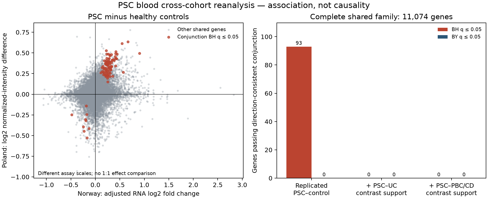

# PSC blood: cross-cohort association without demonstrated disease specificity

September 15, 2026. New public-data reanalysis. **Local methods and code were frozen before new effects, but this was not an independently registered or untouched validation study.**

## Bottom line

Across **11,074 unambiguously matched genes**, **93** meet the frozen direction-consistent Norwegian/Polish PSC-versus-control conjunction with BH q ≤ 0.05: **84 higher and 9 lower in PSC**. **None** meet the more conservative BY threshold. **None** meet either added disease-control support rule: PSC versus UC, or PSC versus UC/PBC/CD.

This gives a limited set of **whole-blood case–control associations**, not an established PSC-specific signature, mechanism, diagnostic test or treatment target. BH control is assumption-dependent across correlated genes. The minimum BH q is **0.01588**, but the minimum BY q is **0.1570**. Numerical fit flags affect two of the 93 genes and remain visible.

**None of the seven preselected benchmarks passes the primary conjunction threshold.** ETS2 is directionally consistent but has q = **0.06672**; its abundance is not a direct measurement of ETS2 regulatory activity. The result must not be promoted by changing the cutoff or replacing the prespecified test.

**Research decision:** do not build a PSC blood classifier or launch another candidate-score sweep from this result. The next higher-value question is the **donor-level disease-by-IL-17A response interaction in PSC-derived cholangiocyte organoids**, described below. That analysis has not been run.

## Why this path was chosen

The [research assessment](research-state-and-strategy.md), [independent review](research-path-review.md) and [public-data comparison](public-data-discovery-options.md) identified a gap: prior audit depth and model scores had grown faster than independent disease evidence. The blood route adds observations from separate recruited study families and explicit alternative-disease comparisons using local CPU compute. It outranked a new regulatory-model sweep or generic four-donor macrophage calibration for immediate information about PSC association.

No original lead-SNP/fine-mapping result, PRKD2 shared-cause gate, UBASH3A coverage conclusion or ETS2 frozen protocol was rewritten to make this analysis pass. The new question has its own [protocol](../docs/psc-blood-replication-protocol.md), [source manifest](../config/psc-blood-sources.json) and [execution freeze](../config/psc-blood-execution-freeze.json).

## Studies, units and measurements

| Arm | Included observations | Frozen comparison and main limitation |
|---|---|---|
| Norway, [GSE177044](https://www.ncbi.nlm.nih.gov/geo/query/acc.cgi?acc=GSE177044) | 220 PSC, including 177 with UC and 43 without; 77 controls | Negative-binomial PSC-minus-control model adjusted for age, recorded sex and five sequencing plates. All plates contain both groups. |
| Poland, [GSE119600](https://www.ncbi.nlm.nih.gov/geo/query/acc.cgi?acc=GSE119600) | 275 source-labeled adults: PSC 45, control 47, UC 45, PBC 90, CD 48 | Unadjusted Welch comparisons of gene-median log2 normalized intensities. Exact per-sample age, sex, treatment and batch are unavailable. |

The pinned RNA metadata declares **GRCh37**, alignment with **STAR v2.6.1d**, and **FeatureCounts/subread v1.6.4**. This reanalysis uses deposited counts without realignment. The Ensembl 116 lookup reconciles stable gene IDs; it is not coordinate lift-over or a claim that old and current annotations are identical. The exact original count-annotation release was not independently resolved here. See [source processing provenance](psc-blood-source-processing.json).

The 738 German UC/control samples in GSE177044 were **not pooled** with Norway: country/cohort and sequencing plates would confound a direct PSC–UC contrast. The 95 source-labeled pediatric IBD arrays were excluded before effects. “Adult” is the deposited label, not independently verified age ≥18.

The Norwegian publication already used the Polish cohort as an external classifier dataset and reported weak performance. Independent recruitment is useful, but this is **reuse of published data, not fresh held-out validation**. Anonymous records do not independently certify identity-level disjointness. The primary papers are [Wacker et al., JHEP Reports](https://pmc.ncbi.nlm.nih.gov/articles/PMC10832281/) and [Ostrowski et al., Scientific Reports](https://pmc.ncbi.nlm.nih.gov/articles/PMC6510750/).

### Complete feature accounting

- RNA: **63,677** original rows retained; **15,045** pass ≥10 counts in ≥30/297 samples. The 48,632 low-count rows remain in the feature/coverage files, including 25,283 all-zero rows. All source Ensembl IDs are unique and unversioned; source gene names are preserved.
- Array: **47,230** measured probes; **31,252** uniquely mapped probes produce **20,749** Entrez genes. The 13 multi-gene and 15,965 unmapped measured probes are recorded, not assigned guessed identities. The complete GPL10558 annotation includes 877 additional, unmeasured platform rows. Its internal annotation date is August 9, 2016.
- Identity: independently recomputed reciprocal Ensembl–Entrez relationships from **all 91,748 rows** of the pinned full-human Ensembl 116 export, not a GPL570- or expression-filtered subset. The source has 25,210 reciprocal genes. Of the 15,045 RNA-eligible genes, 3,390 lack an unambiguous cross-platform identity and 581 are not measured on the array. The shared family is **11,074**.
- Four RNA Wald tests are Cook-filtered and stay unavailable; three lie in the shared family. All mapped array tests are estimable. Missing tests receive 1 **only inside correction/conjunction calculations**, without overwriting their source P values or declaring a biological null.

## Results

The conjunction uses the largest constituent **two-sided raw P value** when all effects have the same nonzero sign; otherwise its value is 1. Correction always uses the complete shared family. Assay effect sizes are not pooled or treated as interchangeable.

| Complete shared-family endpoint | BH q ≤ 0.05 | BY q ≤ 0.05 |
|---|---:|---:|
| Norway PSC–control AND Poland PSC–control | **93** | **0** |
| Above AND Poland PSC–UC | **0** | **0** |
| Above AND Poland PSC–UC AND PSC–PBC AND PSC–CD | **0** | **0** |

The additional disease-control families are exploratory, correlated comparisons, not independent replications or one combined error-control claim. Their minimum BH q values are both 1. These negative results **do not prove equal expression across diseases**, nor do they prove that all 93 associations are generic inflammation. Power, assay measurement and confounding also limit the comparisons.

For context, the separate assay-wide BH families produce 3,309 RNA PSC–control genes and 2,410 array PSC–control genes. Array PSC–UC, PSC–PBC and PSC–CD yield 315, 135 and 1,830 genes, respectively. These per-arm counts are not the replication endpoint.

The first primary ranks include **MTMR3, TKT, PRKCD, LYN and DENND5A**. They are descriptive association leads, not newly established PSC targets. **TKT has a gene-wise dispersion convergence flag**; the second flagged BH candidate, **ARID4B**, has a MAP-dispersion flag. No gene-list enrichment or cell-intrinsic pathway claim was inferred from these names. All 93, including the flagged rows, are in the [candidate diagnostic table](../data/derived/psc-blood-replication/bh-candidates-with-diagnostics.csv.gz).

### Fixed benchmarks, including negative results

| Benchmark | Norway RNA log2 FC | RNA P | Poland log2 intensity difference | Array P | Conjunction BH q |
|---|---:|---:|---:|---:|---:|
| UBASH3A | -0.230 | 0.013 | +0.058 | 0.274 | 1 |
| ETS2 | +0.284 | 1.36e-06 | +0.312 | 0.000741 | 0.06672 |
| PRKD2 | +0.006 | 0.905 | +0.170 | 0.0042 | 1 |
| PFKFB3 | +0.693 | 8.37e-11 | +0.228 | 0.0349 | 0.4732 |
| BCL2L11 | +0.167 | 0.0232 | -0.029 | 0.221 | 1 |
| IFIT1 | +0.515 | 0.00661 | -0.234 | 0.165 | 1 |
| G0S2 | +0.779 | 5.06e-05 | +0.014 | 0.653 | 1 |

All seven have a reciprocal ID and measured-family eligibility, so their results are not being explained away by missing coverage in this analysis. UBASH3A, BCL2L11 and IFIT1 have opposing case–control directions across assays. PRKD2 is near zero in the adjusted Norwegian RNA model. PFKFB3 and G0S2 do not meet the conjunction criterion. None of these abundance results resolves a genetic mechanism, a specific RNA/protein product or a gene's causal role.

## Model checks and sensitivities

The pinned **PyDESeq2 0.5.4** fit used the requested **parametric** dispersion trend; the permitted mean fallback was not used. Ratio normalization had **7,955** eligible genes positive in every sample. No iterative normalization, count replacement, effect-based sample exclusion, independent filtering or LFC shrinkage was introduced.

There are **7 LFC, 9 MAP-dispersion and 16 gene-wise dispersion nonconvergence flags** across eligible RNA rows; the sets can overlap. Joblib workers emitted overflow/invalid-operation warnings. The outer log retains them. The main-process captured-warning list is empty and must not be described as a warning-free fit. Full per-gene flags remain available.

PyDESeq2's standard Cook filter can be triggered by only **34/297** samples because it requires at least three identical full-design rows, including age. All 297 remain fitted. The other samples' Cook distances were reported separately; none of the 93 BH candidates exceeds the package cutoff when considering the maximum over all samples. This is a diagnostic, not an added retrospective exclusion rule.

Among the 93 frozen BH candidates:

- **92/93** have the same direction in the adjusted log2(CPM+1) HC3 sensitivity; **55/93** also pass that sensitivity's RNA-wide BH threshold.
- **89/93** retain the full OLS direction in all five leave-one-plate-out fits.
- **90/93** have the same direction in both prespecified PSC-alone and PSC-with-UC OLS sensitivities.
- **88/93** jointly have no recorded NB convergence flag, agreement between full OLS and NB directions, and all five plate-omission directions matching full OLS. This is descriptive robustness accounting, **not a new 88-gene FDR discovery set**.

Shared controls and overlapping plate-omission samples do not create extra independent cohorts. HC3 and Welch have distinct SEs/reference distributions even when their two-group mean differences match. All sensitivities and flags are retained in [diagnostics](../data/derived/psc-blood-replication/diagnostics.json) and the full source-arm tables.

## What remains unresolved

1. Whole blood mixes cell types. Counts may reflect composition, medication, disease severity or systemic responses rather than an intrinsic cell program.
2. The array arm cannot be adjusted for exact demographic or clinical covariates. In particular, the PBC cohort is female-only and group ages differ. No sex or missing covariate was inferred from expression.
3. The Polish paper mentions historical outlier exclusions without exact established IDs and has a PSC-count discrepancy relative to GEO. All 275 eligible deposited adults were retained; no identities were guessed.
4. BH dependence assumptions and conditional P-value calibration after filtering are assumptions, not facts proved by this dataset. BY is more conservative, not proof that every null result is biologically absent. Numerical flags further limit individual claims.
5. The array's published normalization and 2016 annotation differ from the RNA assay and current mapping export. Exact stable-ID reconciliation reduces identity ambiguity; it does not make the two technologies measure identical molecular quantities.

## Verification and reproducibility

**Completed:** 67 new synthetic tests pass, including an actual small PyDESeq2 simulation, independent statsmodels HC3 checks, mapping/family checks and source-parser failure cases. The full repository reports 322 tests with the same seven historical cache/R-runtime errors present before this work; there are no new test errors. This is **not** a claim that the entire historical suite passes in the present environment.

**Completed:** a clean-output replay using cached inputs reproduces all **12 checked assay/integration artifacts byte-for-byte**, including the complete gene-level results. The replay integration summary differs only in its mechanically rewritten input-plan hash. The original analysis code, sources, plans and results were not edited after their freeze. A separate lossless gzip packaging step reduces aggregate RNA table sizes without changing uncompressed bytes.

**Independent numerical verification passed all 236 checks.** The verifier independently reconstructed all 82,996 array gene/contrast Welch comparisons, complete source/sample/identity joins, RNA filtering and normalization, and all three complete conjunction families with statsmodels BH/BY. It refit the HC3 and plate/subgroup sensitivities for 27 genes: 20 selected by a pre-effect SHA-256 rule plus the seven benchmarks. It also checked all 15,041 available NB Wald P values against the reported statistics and retained convergence flags. These calculations agree within the declared tolerances. The verifier does not import the analysis scripts and does **not** claim an independently reimplemented NB likelihood fit.

See the [reproduction guide](../docs/psc-blood-reproduction.md), [replay receipt](psc-blood-replay-verification.json), [runtime baseline](research-runtime-baseline.json), [method review](psc-blood-method-review.md), [independent verification record](psc-blood-independent-verification.json) and [complete shared-gene results](../data/derived/psc-blood-replication/cross-cohort-gene-results.csv.gz). Sample joins, per-sample expression and model work files stay under ignored `work/`/`data/raw/`.

## Next decision: a disease-by-perturbation test, not a blood classifier

Advance **GSE239283**, with a **separate prospective execution plan**, to test:

`mean(IL17 − vehicle in PSC donors) − mean(IL17 − vehicle in non-PSC donors)`.

The public design has **four PSC and four non-PSC donors**, each with vehicle and **100 ng/mL IL-17A for 24 hours**: **16 libraries, not 16 independent donors**. The 46,343 cells do not supply 46,343 replicates. A donor-blocked pseudobulk interaction, an all-epithelial primary population, complete donor-level changes and leave-one-donor-out sensitivity are the appropriate first analysis—not a comparison of separate DEG-list lengths. The published IL-17 responses are already known; a formal interaction is the new quantitative question.

The non-PSC group comprises procedure controls, not healthy volunteers. Age, clinical context and sampling differences remain. Culture treatment is an ex vivo intervention; disease status is not randomized. Even a positive interaction would not show that IL-17 causes PSC or that blocking it helps patients.

The [source qualification](public-data-discovery-options.md#2-donor-paired-psc-cholangiocyte-il-17a-response) has complete cell metadata and verified matrix dimensions. About **145 MB** of public processed inputs and **4–8 CPU cores/8–16 GB RAM** should suffice; the full matrix, feature and barcode checks are still to be completed. No new GPU model, paid compute, researcher contact or controlled-access claim is needed for that first test. It has **not** been executed as part of this blood analysis.

MacroMap is now a well-qualified **reserve** for broad-stimulus versus ETS2 program calibration, not direct PSC validation. GSE255234's heme/LPS design is clarified, but its historical full-universe CPM provenance remains unresolved. PRKD2 retains its specific study-covariance/model-input requirements; the blood result does not repair them.

**What this work achieved:** a reproducible, independently checkable disease-data result that constrains the next research decision. **What it did not achieve:** a biological breakthrough or a clinical recommendation.
