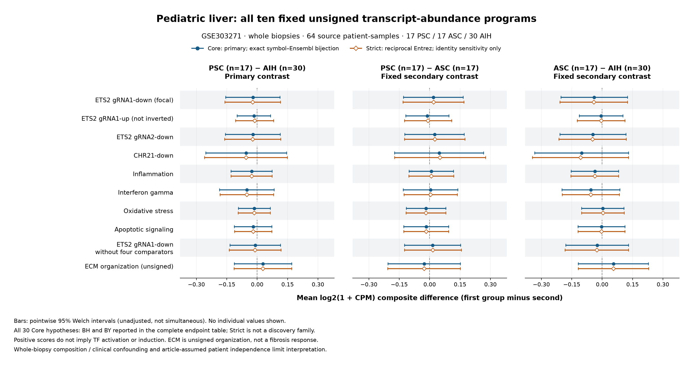

# Pediatric PSC liver: fixed whole-biopsy RNA programs

## Result and scope

**No mean-score difference was detected in the prespecified panel.** In GSE303271, all 30 Core comparisons have nominal P ≥ **0.382808**. There are **0 nominal P < 0.05, 0 BH q < 0.05 and 0 BY q < 0.05** findings. Every Core BH q is **0.9593488442261611** and every BY q is **1**. This is not a result that became null only after multiple-testing correction.

The focal ETS2 gRNA1-down score difference, **PSC minus AIH**, is **−0.0210943**, with pointwise Welch 95% CI **[−0.1546860, +0.1124974]** and nominal P **0.7519284**. The units are differences in mean per-sample, equal-gene **log2(1 + CPM) composite scores**, not raw RNA fold changes or ETS2 activity.

This finding does **not** establish equivalence, absence of inflammation, absence of ETS2 dependence in a cell type, or a clinical conclusion. No equivalence margin was specified. There are no healthy controls and no qualified patient-linked clinical or composition adjustment. The analysis neither confirms nor refutes the separate perturbation experiments or the fixed MacroMap prediction comparison.

The [prospective protocol](../docs/psc-liver-program-protocol.md), [native plan](../config/psc-liver-program-freeze.json) and [outer seal](../config/psc-liver-program-execution-seal.json) were committed and pushed in **`c1ce7f25934c3797eed4660cfed414749c8b46bf` before this analysis accessed expression values**. One fixed primary, a complete independent numerical audit and an unchanged-plan mechanical replay passed. No scientific methods, thresholds, sources, programs or groups changed after values were accessed.

**This fixed liver question is complete.** The epithelial IL17A-alone response-transfer question remains **HOLD and unfulfilled**. The unsigned ECM set is not a replacement for it. No rescue analysis follows the null result.

## Cohort, quantity and frozen panel

The [source qualification](psc-liver-input-qualification.md) retains all **41,096 released rows × 64 source patient-samples**, with deposited labels **17 PSC, 17 ASC and 30 AIH**. ASC is autoimmune sclerosing cholangitis; AIH is autoimmune hepatitis. GEO/paper descriptions of 34 PSC are not permission to merge the deposited PSC and ASC groups. The source is cryopreserved whole tissue from diagnostic liver biopsies, not sorted cells, a whole organ or the paper's separate spatial experiment.

The article's 64-patient statement supports the working independence assumption. Distinct sample/library accessions alone do not prove independent people. An independent person/visit crosswalk was not recovered. Exact sample-linked age, sex, stage, treatment, IBD and batch data were not qualified. Published cohort summaries were not assigned to individual samples.

All released rows, including 998 all-zero rows, define each library denominator. Scores use positive equal weights on mapped members' log2(1 + CPM). There is no expression filter, learned weighting, gene matching, variance standardization or missing-member zero imputation. The gRNA1-up program is **not inverted**. The [identifier preparation](psc-liver-program-inputs.md) preserves original source labels and uses the cached Ensembl 116 reference, not a reconstructed historical counting annotation. GRCh38/STAR 2.7.2b/FeatureCounts 1.6.4 are source-reported; exact GTF and counting settings remain unavailable.

Core uses exact symbol–Ensembl bijections and is the sole 30-hypothesis discovery family. Strict additionally requires reciprocal Entrez identity. Its 30 rows are a fixed identity sensitivity, not a discovery or rescue family. The ten programs comprise the eight fixed original programs, the fixed comparator-nonoverlap ETS2 gRNA1-down version, and the separately qualified unsigned ECM organization set.

| Program | Original denominator | Core mapped | Strict mapped |
|---|---:|---:|---:|
| ETS2 gRNA1-down (focal) | 927 | 848 | 825 |
| ETS2 gRNA1-up (not inverted) | 668 | 612 | 536 |
| ETS2 gRNA2-down | 875 | 809 | 789 |
| CHR21-down | 141 | 126 | 122 |
| Inflammation | 815 | 750 | 744 |
| Interferon gamma | 139 | 121 | 118 |
| Oxidative stress | 436 | 403 | 400 |
| Apoptotic signaling | 588 | 544 | 542 |
| ETS2 gRNA1-down without four comparators | 927 parent gate | 695 | 673 |
| ECM organization (unsigned) | 321 | 301 | 299 |

Ordinary coverage uses the original denominator: at least 80% and at least ten unique mapped members. The nonoverlap program instead preserves its parent's coverage gate, then requires at least ten retained members after subtracting the union of the four original comparator programs. The subtraction removes 153 Core and 152 Strict members. Its displayed component `coverage_gate=false` for 695/927 or 673/927 is therefore expected: **parent gate true plus the retained-member gate makes this score available**. No threshold was relaxed after results. ECM is not part of that subtraction.

The [ECM source](psc-liver-external-program-qualification.md) is the official MSigDB 2026.1.Hs / Reactome 95 `REACTOME_EXTRACELLULAR_MATRIX_ORGANIZATION` set. Its denominator is **321 published symbols**, not its 340 original Ensembl records. It is unsigned membership, not a directed fibrosis or IL17 response. Literal ETS2 is absent; no new target exclusion was made.

## Complete Core panel

Differences are first group minus second. Intervals below are **pointwise, unadjusted Welch intervals**, not simultaneous or multiplicity-adjusted intervals. All 30 rows form one BH/BY family; all have the q values stated above. Display rounding does not change the exact machine-readable values.

| Program | PSC − AIH: difference [95% CI]; P | PSC − ASC: difference [95% CI]; P | ASC − AIH: difference [95% CI]; P |
|---|---|---|---|
| ETS2 gRNA1-down (focal) | -0.0211 [-0.1547, +0.1125]; 0.7519 | +0.0181 [-0.1293, +0.1655]; 0.8034 | -0.0392 [-0.2033, +0.1250]; 0.6319 |
| ETS2 gRNA1-up (not inverted) | -0.0162 [-0.0986, +0.0661]; 0.6926 | -0.0112 [-0.1172, +0.0947]; 0.8295 | -0.0050 [-0.1124, +0.1024]; 0.9248 |
| ETS2 gRNA2-down | -0.0211 [-0.1562, +0.1139]; 0.7538 | +0.0242 [-0.1219, +0.1703]; 0.7370 | -0.0453 [-0.2083, +0.1176]; 0.5768 |
| CHR21-down | -0.0540 [-0.2530, +0.1450]; 0.5871 | +0.0469 [-0.1723, +0.2660]; 0.6653 | -0.1009 [-0.3322, +0.1304]; 0.3828 |
| Inflammation | -0.0272 [-0.1283, +0.0739]; 0.5907 | +0.0086 [-0.1010, +0.1183]; 0.8731 | -0.0358 [-0.1530, +0.0813]; 0.5397 |
| Interferon gamma | -0.0508 [-0.1849, +0.0833]; 0.4492 | +0.0048 [-0.1294, +0.1390]; 0.9422 | -0.0556 [-0.1982, +0.0870]; 0.4355 |
| Oxidative stress | -0.0139 [-0.0927, +0.0649]; 0.7240 | -0.0175 [-0.1146, +0.0796]; 0.7139 | +0.0036 [-0.1008, +0.1080]; 0.9445 |
| Apoptotic signaling | -0.0200 [-0.1119, +0.0719]; 0.6632 | -0.0171 [-0.1277, +0.0936]; 0.7542 | -0.0029 [-0.1183, +0.1125]; 0.9593 |
| ETS2 gRNA1-down without four comparators | -0.0094 [-0.1338, +0.1149]; 0.8791 | +0.0148 [-0.1232, +0.1529]; 0.8272 | -0.0243 [-0.1786, +0.1301]; 0.7519 |
| ECM organization (unsigned) | +0.0290 [-0.1126, +0.1706]; 0.6808 | -0.0270 [-0.2050, +0.1510]; 0.7589 | +0.0560 [-0.1168, +0.2288]; 0.5134 |

All **60 Core/Strict** effects, raw P values, statuses, intervals, coverage fields and applicable q values are in [endpoints.csv](../data/derived/psc-liver-programs/endpoints.csv). Strict q values remain empty, not fabricated ones or zeros. The [group summaries](../data/derived/psc-liver-programs/group-summaries.csv) preserve source n, mean and sample variance; the reporter did not calculate a new SD.

[Vector figure](figures/psc-liver-programs.svg). All programs and contrasts are shown. No individual values are plotted. Positive composite scores or differences do not imply transcription-factor activation, induction, cell abundance or matrix deposition.

## Prespecified sensitivity and uncertainty

- All **60 Welch intervals and 60 percentile-bootstrap intervals include zero**. All score vectors and Welch rows are available; no Core P was replaced by an unavailable-value correction placeholder. Every available Core P entered the fixed full 30-row family.
- Strict's focal difference is **−0.0219796**, CI **[−0.1586454, +0.1146861]**, P **0.7474925**. All **30 Core/Strict point directions agree**, but overlapping mapped gene sets and the same biopsies make this a sensitivity, not independent replication.
- The bootstrap uses the frozen 10,000 within-group PCG64 resamples, seed 2026091602, shared across programs/tiers and contrasts. The focal Core percentile interval is **[−0.1508200, +0.1063917]**. These are pointwise diagnostic intervals; no bootstrap P or additional discovery family was calculated. See [all bootstrap intervals](../data/derived/psc-liver-programs/bootstrap-intervals.csv).
- The complete private omission inventory contains 3,840 rows, including unchanged copies when the omitted unit is outside the contrast. Public stability denominators are **47 for PSC−AIH, 34 for PSC−ASC and 47 for ASC−AIH**, not 64 or 3,840. Focal Core omitted-unit points range from **−0.0359603 to +0.0035776**, with **one strict sign reversal among 47 relevant omissions**. Near-zero signs can be sensitive even when all full-analysis intervals include zero. No omission replaces the full analysis. Private omission Welch fields are diagnostics, with no discovery q values; public output contains only the approved aggregate point ranges/sign summaries. See [all omission summaries](../data/derived/psc-liver-programs/omission-stability.csv).
- [Mapping summary](../data/derived/psc-liver-programs/mapping-summary.csv) and [held endpoint status](../data/derived/psc-liver-programs/held-endpoints.json) preserve all coverage decisions and missing source definitions. HOLD is neither an empty gene set nor a zero score.

## Verification and reproducibility

The [complete independent audit](psc-liver-program-independent-verification.json) authenticated the completed native inventory before numerical parsing. It independently parsed all **2,630,144 original count cells**, compared the qualified cache, 41,096 rows, 64 columns and totals, all **1,280 scores / 20 vectors**, all 60 endpoint rows, the full 30-Core correction family, **640,000 shared RNG indices**, **600,000 bootstrap differences**, all **3,840 private omissions** and 60 public omission summaries. It performed **748,519 structured scalar checks**. No native logCPM matrix was saved, so direct comparison to that unsaved intermediate is **not claimed**.

Counts, axes, statuses, inventory and RNG indices require exact agreement. Positive P/q, variance, SE and df use relative tolerance 1e-10 without an absolute floor; other finite fields use relative 1e-10 / absolute 1e-12 after domain/availability checks. The independently written parser/calculation pipeline shares installed NumPy RNG and SciPy distribution functions; it is not an independent implementation of those libraries or a biological replication. All 73 outer metadata/code/runtime/source-receipt seals and both original raw/cache pins remained unchanged.

The [mechanical replay](psc-liver-program-replay-verification.json) changed only the fresh destination argument. **All 12 native artifacts, including completion, are byte-identical**; 24 actual hashes were checked. Native `root_freeze_written=false` means that the native writer did not create the separate external root freeze. It does not mean that the prospective freeze was absent.

Before values, root ran 170 author/independent-method tests and 74 separate native-output-adapter tests, plus guarded source-only checks. The later aggregate reporter passed 30 root tests. Its exact authenticated-snapshot schema and privacy checks are bounded, not a guarantee for unseen statuses or an adversarial concurrent filesystem. It added no statistical calculations. Root independently replayed all **11 presentation files byte-for-byte**, checked 22 hashes, visually inspected the actual PNG and checked all 11 published file hashes. See [presentation verification](psc-liver-program-presentation-replay-verification.json), the [report manifest](../data/derived/psc-liver-programs/report-manifest.json), [completion](../data/derived/psc-liver-programs/completion-receipt.json) and [verification/provenance](../data/derived/psc-liver-programs/verification-provenance.json).

The [reproduction guide](../docs/psc-liver-program-reproduction.md) states exact inputs, runtime, checks and commands. A clone alone lacks ignored sources, joins, caches and acceptances. Do not overwrite an existing run or publication directory, silently rehash changed inputs, or substitute a different environment. Donor/source identifiers, individual scores, library totals, individual omissions and arrays remain private. Aggregate-only publication is not formal differential privacy or a promise of zero possible inference.

## Interpretation and remaining boundary

The result provides no positive statistical support for the proposed broad whole-biopsy score separation in this pediatric disease-control cohort. It is compatible with differences inside the reported intervals under the working model. No calibrated biological equivalence margin was tested. Gene-level changes can cancel in a composite, and cell composition or cell-restricted regulation can differ without a detectable whole-biopsy mean shift; this analysis **does not show that either explanation occurred**.

Without healthy tissue, a null disease-control contrast cannot establish that all three groups share an induced inflammatory program. Without linked clinical/stage/batch information, it cannot separate these influences from disease labels. RNA abundance composites do not identify ETS2 dependence, a causal risk-variant effect, fibrosis activity, treatment response or clinical benefit. The [independent aggregate interpretation review](psc-liver-program-results-review.md) found no unresolved reporting issue.

GSE159676 expression remains HOLD for its source-scale/design conflicts. NoPSC remains PARK without a qualified full bulk export. The epithelial IL17 transfer source remains HOLD. The [finite reserve appraisal](psc-remaining-frontier-appraisal.md) does not create an active rescue backlog. This analysis closes at its prespecified question, not at a claim that all possible PSC research is exhausted.
