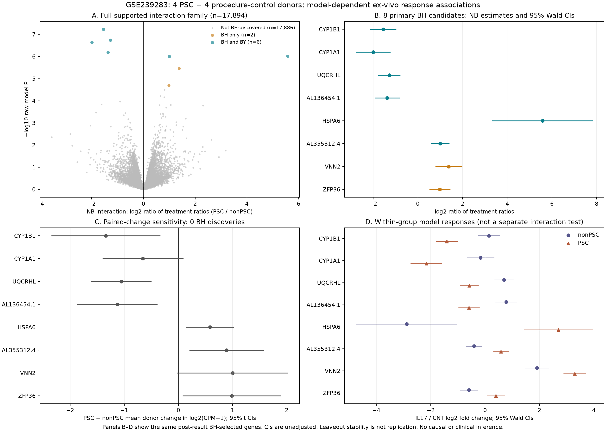

# PSC organoid IL-17A response: donor-level results

**Completed September 16, 2026.** Public-data reanalysis of GSE239283. The [protocol](../docs/psc-organoid-il17-protocol.md) and [execution freeze](../config/psc-organoid-il17-execution-freeze.json) preceded new effects. Checkpoint `52013ec` was committed before fitting and pushed. Source values and frozen methods remain unchanged.

## Main result

**Eight genes meet the fixed negative-binomial (NB) interaction BH criterion; six also meet BY. None meets the full-family Welch sensitivity criterion.** The eight candidate directions agree between the two estimands and remain unchanged in all eight donor-omission summaries. This is **model-dependent evidence of different relative IL-17A responses in cultured organoids**, not independent biological validation, a proven PSC mechanism, a PSC-specific signature or a treatment recommendation.

There are **four PSC and four non-PSC procedure-control donors**. Each supplies one CNT and one IL17 library. The 16 libraries and 46,343 retained cells do not increase independent donor replication beyond eight. Exposure is 100 ng/mL IL-17A for 24 hours at passage 3. Exact eight-donor clinical covariates and culture randomization are not qualified. Donor blocking removes baseline levels, not age-, procurement-, clinical-history- or culture-related response confounding. Pseudobulk also cannot separate within-cell gene regulation from changes in retained cell-state composition.

[Vector figure](figures/psc-organoid-il17.svg). Panel A includes all 17,894 supported interaction tests. Panels B–D display the eight **post-result BH-selected** genes. Intervals are pointwise, unadjusted 95% intervals, not simultaneous or selection-adjusted intervals. Panel C has no full-family discoveries despite some nominal intervals excluding zero. No donor-level expression is published in these figures.

## What was measured

The NB interaction is

`log2[(normalized mean_IL17 / normalized mean_CNT)_PSC / (normalized mean_IL17 / normalized mean_CNT)_nonPSC]`.

A positive interaction means a more positive modeled **relative** response in PSC. It can combine induction, less repression, or opposing within-group responses. It is not an absolute RNA gain or a disease main effect. The prespecified Welch sensitivity instead compares the equal-donor means of IL17-minus-CNT `log2(CPM+1)` changes. Its denominator uses every released raw feature. These are related but different estimands and are not independent studies.

The model is `Intercept + donor + IL17 + PSC×IL17`, with rank 10 and six residual degrees of freedom. Disease main effects would alias donor indicators. The fixed filter is at least 10 counts in at least four of 16 libraries. Ratio normalization uses eligible features positive in every library. There is no count replacement, LFC shrinkage, independent filtering or automatic Cook exclusion. BH and BY use each complete fixed eligible family; missing P values become 1 only inside correction.

| Coverage | Number |
|---|---:|
| Original released Ensembl features, all retained in public tables | 36,601 |
| Count-eligible family | 17,897 |
| Low-count excluded features, retained with status | 18,704 |
| All-zero features in the fixed retained-cell population | 7,641 |
| All-positive eligible normalization basis | 17,463 |
| Supported interaction / nonPSC response tests | 17,894 each |
| Supported PSC response / finite Welch sensitivity tests | 17,897 each |

## Complete primary candidate list

Original source gene labels are retained. They are not independently updated functional annotations. Negative interaction signs do not mean lower untreated expression in PSC.

| Source label | Source Ensembl ID | NB interaction log2 | 95% Wald CI | BH q | BY q | Welch mean-change difference |
|---|---|---:|---|---:|---:|---:|
| CYP1B1 | ENSG00000138061 | -1.550 | [-2.110, -0.990] | 0.0010595 | 0.010987 | -1.341 |
| CYP1A1 | ENSG00000140465 | -1.992 | [-2.747, -1.238] | 0.0013593 | 0.014096 | -0.657 |
| UQCRHL | ENSG00000233954 | -1.279 | [-1.759, -0.798] | 0.0013593 | 0.014096 | -1.058 |
| AL136454.1 | ENSG00000231767 | -1.371 | [-1.910, -0.831] | 0.0028749 | 0.029812 | -1.132 |
| HSPA6 | ENSG00000173110 | +5.576 | [+3.344, +7.808] | 0.0029254 | 0.030336 | +0.581 |
| AL355312.4 | ENSG00000273132 | +0.998 | [+0.598, +1.397] | 0.0029254 | 0.030336 | +0.888 |
| VNN2 | ENSG00000112303 | +1.383 | [+0.799, +1.967] | 0.0088963 | 0.092251 | +1.000 |
| ZFP36 | ENSG00000128016 | +0.983 | [+0.531, +1.434] | 0.044746 | 0.46399 | +0.985 |

Four interactions are positive and four negative. The six BY candidates are CYP1B1, CYP1A1, UQCRHL, AL136454.1, HSPA6 and AL355312.4. VNN2 and ZFP36 are BH-only candidates. BY addresses arbitrary cross-gene dependence **conditional on valid constituent P values**; it does not repair small-sample model calibration or confounding.

The [complete candidate/diagnostic table](../data/derived/psc-organoid-il17-summary/bh-candidates-with-diagnostics.csv.gz) preserves within-group responses, every sensitivity, uncertainty, raw-package fields and fit flags. The [complete primary table](../data/derived/psc-organoid-il17/organoid-primary.csv.gz) includes every original feature, not only discoveries.

### Donor sensitivities substantially limit the conclusion

- **Zero Welch BH or BY discoveries** among the same 17,897 eligible genes. The smallest family-wide Welch BH q is 0.237006. All eight primary candidates have Welch BH q approximately **0.999796**, and BY q 1. CYP1A1 and VNN2 also have nominal Welch 95% intervals spanning zero.
- All eight candidates have the same nonzero NB and mean-change direction. All eight retain their full paired-change sign in **8/8 donor-pair omissions**. These are mean-change summaries, **not NB refits, stable q values, confidence intervals or independent replications**. Across all finite NB genes, 1,458 directions oppose the Welch direction; agreement is not universal.
- Four candidate allocation fractions are 2/70, three are 4/70, and CYP1A1 is 8/70. These enumerate all unstudentized four-versus-four label allocations, including the observed labels and their complement. They are descriptive, not randomized-disease P values or another FDR discovery gate. The 299 features at the minimum possible fraction are not 299 discoveries.
- HSPA6 illustrates the scale distinction: NB interaction **+5.576** versus mean-change difference **+0.581**, with normalized base mean about 18.5. A large relative fold contrast is not a comparably large absolute RNA change.

This sensitivity failure does not prove that the NB findings are false or that IL-17A has no role in PSC. It prevents describing these candidates as confirmed across inferential approaches.

### Within-group responses are not the interaction

PSC has 615 within-group BH genes, of which 298 meet BY. NonPSC has 164 BH genes, of which 87 meet BY. **Different list lengths do not establish different responses.** The direct interaction has only eight BH candidates.

For example, VNN2 has positive fitted responses in both groups. ZFP36's positive interaction combines PSC +0.391 with nonPSC −0.592. CYP1A1's negative interaction combines PSC −2.163 with nonPSC −0.170. These are fitted group responses, not measurements of treatment benefit or untreated disease abundance.

## Source identity and numerical safeguards

The [source qualification](psc-organoid-input-qualification.md) established that the merged integer export matches SCT-assay margins, not raw RNA. It was not used as the NB input. The analysis instead uses all **36,601 original Cell Ranger RNA features**, summed for the exact same **46,343 published retained cells** across 16 original libraries. All 48 original processed members were checked. The 1,821 original cells outside the fixed retained population were not added back.

This is a deliberately defined **full-original-released-raw-universe** analysis, not a reconstruction of the historical filtered RNA matrix. Its count total is 1,128,543,232, which exceeds historical RNA metadata by 70,263 counts and 68,460 positive entries. The exact historical reference/filter/export cause remains unresolved; no guessed filter forces agreement. Ten duplicated-label groups (20 distinct Ensembl rows) remain separate. Source acquisition totaled 879,495,941 bytes; no FASTQ was downloaded.

A mathematical/synthetic review **before effects** showed that software can return finite Wald P values and a convergence flag when an entire count arm is zero. A group response requires positive pooled CNT and IL17 counts; the interaction requires all four disease-by-treatment arms positive. The frozen safeguard masks only affected inference and leaves the family unchanged.

Three features—AC124852.1, DEFB4A and AL359636.2—have zero pooled nonPSC CNT counts. Their interaction and nonPSC-response inference are unavailable, with q=1. The supported PSC response remains available. The [mask audit](../data/derived/psc-organoid-il17-summary/masked-contrasts.csv.gz) retains all unmasked package diagnostics. DEFB4A's unmasked nonPSC package q≈0.005325 is **not** treated as a valid finite-response Wald result. Unavailable inference is not absence of a biological response.

### Native fit diagnostics

- All 17,897 LFC flags are converged. **118 gene-wise dispersion and 67 MAP dispersion flags are false**, on 185 distinct genes. These flags remain in the [complete diagnostic subset](../data/derived/psc-organoid-il17-summary/native-flagged-features.csv.gz) and primary table. No post-effect filter removes them or changes any correction family.
- All eight primary candidates have both dispersion convergence flags true. All Cook values are finite and none exceeds the diagnostic F(10,6) cutoff, 7.874119. Automatic Cook exclusion was disabled because all full design rows are unique.
- There are 143 eligible features with at least one zero-total donor pair (97 involving nonPSC, 81 involving PSC; these sets overlap). This is a diagnostic, not an automatic whole-group mask. None is one of the eight candidates.
- The parametric dispersion trend was used, with no fallback. Both the captured warning list and native fit log are empty. **No warnings does not erase stage flags or establish small-n calibration.**

## Verification and reproducibility

The [independent verifier receipt](psc-organoid-independent-verification.json) reports **397 passed checks**. It reconstructs source/code/software pins, axes, count totals, filter, normalization, rank, masks, all three contrasts and their covariance, full-family corrections, Welch df/intervals, all eight leaveouts and all 70 allocations. It imports neither the analysis module nor PyDESeq2 helper calculations. Shared NumPy/SciPy dependencies remain a software-independence limit.

All 16 count-selected conditional NB coefficient checks agree under the **prespecified** tolerances. Maximum contrast difference is 8.18×10⁻⁵ native SE, versus a 0.02 limit; maximum twice-objective improvement is 1.48×10⁻⁸, versus 0.001. Maximum Newton decrement is 5.91×10⁻⁷, below 10⁻⁵. **Nine SciPy `optimizer_success` flags are false** despite meeting that separately prespecified numerical criterion; both fields are retained. None of the eight BH candidates was selected into this deterministic 16-feature panel. Thus this is not candidate-specific independent optimization.

The verifier does **not** independently refit gene-wise/trend/prior/MAP dispersion estimation or prove small-sample Wald calibration. Covariance/Wald arithmetic is checked over the full family; the conditional coefficient panel is narrower. Numerical agreement is not independent biological replication.

A [fresh-directory replay](psc-organoid-replay-verification.json) reproduces **all eight public files and all 13 private artifacts byte-for-byte**. Private donor values, coefficients, source joins and replay caches remain ignored. The pre-effect suite has 84 source/analysis and 24 independent-verifier passing tests. The aggregate-only reporting wrapper adds 17 passing tests. Historical full-suite missing-input/R-runtime failures remain separate; the milestone test record gives the exact current count.

The [independent results review](psc-organoid-results-review.md), [method review](psc-organoid-independent-review.md), [machine-readable summary](../data/derived/psc-organoid-il17-summary/summary.json) and [reproduction guide](../docs/psc-organoid-reproduction.md) provide the audit trail.

## Decision and next work

Retain the eight genes as **model-dependent candidate interactions**, with their opposing directions, full-family Welch failure and source/numerical limitations. No gene is promoted to a causal PSC target or treatment. Do not create an unplanned program from these genes and call its application to unstimulated liver validation of a treatment interaction.

The next analyses remain unconditional on this result: separately frozen MacroMap stimulus-context discrimination, then the qualified pediatric liver disease-control panel using externally fixed programs. The adult GSE159676 array branch is held for mixed-scale values and donor/label issues. The NoPSC atlas is parked for a missing qualified bulk export. BACH2 genotype-source qualification is a separate bounded branch. See the [active agenda](../docs/psc-analysis-agenda.md).

Sources: [GSE239283](https://www.ncbi.nlm.nih.gov/geo/query/acc.cgi?acc=GSE239283), [primary article PMC11150034](https://pmc.ncbi.nlm.nih.gov/articles/PMC11150034/), DOI [10.1097/HC9.0000000000000454](https://doi.org/10.1097/HC9.0000000000000454). Published IL-17 narratives were known; this is not untouched validation. No researcher contact, enrollment, paid compute, private-data acquisition or clinical recommendation occurred.
