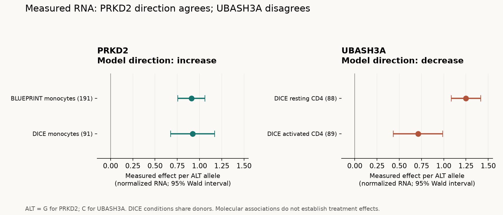

# Measured RNA follow-up: PRKD2 and UBASH3A

Completed 2026-09-11. Eight targeted public-data queries, 121 preserved association rows, and no additional AlphaGenome requests. This extends the [mechanism audit](mechanism-audit.md); it does not change the frozen pilot or its original exclusions.

**PRKD2 now has an allele-aligned expression association in two cohorts that agrees with the model. UBASH3A's total-RNA prediction disagrees with a separate CD4 cohort. A blood dataset contains the predicted +29-nucleotide splice boundary and direction, but a systematic strand-label discrepancy limits its interpretation.** These results refine molecular hypotheses; they do not identify a treatment for established PSC.

## PRKD2: the direction question is substantially resolved

For rs313839, the verified build-38 change is **chr19:46718300 C>G**. The eQTL Catalogue explicitly defines ALT as the effect allele. Its reanalysis of BLUEPRINT monocytes reports higher PRKD2 expression per G allele, and the separate DICE classical-monocyte cohort has the same direction. [Catalogue allele definitions](https://www.ebi.ac.uk/eqtl/Data_access/), [BLUEPRINT study](https://pmc.ncbi.nlm.nih.gov/articles/PMC5119954/), [DICE study](https://pmc.ncbi.nlm.nih.gov/articles/PMC6289654/).

| Public dataset | Samples | Beta per G allele | Standard error | Nominal P |
|---|---:|---:|---:|---:|
| BLUEPRINT monocytes, QTD000021 | 191 | +0.908576 | 0.078278 | 1.71 × 10⁻²³ |
| DICE classical monocytes, QTD000504 | 91 | +0.921304 | 0.126054 | 2.29 × 10⁻¹⁰ |

Our [original GWAS audit](../data/derived/allele-audit.csv) supports **C as the working disease-risk allele**. Re-expressing these coefficients per C gives −0.908576 and −0.921304. Thus the working interpretation is **risk C → lower PRKD2 RNA**, consistent with the model's C>G increase. This is a direction comparison: measured QTL coefficients and the model's +0.020952225 log-fold score are on different scales.

Association at this SNP does not establish that it is the causal variant rather than a correlated marker, or that changing PRKD2 mediates PSC risk. Those require additional genetic and experimental evidence.

The exact [BLUEPRINT](../data/derived/qtl-query-rows/QTD000021-chr19_46718300_C_G.tsv) and [DICE](../data/derived/qtl-query-rows/QTD000504-chr19_46718300_C_G.tsv) subset rows retain REF, ALT, allele counts, sample counts, beta, error and P. BLUEPRINT is a reprocessed version of the benchmark cohort, not a second independent study. DICE supplies the separate-cohort check. The Catalogue used updated processing, so its beta is not presented as the exact original coefficient used in Goode et al. The contradictory A/G labels in the paper supplement and thesis still require author clarification; no original label has been silently corrected.

## UBASH3A: distinguish total abundance from splice choice

For rs1893592, the verified build-38 change is **chr21:42434957 A>C**. DICE reports **higher gene-level RNA per C** in both CD4 conditions. Our original model score was negative (−0.03457617). The disagreement therefore persists in separate measured data.

| Public dataset | Samples | Beta per C allele | Standard error | Nominal P |
|---|---:|---:|---:|---:|
| DICE resting naive CD4, QTD000479 | 88 | +1.249720 | 0.084555 | 1.21 × 10⁻²³ |
| DICE CD4, anti-CD3/CD28 for 4 h, QTD000484 | 89 | +0.710505 | 0.141961 | 3.66 × 10⁻⁶ |

DICE recruited 91 healthy volunteers in San Diego and measured several cell types from the same people. These two conditions are **not two independent replication cohorts**. Four-hour activation also differs from the six-hour assay in Ge and Concannon. An RNA-seq gene count is not interchangeable with their transcript-specific qPCR endpoint, or with functional protein abundance. [DICE methods](https://pmc.ncbi.nlm.nih.gov/articles/PMC6289654/), [prior endpoint audit](mechanism-audit.md).

The Catalogue normalizes gene counts and junction ratios before QTL mapping. A beta of +1.25 means a positive effect on the normalized phenotype, **not a 125% increase**. All P values here are source-reported nominal values. The plotted intervals are descriptive beta ± 1.96 SE; no cross-cohort meta-analysis or treatment-effect calculation was performed. [Catalogue processing](https://www.ebi.ac.uk/eqtl/Methods/).

## The +29-nucleotide splice hypothesis

After finding no target splice measurement in DICE's selected QTL files, we selected both non-GTEx whole-blood LeafCutter datasets in the pinned release-7 metadata: Lepik_2017 and TwinsUK. This was an explicitly exploratory extension; the [selection and matching rules](../config/qtl-blood-query-plan.json) were saved before inspecting their QTL values. Blood contains mixed cell populations, so neither is an exact CD4-cell test.

**Lepik_2017 / QTD000377:** rs1893592-C is associated with higher usage of `21:42434983:42437488:clu_31404_-`: beta **+0.523483**, SE 0.063608, nominal P **1.98 × 10⁻¹⁵**, 471 samples. This is an existing Catalogue result from the Estonian Biobank cohort, not a newly generated experimental observation. The original paper describes 491 analysis participants; 471 is the sample count in this reprocessed QTL dataset. [Original study](https://pmc.ncbi.nlm.nih.gov/articles/PMC5609773/), [exact QTL subset](../data/derived/qtl-query-rows/QTD000377-chr21_42434957_A_C.tsv).

The apparent one-base difference at the right endpoint is a format convention. LeafCutter's regtools conversion uses `A = BED start + first block size` and `B = BED end − last block size + 1`. Therefore the reported ID maps to the half-open interval **[42434983, 42437487)**, exactly the model's alternative boundary. Its start is 29 bases after the canonical **[42434954, 42437487)** boundary. The current upstream implementation was pinned for this coordinate check; it is not asserted to be the precise historical binary that generated the dataset. [Pinned conversion code](https://github.com/davidaknowles/leafcutter/blob/2c9907ef66adf0bfb3092f0ceb6886ee5c046fbb/clustering/leafcutter_cluster_regtools.py#L62), [Catalogue phenotype metadata](https://zenodo.org/records/7850746).

There is a material strand discrepancy: the source cluster ends in `_-`, while the same Catalogue phenotype row assigns it to **UBASH3A on the + strand**. The [whole-metadata audit](qtl-strand-audit.csv) finds this is systematic: **115,561 of 116,015 (99.61%)** unique, single-gene-assigned Lepik junction phenotypes have opposite cluster and annotated-gene strands. The analogous discordance is 0.67% for DICE metadata and 0% for TwinsUK. These are annotation consistency counts, not biological replicate counts. DICE's two metadata files are identical and do not constitute two independent audits.

This pattern suggests a dataset-wide orientation or labeling issue; it does not establish its cause. Both labels are preserved. The result is **agreement in boundaries and association direction with unresolved strand provenance**, not completed validation of a positive-strand CD4 mechanism. Normalized junction-ratio beta also cannot be read as a percent of intron-retaining transcripts. The prior small lymphoblastoid experiment with an opposing direction remains in the [mechanism audit](mechanism-audit.md).

**TwinsUK / QTD000553:** its returned UBASH3A association concerns a different junction, **[42432202, 42437487)**, beta +0.671672 per C, nominal P 4.88 × 10⁻⁹. That junction spans the annotated exon immediately before the affected donor. It is not a replication of the +29 event. The metadata includes the canonical boundary but no +29 boundary assigned to UBASH3A. The recorded 195-sample count must not be treated as 195 unrelated replication units without a relatedness audit.

**Missing measurements remain missing.** DICE has no UBASH3A-assigned junctions in the retrieved phenotype metadata, and chromosome 21 is absent from its filtered splice-association indexes. This is not proof that the gene is unspliced, that the alternative junction is absent biologically, or that its effect is zero. Catalogue `cc` files retain selected representative traits using fine-mapping and connected components; they are not a complete matrix of every tested junction. [Filtering method](https://journals.plos.org/plosgenetics/article?id=10.1371/journal.pgen.1010932).

## What independence means here

- DICE and the Estonian Biobank are separate cohorts from the earlier BLUEPRINT and GEUVADIS evidence. We analyzed published genotype–RNA association summaries, not new donor-level RNA/genotype data or a causal perturbation experiment.
- The model used **ALL_FOLDS**, so the sequence intervals were not held out. A separate cohort does not by itself establish a fully independent model benchmark.
- We extracted [18 relevant training-track records](../data/derived/qtl-comparison-training-tracks.csv) from AlphaGenome's published Supplementary Table 2. The relevant CD4/monocyte RNA and splice tracks cite ENCODE accessions. Exact donor/sample overlap with the QTL cohorts remains unverified. The publication manifest is not a guarantee that the hosted endpoint is byte-identical to the publication model. [AlphaGenome data manifest](https://www.nature.com/articles/s41586-025-10014-0).

## Next useful work

1. Resolve the Lepik strand discrepancy from archived workflow parameters or maintainer clarification, preserving original labels. Retrieve unfiltered canonical and +29 coefficients or donor-level junction counts if accessible. The public summaries cannot answer this alone.
2. Freeze a direct reanalysis protocol: check genotype quality and local haplotypes, mapping bias and junction overhang support; analyze canonical usage, +29 usage, exon skipping, intronic coverage and total abundance separately; use donors as the statistical units and account for repeated conditions/relatedness. GEUVADIS is accessible for method development but was already used in prior UBASH3A research, so reusing it would not add a new validation cohort.
3. Continue public-data work on the controlled benchmark: complete credible-set memberships and matched comparison variants before expanding model runs. These source checks are already more informative than simply adding compute to the same four variants.

The [updated researcher questions](../docs/mechanism-review-questions.md) now describe concrete discrepancies and requested data fields. No outreach was sent. No personal genome or clinical records were used.

## Reproducibility

The [query manifest](../config/qtl-followup-queries.json) records URLs, build, alleles, sample context, query interval, software version, retrieval timestamps and subset hashes. There are **39 pinned public source files**, including file headers, tabix indexes, annotation metadata and primary-source documentation. Whole multi-gigabyte association files were not downloaded or hashed. The retired API was replaced by indexed archive queries. [Archive access documentation](https://www.ebi.ac.uk/eqtl/Data_access/).

The full [expression table](qtl-expression-comparison.csv), [splice table](qtl-splice-comparison.csv), [coverage accounting](qtl-query-coverage.csv), [annotation extract](../data/derived/ubash3a-qtl-junction-annotations.csv) and [provenance](qtl-followup-provenance.json) are versioned. Raw source files are locally cached and ignored by Git. See the README for reproduction commands.

Validation: all 39 source-cache hashes and eight subset hashes passed; repeating all eight remote queries reproduced the saved subsets exactly; 21 tests passed. The plotted figure was visually inspected. Tests cover allele flips, multiallelic selection, coordinate conversion, preserved strand disagreement, duplicate annotations and empty filtered results.
