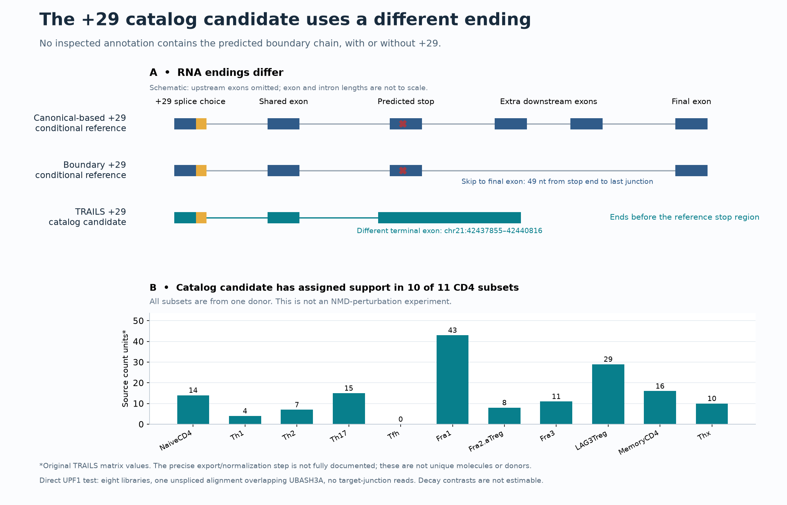

# UBASH3A: testing the proposed RNA-survival mechanism against public data

**Result, September 14, 2026:** this follow-up does **not establish preferential survival of the predicted boundary +29 RNA**. A public immune-cell catalog contains the exact +29 junction, with assigned support in CD4 subsets, but that candidate has a different terminal exon. None of the inspected annotations contains the proposed boundary downstream chain, even without +29. An original-read check of the available UPF1 experiment finds insufficient UBASH3A coverage to estimate a decay response. This is a useful structural finding and an unavailable decay contrast, not a negative NMD experiment.

## What was tested

The [previous reconstruction](ubash3a-transcript-consequences.md) predicted that adding 29 bases to ENST00000398367.2 would place the new stop 49 nucleotides from its end to the final exon junction, or 51 from its first base. Other reconstructed RNAs retain additional downstream junctions. The hypothesis was that the boundary arrangement might undergo less nonsense-mediated decay (NMD). These were conditional sequence predictions; the complete altered RNAs had not been identified experimentally.

The [public-data protocol](../docs/ubash3a-hypothesis-test-protocol.md) and [plan](../config/ubash3a-hypothesis-test-plan.json) were frozen at **18:58:36 UTC**, after study-level discovery but before new UBASH3A structures or counts. Thirteen annotation inputs were pinned before the first scan at **19:24:00 UTC**. The exact positive-strand GRCh38 junctions remained **42434954 → 42437488** for normal splicing and **42434983 → 42437488** for +29. Nearby donors, complete intron retention and exon skipping did not qualify.

The scan kept all coordinate-overlapping or gene-labeled transcript models, including discordant strands and labels. It recovered **165 source-model rows, 126 on chromosome 21's positive strand**, with 1,778 exon rows. These are catalog entries, sometimes repeated across source files, not independent molecules or donors. Full internal-chain agreement was kept separate from agreement only after the target junction. The [complete annotations](../data/derived/ubash3a-hypothesis-test/observed-transcript-models.csv), [exons](../data/derived/ubash3a-hypothesis-test/observed-exons.csv), [reference matches](../data/derived/ubash3a-hypothesis-test/reference-chain-matches.csv) and [13-file summary](../data/derived/ubash3a-hypothesis-test/annotation-summary.csv) retain every result.

## All five source families

| Source | Independent context | Exact +29 finding | What it can establish |
|---|---|---|---|
| [GSE229971](https://www.ncbi.nlm.nih.gov/geo/query/acc.cgi?acc=GSE229971), activated CD4 | One donor, four time points; four annotation files | None in these files | Filtered RNA-structure reference; no NMD intervention |
| [GSE202327](https://www.ncbi.nlm.nih.gov/geo/query/acc.cgi?acc=GSE202327), resting CD4 | One donor; one CD4 sample in two annotation versions | None in either version | The versions are a filtering comparison, not replication |
| [TRAILS](https://www.nature.com/articles/s41467-024-48615-4) | One donor across 29 immune subsets, plus one independent PBMC donor; five files including algorithm comparisons | One candidate in the main catalog; different downstream ending | Catalog-level support for the exact junction, with important replication and filtering limits |
| [Rapid UPF1 depletion / NMDRHT](https://www.ebi.ac.uk/biostudies/arrayexpress/studies/E-MTAB-14725) | Engineered HCT116 cells; two culture replicates per arm on each of two platforms | No locus model in the inspected catalog; no exact target junction in eight original-read extracts | Intended transfer test is not estimable because the gene lacks usable coverage |
| [Leshem primary-lung deposit, versioned record 22691785](https://zenodo.org/records/22691785) | Seven unique donors, 13 donor-cell pairs, 26 treated/control samples across four cell types | One normal-junction model; no +29 model | Target RNA is not identifiable in this catalog, so its treatment contrast was not calculated |

The [dataset-by-question assessment](../data/derived/ubash3a-hypothesis-test/dataset-question-assessment.csv) records the distinct evidence levels and limitations. Multiple CD4 subsets, time points, annotation filters and algorithms do not increase the number of independent donors.

The bounded additional CD4/NMD search found no eligible direct experiment. Three broader GEO hits were retained with [explicit exclusions](../data/derived/ubash3a-hypothesis-test/additional-search-exclusions.csv): carcinoma/CD8 co-culture, observational memory-Treg splicing, and T-ALL spliceosome inhibition. This was a finite search, not an exhaustive claim that no suitable data exist anywhere.

## The +29 candidate is structurally different

The main TRAILS annotation contains **e09f04f5-c617-4bb3-b69c-519ccb16d0f1**, an 11-exon positive-strand UBASH3A model spanning chr21:42403917–42440816. It uses the exact +29 junction and the common exon at 42437488–42437580. Its next junction is **42437580 → 42437855**, entering an alternative terminal exon at **42437855–42440816**.

The five earlier reference models instead continue from 42437580 to **42442452**. The candidate ends before that exon and before the earlier predicted stop at **42442545–42442547**. It therefore matches neither a full reconstructed +29 RNA nor any reconstructed downstream chain. The proposed boundary chain would subsequently use **42442596 → 42447057**; no inspected model contains that complete downstream arrangement with either normal or +29 target splicing.

The [original TRAILS support values](../data/derived/ubash3a-hypothesis-test/trails-locus-source-counts.csv) assign this candidate **247 source count units across 29 subsets**, including **157 across the 11 CD4 subsets**, with positive values in **10 of 11**. All these subsets come from one donor. The deposited matrix is associated with a FLAIR quantification command that also requests TPM output, but the precise export/normalization step for this deposited file is not fully documented. Values are preserved as source count units; they are not labeled unique molecules, independent full-length molecules per subset, or a normalized comparison of cell-type abundance.

There are **1,218 preserved values for 42 of 43 locus models**. The missing matrix ID is a negative-strand, ineligible model and remains missing rather than being filled with zeros. All 43 models have [original source annotations](../data/derived/ubash3a-hypothesis-test/trails-locus-source-annotations.csv). Their source start coordinates consistently use a zero-based convention relative to the GTF; source ends agree exactly. The GTF's generic `PacBio` feature label does not identify the sequencing platform: the study methods and code specify Oxford Nanopore sequencing.

The exact +29 event was not recovered in the independent male PBMC catalog, its TRAILS-validation subset, or either ESPRESSO comparison. Those algorithm comparisons reuse the original donor's data. TRAILS applies junction correction, full-length-support criteria, TSS filtering and artifact filtering; the other CD4 catalogs also apply collapse/correction and transcript filters. These non-detections limit confidence in this particular catalog candidate, but do not prove it is an artifact or absent from cells. Individual supporting molecules were not inspected in the TRAILS raw reads.

TRAILS labels the candidate `predicted_NMD=FALSE`. That is source computational annotation, not an observed survival response. Neither that label nor the assigned counts establish a stable protein. The exact +29 event itself was already reported in earlier work; this audit does not claim discovery of it.

## The original UPF1 reads do not cover the requested contrast

The published rapid-depletion study supplies **E-MTAB-14725** long-read alignments and matching indexes. Its records specify 500 micromolar IAA for 12 hours in N-AID-UPF1 HCT116 cells, versus no IAA, with two source-labeled culture replicates for each condition on PacBio and ONT direct RNA. The platforms were analyzed separately, and replicate labels were not assumed to establish matched culture blocks. See [Boehm et al., PMID: 40934927](https://pubmed.ncbi.nlm.nih.gov/40934927/) and the pinned [sample and read-source manifest](../config/ubash3a-upf1-read-sources.json).

After the catalog scan, a [separate original-read plan](../config/ubash3a-upf1-read-test-plan.json) was frozen at **19:31:21 UTC**, before any target alignments or NMD-response counts were inspected. Only the fixed UBASH3A interval was extracted from each indexed BAM. Source size, ETag and modification time agreed before and after extraction; the server honored a bounded range probe, and every source chromosome-21 length matched GRCh38. The subset, original index, header and prefix hashes are retained. The entire remote BAMs were not downloaded or whole-file hashed.

**Seven extracts contain zero alignments. The eighth, treated PacBio replicate 1, contains one alignment overlapping the end of the gene.** It spans chr21:42446564–42448962 on the reverse alignment strand, MAPQ 60, with CIGAR `26S1224M4D1171M`. It has no spliced `N` operation and cannot identify either target junction or any requested full RNA. Original index metadata contain 157,121–296,358 mapped chromosome-21 alignments per library, so the source indexes are not empty; those index counts are not a normalization denominator for this test.

The [eight-sample summary](../data/derived/ubash3a-hypothesis-test/upf1-read-summary.csv), [actual alignment](../data/derived/ubash3a-hypothesis-test/upf1-locus-alignments.csv), **all 80 reference-count rows** and **48 architecture-count rows** retain the zeros. Every planned [descriptive decay contrast](../data/derived/ubash3a-hypothesis-test/upf1-read-contrasts.csv) is **not estimable**. No pseudocount or P value was introduced. This provides no evidence that the target RNA resists NMD or responds to UPF1 loss; it was not adequately measured in this cell line. Even a covered UPF1-dependent abundance response would not alone establish a direct half-life or a CD4-cell mechanism.

The primary-lung source offers a different perturbation, SMG1 inhibition versus DMSO, but its original Isocall GTF identifies only a normal target-junction model at this locus. Target treatment counts were not inspected or substituted with gene-level effects. Its cited GEO accession GSE329233 was absent from the Entrez result and the attempted family SOFT download returned 404. The versioned source-data and code deposits are available. The deposited study-specific Isocall scripts establish GRCh38/GENCODE v49 alignment provenance; peer-reviewed manuscript status was not established here.

## What a direct experiment must distinguish

The [reference junction chains](../data/derived/ubash3a-hypothesis-test/reference-junction-chains.csv) and [12 cDNA planning windows](../data/derived/ubash3a-hypothesis-test/diagnostic-RNA-windows.csv), with [FASTA sequences](../data/derived/ubash3a-hypothesis-test/diagnostic-RNA-windows.fasta), now give explicit RNA discriminators. With 20-base flanking anchors, linking the +29 junction to the first distinguishing downstream junction requires **278 RNA nucleotides** for the reference architectures, or **133** for the TRAILS candidate. These minimal windows do **not** include rs1893592. Extending the left portion to include all 29 retained bases gives **297** or **152** nucleotides and allows separate hypothetical A/C templates. These are constructed reference-genome windows, not observed genotypes or validated primers. They distinguish local architectures, not the complete upstream coding transcript; suitable fragment-spanning assays can establish this local linkage without necessarily requiring an entire long read.

Protein detection alone also has an identification problem. The [sequence-equivalence check](../data/derived/ubash3a-hypothesis-test/protein-sequence-equivalence.csv) shows that, for a fixed A or C allele, the boundary +29 model and two other reconstructed RNAs encode the **same 498-aa product**. The two 536-aa products are likewise shared between two RNAs. An altered peptide could support translation without identifying the RNA that supplied it.

The justified next experiment is therefore in **primary CD4 cells**: establish molecule-level linkage and the complete coding RNA, including the alternative TRAILS ending as a separately labeled candidate; compare its abundance under a controlled NMD perturbation with the appropriate normal-splicing RNAs; then use a direct decay-rate measurement and protein assay if the RNA is verified. The newly encountered terminal-exon candidate is an exploratory follow-up, not a successful test of the frozen boundary hypothesis. New 3D protein modeling would not resolve these missing measurements.

## Verification and reproducibility

- An independent parser, using zero-based intervals and no imports from the primary annotation implementation, agrees on all **13 sources, 165 model rows, 1,778 exons and 140 reference-match rows**, with **2,135 scalar/structure checks**. [Annotation verification](ubash3a-hypothesis-test-independent-check.json).
- A separate check reproduces all **1,218 source values**, the 247/157 support sums, all **10 conditional protein scenarios**, the **12 RNA windows**, all **eight BAM/index checks** and the single actual alignment's CIGAR interpretation. [Support and read verification](ubash3a-test-support-independent-check.json).
- **196 repository tests pass**, including synthetic exact-junction, coordinate, strand, terminal-exon, CIGAR-deletion, anchor, quality and cache-integrity cases. Deterministic analyses replay byte for byte, source caches verify, and earlier results are preserved; see the [completion record](ubash3a-hypothesis-test-verification.json) and [reproduction guide](../docs/ubash3a-hypothesis-test-reproduction.md).
- One parsing repair was necessary: the source GTF uses an unquoted numeric attribute. The first run stopped, and support for that standard form was added with tests. Its [repair record](../config/ubash3a-hypothesis-test-execution-repairs.json) retains the initial stage and new code hashes; the original method, source selection and coordinate rules were unchanged.

Source files remain in ignored local storage with public URLs, retrieval times and hashes in the [70-source manifest](../config/ubash3a-hypothesis-test-sources.json). No researcher outreach, participant enrollment, new sequence-model call or patient analysis was performed.
