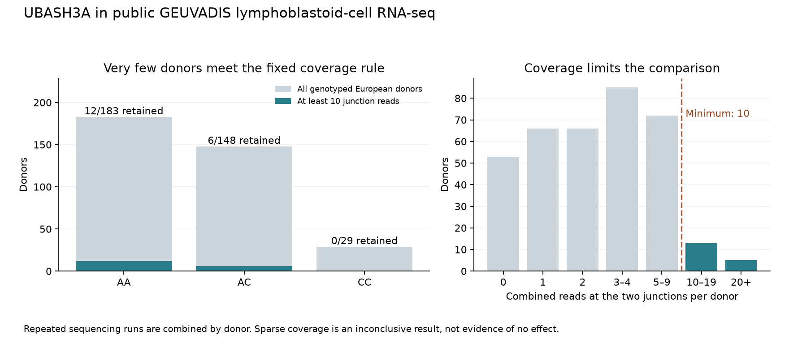

# UBASH3A: strand check and direct public junction counts

2026-09-11, public-data follow-up. Public-source retrieval continued into September 12 UTC. Research analysis only; no patient data or additional AlphaGenome requests were used.

**The target splice boundaries are consistent with UBASH3A's positive strand. A mismatch in published workflow settings provides a plausible explanation for the reversed Lepik labels, but its historical cause is not yet confirmed. Our direct GEUVADIS reanalysis is inconclusive: only 18 of 360 genotyped European donors have sufficient junction coverage, with no CC donors retained.** The useful next step is a small, precisely specified blood/CD4 data request, not a larger model run.

## What the strand evidence establishes

The [previous QTL follow-up](qtl-followup.md) found a positive rs1893592-C association with the +29-nt splice junction in Lepik_2017 blood: beta 0.523483, SE 0.063608, nominal P 1.98464e-15, n=471. Its phenotype identifier ends in `clu_31404_-`, although the assigned UBASH3A gene strand is positive. Across that dataset's metadata, 115,561 of 116,015 unique single-gene-assigned phenotypes have conflicting strand labels.

The new [reference-sequence check](ubash3a-junction-motifs.csv) and the independently processed Snaptron records agree on both boundaries:

| Junction | GRCh38 intron, zero-based half-open | Positive-strand motif | Opposite-strand motif | Lepik cluster suffix |
|---|---|---|---|---|
| Canonical | chr21:[42434954,42437487) | GT–AG | CT–AC | minus |
| +29 nt | chr21:[42434983,42437487) | GT–AG | CT–AC | minus |

The motifs support positive-strand splicing at these coordinates; the labels have not been silently rewritten. Snaptron uses one-based inclusive intron coordinates, so its starts are 42434955 and 42434984, with end 42437487 for both. Leafcutter's identifier convention differs again; that conversion was documented in the previous report. [Ensembl reference sequence](https://rest.ensembl.org/sequence/region/human/21:42434944..42437504:1?content-type=application/json), [Snaptron field definitions](https://snaptron.cs.jhu.edu/reftables.html).

There is also a concrete software explanation to investigate:

- In the published catalogue workflow, `reverse_stranded` selects HISAT2's RF orientation but sends `-s 2` to regtools.
- The workflow's container recipe declares regtools 0.6.0. That version defines `-s 1` as first-strand/RF and `-s 2` as second-strand/FR.
- For a genuine RF library, selecting FR reverses the inferred junction strand. A [four-read synthetic truth table](ubash3a-strand-flag-audit.csv), derived from the pinned source expression, demonstrates the reversal for both reads and both RNA strands.

This is an **inference from source code**, not confirmation of the parameters or container contents used in the historical Lepik run. The recipe, actual image and actual run must be distinguished. The original study used TruSeq stranded mRNA; Illumina describes its first read as antisense to the RNA. We still need the catalogue maintainers to confirm whether this branch explains QTD000377 and whether a corrected release exists. [Catalogue alignment code](https://github.com/eQTL-Catalogue/rnaseq/blob/7ba2a4d5efc9f4754bd32d3288d025f884d760e4/modules/align.nf), [junction-extraction code](https://github.com/eQTL-Catalogue/rnaseq/blob/7ba2a4d5efc9f4754bd32d3288d025f884d760e4/modules/leafcutter.nf), [regtools definitions](https://github.com/griffithlab/regtools/blob/9221a198dd0e1f681d2deef49ebd58f4ae4e5e01/src/junctions/junctions_extractor.cc), [Lepik study](https://pmc.ncbi.nlm.nih.gov/articles/PMC5609773/), [Illumina guide](https://support.illumina.com/downloads/truseq-stranded-mrna-reference-guide-1000000040498.html).

The source association still measures a normalized junction phenotype in mixed blood. It does not establish an absolute transcript fraction, a causal allele effect, a protein consequence or a treatment effect. The opposite gene-expression prediction and conflicting earlier splice measurements remain in the evidence record.

## Direct GEUVADIS measurement

Before retrieving target counts or inspecting genotype groups, we saved the [analysis plan](../config/ubash3a-public-junction-plan.json) and its [timestamp and checksum](../config/ubash3a-junction-run.json). The hypothesis and dataset were chosen after earlier literature/model results, so this is an exploratory follow-up, not a prospective discovery or held-out model benchmark. Ji et al. already used GEUVADIS in their UBASH3A analysis. [Ji et al. 2017](https://pmc.ncbi.nlm.nih.gov/articles/PMC5540332/).

We retrieved the two exact junctions from Snaptron's `srav3h` compilation, which uses GRCh38 recount3 data, and restricted them locally to the public ERP001942 study. The counts were checked against the underlying indexed archive; both complete target rows matched exactly. All 667 sample-to-run mappings were separately checked through direct Snaptron sample-ID lookups and recount3 metadata, then matched to ENA donor aliases. The metadata search endpoint failed despite its advertised registry fields; direct ID and coordinate lookups worked. This was a service problem, not absence of biological data. [Snaptron compilation documentation](https://snaptron.cs.jhu.edu/data.html), [recount3 access documentation](https://research.libd.org/recount3/reference/locate_url.html), [ENA study](https://www.ebi.ac.uk/ena/browser/view/ERP001942).

Public 1000 Genomes phase-3 genotypes were extracted for GRCh37 position 21:43855067, REF=A and ALT=C, using an indexed single-position query. The source VCF has `ID=.` at this row; its missing rsID was preserved. The rs1893592 identity rests on the previously verified Ensembl build/coordinate/allele mapping. We did not infer genotypes from the RNA being tested. The complete genome-wide VCF was not downloaded. [1000 Genomes source release](https://ftp.1000genomes.ebi.ac.uk/vol1/ftp/release/20130502/).

| Sample accounting | Count |
|---|---:|
| Verified processed RNA-seq runs | 667 |
| Unique donor aliases | 464 |
| Donors with repeated runs, combined before analysis | 173 |
| Donors with matched public genotypes | 447 |
| Without matched genotypes, excluded from genotype comparisons | 17 |
| Genotyped CEU/FIN/GBR/TSI donors | 360 |
| European donors with at least 10 combined junction reads | 18 |
| European donors with at least 20 reads, fixed sensitivity check | 5 |

YRI was kept separate: 87 genotyped donors, only one meeting the 10-read threshold and none meeting the 20-read threshold. Counts above are derived from this specific release and matching procedure, not copied from a paper's headline sample size.



The fixed primary endpoint was **+29 junction reads / (canonical + +29 junction reads)** for donors with at least 10 combined reads. This is a composition of two junctions, not the fraction of all UBASH3A transcripts or a measurement of whole-intron retention.

| European genotype | All genotyped donors | Retained at ≥10 reads | Canonical reads in retained donors | +29 reads in retained donors |
|---|---:|---:|---:|---:|
| AA | 183 | 12 | 206 | 0 |
| AC | 148 | 6 | 84 | 1 |
| CC | 29 | 0 | 0 | 0 |

Across all 464 RNA donors, including those failing coverage or genotype matching, the two junctions had 1,472 canonical and nine +29 supporting reads. The nine alternative reads occurred in eight donors. These small counts do not establish a stable allele-effect size.

The planned population-adjusted regression also cannot produce its specified HC3 uncertainty: after filtering, a population category has a single donor, giving unit leverage. The 20-read sensitivity analysis has the same problem. Both are recorded as **not estimable**, with blank effect/uncertainty fields, rather than a zero or a favorable P-value. We retained the original thresholds and covariates. [Genotype-group results](ubash3a-junction-genotype-groups.csv), [model status](ubash3a-junction-associations.csv), [complete audit](ubash3a-junction-audit.json).

This result neither validates nor disproves AlphaGenome's predicted allele direction. These are lymphoblastoid cells, whereas the prediction used CD4 tracks. Counts include all aligned junction-supporting reads in this release; per-read mapping quality and overhangs were not audited. Sequencing-center effects, relatedness and other confounding were not fully modeled. Technical repeats were combined, and no donor was treated as multiple independent samples.

## What is available from Lepik, and what remains missing

We checked the published archive, count-release metadata, cluster lead file and coverage-plot archive. The lead file contains one record for `clu_31404_-`, with **seven tested traits**, rs1893592 A>C and the different exon-spanning trait `21:42432202:42437488:clu_31404_-` as its lead endpoint. That row has beta 0.550024 and nominal P 1.0898e-17. It is not the canonical/+29 contrast. Its exact fields are preserved in the [cluster lead table](../data/derived/ubash3a-lepik-cluster-lead.csv).

The coverage archive contains one UBASH3A PDF showing genotype-group base coverage and exon effects, plus junction annotations. It does not provide the required donor-by-junction count matrix. We did not digitize it into invented junction counts. The linked public release-3 RNA count matrices do not identify a release of the needed Leafcutter per-junction counts. [Archive directory](https://ftp.ebi.ac.uk/pub/databases/spot/eQTL/coverage_plots/QTS000019/), [count-release metadata](https://zenodo.org/records/4678936).

In a **2023** public response, catalogue maintainer Kaur Alasoo explained that unfiltered transcript/splicing `.all.tsv.gz` files were not routinely shared because they exceeded 10 TB, and subsequently offered to arrange a targeted transfer. That is a useful contact route, not a guarantee of current availability. We therefore prepared a [short, unsent data request](../docs/ubash3a-data-request-draft.md) and a [six-row endpoint specification](../data/derived/ubash3a-data-request-endpoints.csv). The request asks first for aggregate statistics or a small extraction; raw individual-level data are not required for the initial answer. [Maintainer discussion](https://github.com/eQTL-Catalogue/eQTL-Catalogue-resources/issues/35).

## Concrete next step and independent work

For the UBASH3A branch, the next decisive evidence is the exact canonical/+29 rs1893592-C comparison in sufficiently covered blood or CD4 samples, with the cluster denominator and strand history explained. The draft asks for that bounded result. No outreach has been sent.

While awaiting a response, a separate useful compute task is to inspect the small published PSC fine-mapping archive, validate complete credible-set membership and freeze a controlled extension with comparison variants. This is listed in the [research backlog](../docs/research-plan.md); it has not been presented as completed here. More UBASH3A predictions would not repair the measurement gap found in this analysis.

## Reproduction

Use the existing Python 3.12 research environment and `requirements-qtl.txt`; no API key or GPU is needed.

```bash
python scripts/fetch_sources.py --manifest config/ubash3a-junction-sources.json
python scripts/fetch_ubash3a_junction_genotypes.py
python scripts/audit_ubash3a_strand.py
python scripts/summarize_ubash3a_junctions.py
python -m unittest discover -s tests -v
```

The main source manifest pins 35 files, including metadata, the two count responses, source code, a 53 MB coverage archive and the 16 MB raw-junction index. The genotype subset is separately pinned and can be rechecked with `--refresh`. To repeat the independent archive check, run `python scripts/verify_ubash3a_junction_archive.py`; its [recorded result](ubash3a-junction-archive-check.json) requires exact agreement for both target rows. Full public sample tables and the joined donor table stay in ignored `data/raw/`; aggregate outputs are versioned. Tests cover incomplete sparse responses, coordinate/allele mismatches, repeated donors, missing genotypes, strand orientation and unestimable regressions. All 26 tests passed. The original pilot and earlier audit results remain unchanged apart from forward links.
