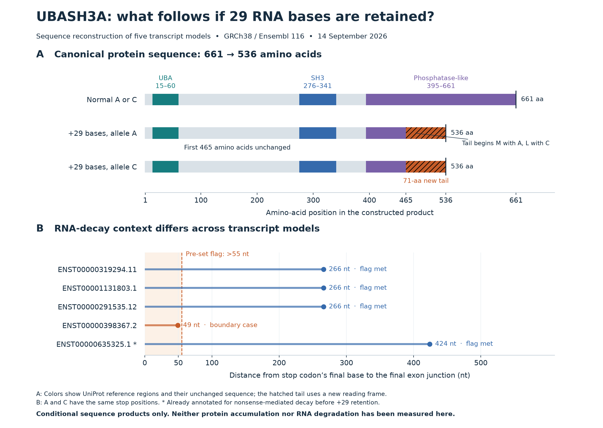

# UBASH3A: consequences of the exact +29-base splice form

**Completed 14 September 2026.** Conditional sequence reconstruction; no new expression measurement, allele-effect estimate or clinical inference.

Retaining these 29 intronic bases changes the coding frame in all five selected transcript models. In the canonical model, the possible translation product is **536 amino acids rather than 661**: the first **465 amino acids are unchanged**, followed by a **71-amino-acid new tail** and an early stop. Four altered models meet the frozen positional RNA-decay flag; the fifth is a boundary case. These are consequences **if this exact splice form is made and translated**, not evidence that the proteins accumulate in cells.



[Scalable figure](figures/ubash3a-transcript-consequences.svg) · [All 20 scenario results](../data/derived/ubash3a-consequences/consequences.csv) · [Independent verification](ubash3a-consequences-independent-check.json)

## What was fixed and reconstructed

The [protocol](../docs/ubash3a-consequence-protocol.md) and [plan](../config/ubash3a-consequence-plan.json) were saved before sequence-consequence calculation. They fix GRCh38 chromosome 21, positive strand, an upstream exon ending at **42434954**, a downstream exon starting at **42437488**, and retention of **42434955–42434983**, inclusive. The rs1893592 **A>C** substitution at **42434957** is the third retained base. Other alleles at this multiallelic site are outside this comparison.

Current Ensembl release 116 / GRCh38.p14 annotation was captured on September 14. The expanded gene record matches the previously preserved annotation exactly as a JSON object. All **10** models are inventoried; **five** have the required consecutive exon boundaries. Their versions, coding boundaries and all other splice junctions remain fixed. Selection does not establish expression of any full-length model in a relevant cell. [Ensembl gene record](https://rest.ensembl.org/lookup/id/ENSG00000160185?expand=1), [variant record](https://rest.ensembl.org/variation/human/rs1893592).

Each model has four scenarios: normal-A, normal-C, +29-A and +29-C. Normal-A and normal-C produce identical mature RNA and protein because the intronic variant is removed. The retained RNAs differ at exactly one base:

```text
A: GTATGTTTGAGGACTGTCTAGTAGGAAAG
C: GTCTGTTTGAGGACTGTCTAGTAGGAAAG
     ^ rs1893592; third retained base
```

Genomic exon concatenation reproduces each Ensembl cDNA exactly. The annotated coding coordinates reproduce each API CDS, including its terminal stop, and translation reproduces each reference protein. Retention occurs after coding base 1393 in the 661-aa models and 1279 in the other three; 29 is not a multiple of three, so it changes the downstream codon grouping. Altered transcripts were then translated from their annotated start to their **first in-frame stop in the full mature RNA**. Stops were not assumed to occur immediately inside the retained segment.

## Transcript-by-transcript result

Both retained alleles have the same peptide length, stop position and positional decay flags. Protein lengths are possible ORF products, not measured abundances.

| Transcript version | Starting annotation | Normal → +29 peptide length | First changed amino acid | +29 stop end to final junction | Frozen >55-nt flag |
|---|---|---:|---:|---:|---|
| ENST00000319294.11 | Canonical, protein coding | 661 → 536 | 466 | 266 nt | Yes |
| ENST00001131803.1 | Protein coding | 661 → 536 | 466 | 266 nt | Yes |
| ENST00000291535.12 | Protein coding | 623 → 498 | 428 | 266 nt | Yes |
| ENST00000398367.2 | Protein coding | 526 → 498 | 428 | 49 nt | No; boundary case |
| ENST00000635325.1 | Already annotated for nonsense-mediated decay | 521 → 498 | 428 | 424 nt | Yes |

The 661-aa models retain 465 identical amino acids and replace/remove the remaining 196 reference residues. The shorter models retain 427 identical amino acids. Every retained product acquires the same 71-aa tail, with one allele-specific difference: its first amino acid is **M for A** and **L for C**. This is residue 466 or 428, respectively. The A-form tail is:

```text
MFEDCLVGKGTRYWTVVSESALCLPPQPSAVCRRPNSSWKNSNWRKKSRYEWNLESLNGQNGKLAKPPQPS
```

All retained ORFs terminate at the same genomic **TGA**, chr21:**42442545–42442547**. The stop lies in a downstream exon, after translation has continued beyond the 29 retained bases. The full coordinates and nucleotide-level maps are retained in the output tables.

## What the RNA-decay features do and do not establish

The frozen primary flag requires the stop's **final nucleotide** to be more than 55 nt upstream of the final exon boundary. A second flag uses >50 nt. These are descriptive features relevant to nonsense-mediated decay (NMD), with known context-dependent exceptions; they are not calibrated decay probabilities. No numerical tumor-trained NMD prediction is transferred to UBASH3A in CD4 cells. [Lindeboom et al., 2016](https://doi.org/10.1038/ng.3664), [Lindeboom et al., 2019](https://pmc.ncbi.nlm.nih.gov/articles/PMC6858879/).

- **Four of five altered models meet both frozen flags.** The stop is 266 or 424 nt before the final junction. ENST00000635325.1 was already NMD annotated, and its normal ORF already meets the flag, at 326 nt; +29 retention does not newly create that classification.
- **ENST00000398367.2 needs a boundary interpretation.** Its stop is 49 nt from the final base, or 51 nt from the first base, to the final junction. Both conventions fall below the primary >55-nt flag. The >50-nt result depends on the stop-coordinate convention. It is a candidate for different RNA stability, not demonstrated NMD escape.
- All retained stops are **49 nt before the nearest downstream junction**, in a **145-nt exon**, and well beyond the first 150 coding nucleotides. The other four models have additional downstream junctions. No retained scenario triggers the frozen long-exon (>400 nt) or start-proximity context flag.

The [independent check](ubash3a-consequences-independent-check.json) reports both stop-coordinate conventions for all 20 scenarios. The threshold and convention were not changed after seeing the boundary result.

## Protein regions and the structural-modeling decision

The reviewed human [UniProt P57075 record](https://www.uniprot.org/uniprotkb/P57075/entry), entry version 198 / sequence version 1, exactly matches the normal 661-aa products of ENST00000319294.11 and ENST00001131803.1. Its reference regions are UBA **15–60**, SH3 **276–341**, and phosphatase-like **395–661**. UniProt describes negligible phosphatase activity at neutral pH; the region label should not be read as proof of a strong catalytic function.

All five retained products preserve the complete reference **UBA and SH3 sequences**, while interrupting the phosphatase-like region. This supports a testable possibility of retained interaction capacity with an altered C-terminal region, conditional on protein survival; it does not establish folding, interaction strength, a dominant-negative effect or loss of function.

Feature projection uses exact genomic codons plus matching amino acids, with an explicit per-residue [alignment](../data/derived/ubash3a-consequences/protein-reference-alignment.csv); canonical residue numbers are not copied onto shorter models. The [feature table](../data/derived/ubash3a-consequences/protein-features.csv) counts **70/267** phosphatase-like reference residues with unchanged genomic codons. The 661-aa products nevertheless have **71 identical amino acids** in positions 395–465: residue 465 is coincidentally unchanged despite using a different codon across the altered junction. Thus 70 mapped codons and a 465-aa unchanged sequence prefix are consistent. The normal 526- and 521-aa models already preserve only part of this reference region.

**Decision: defer a new 3D model.** Sequence reconstruction already establishes interruption of the reference region. A structure prediction would not resolve the immediate uncertainties: full-length splice-form abundance, NMD sensitivity and whether a stable protein exists. Modeling becomes useful after a particular surviving product is demonstrated and a concrete folding or interaction question can be specified.

## How this relates to the published work

The exact +29-base splice form is **previously reported**, not a discovery of this project. Mucaki et al.'s Table 2 reports 8.6 ± 4.6% for strong-allele (A) homozygotes and 4.2 ± 5.8% for weak-allele (C) homozygotes, normalized to an internal gene reference, with **one individual per genotype**. These are reference-normalized qPCR values, not direct junction-read fractions or a robust population allele-effect estimate. Table 1 combines +555 and +29 cryptic donors in one row and labels that row “In-frame: Y.” That single flag is not resolved to the individual events; it cannot validate an in-frame interpretation of +29. We preserve the source statement and report the separately verified +29 sequence calculation. [Mucaki et al., 2020, Tables 1–2](https://pmc.ncbi.nlm.nih.gov/articles/PMC7066660/).

Ge and Concannon's primary-CD4 study explicitly identifies its intron-containing RNA as **ENST00000473381.1**. That model appears in our inventory but lacks the exact consecutive boundaries used here. Its RT-PCR/Sanger and expression findings concern that different RNA endpoint, not direct evidence for this +29 construction. Exon/intron numbering also depends on the reference transcript. [Ge and Concannon, 2018](https://pmc.ncbi.nlm.nih.gov/articles/PMC6018660/).

Earlier model-versus-RNA direction conflicts and sparse junction-read results remain unresolved in the [preserved junction report](ubash3a-junction-followup.md). This reconstruction tests the consequence of a fixed splice event, not which allele increases its use or whether it mediates PSC risk.

## A specific hypothesis and how to falsify it

**Hypothesis:** in a cell producing the exact +29 splice event, downstream transcript structure affects RNA survival. The ENST00000398367.2-derived form may be less sensitive to exon-junction-dependent NMD than the canonical-derived form. If it yields a stable protein, the expected product is 498 aa, with intact UBA/SH3 reference sequences and the altered C-terminal tail.

The next discriminating experiment would first identify the **complete +29-containing RNA**, linking its retained donor to its downstream junctions in a relevant CD4 T-cell context. A short junction count alone cannot assign the downstream transcript model. Quantifying the identified RNAs under matched conditions with and without an NMD perturbation would then test relative sensitivity. A tail-specific protein measurement could test accumulation; a terminal-region assay could distinguish full-length from altered sequence.

The hypothesis weakens if the specified full-length +29 RNA is absent at adequate assay sensitivity, if the boundary form is not less NMD sensitive under the tested conditions, or if an RNA-positive sample lacks the predicted product within stated protein-detection limits. Functional effects would require a separate assay even if the product is detected. These are proposed tests; no experiment, outreach or service enrollment was performed.

## Deliverables and verification

- [Source manifest](../config/ubash3a-consequence-sources.json): 26 hashed usable caches, retrieval dates, source URLs, annotation versions and failed attempts. The Ge paper is an unchanged reuse of the earlier pinned HTML; its current Europe PMC XML request returned 404. Raw third-party content remains outside Git.
- [Transcript inventory](../data/derived/ubash3a-consequences/transcript-inventory.csv), [mature RNAs in DNA alphabet](../data/derived/ubash3a-consequences/transcripts.fasta), [ORFs including stop](../data/derived/ubash3a-consequences/orfs-with-stop.fasta), [possible proteins](../data/derived/ubash3a-consequences/proteins.fasta), [retained segments](../data/derived/ubash3a-consequences/retained-segments.fasta), and [exon coordinates](../data/derived/ubash3a-consequences/exon-coordinates.csv).
- Independent genomic exon extension and Biopython translation reproduce every scenario, reference CDS/protein, exon boundary and feature map: **69,547 scalar comparisons pass**. Shared source annotations remain a common dependency, so this verifies the computation rather than annotation completeness or biological existence.
- All **10 deterministic primary outputs** replay byte for byte. The [completion record](ubash3a-consequences-verification.json) records repository tests, output hashes and preservation of prior work. The [reproduction guide](../docs/ubash3a-consequences-reproduction.md) describes the offline workflow.
